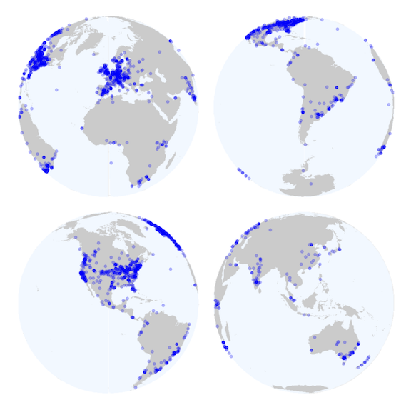

```{r titleslide, child="components/titleslide.Rmd"}
```


```{r setup, include=FALSE}
library(tidyverse)
library(knitr)
library(kableExtra)
opts_chunk$set(echo = FALSE,   
               message = FALSE,
               warning = FALSE,
               collapse = TRUE,
               fig.height = 4,
               fig.width = 8,
               fig.align = "center",
               cache = FALSE)
# options(htmltools.dir.version = FALSE)
```


---
# Welcome!

```{r out.width = '80%', echo = FALSE}
knitr::include_graphics("images/jamie-street-p2ifKHu3dXM-unsplash.jpg")
```

---
# Lecture Goals

<br>
<br>
- Get to know the teaching team
- Understand the aims and structure of the unit
- Look at the learning objectives of the unit
- Introduction to the tools that we will be using during the semester.


---
class: transition middle
# Teaching team


---
# Patricia Menéndez
<br><br>
.pull-left[
* `r emo::ji("mortar_board")` My training is in mathematics and statistics.
*  `r emo::ji("mortar_board")` PhD Mathematical Statistics,  [ETH](https://ethz.ch/en.html), Zurich (Switzerland).
* I have experience working in academia and also for the government and with industries.

]

.pull-right[
```{r img-stu, out.width = "80%"}

```
<br>
* Research: applied statistics, machine learning, data analysis for social good.

* Lecturer and Chief examiner

]


---
# Samithree Rajapaksha
<br>
.pull-left[

- `r emo::ji("mortar_board")`  I graduated with an honour’s degree in Industrial Statistics from University of Colombo majoring Industrial Statistics and Financial Mathematics.
-  I am  a statistician in the area of Public Transport Studies, pursuing my PhD study at Monash University Australia attached to Sustainable and Effective Public Transport research group. 
]

.pull-right[
```{r img-samithree, out.width = "80%"}

```
<br>
I have been using R extensively during my PhD studies.
]

---

# Nitika Kandhari
<br>
.pull-left[

* `r emo::ji("mortar_board")` Bachelor’s degree in Bioinformatics
* `r emo::ji("mortar_board")` Master’s degree in Bioinformatics
* Current: PhD Student in the Faculty of Medicine Nursing and Health Sciences
* Data Officer with [Monash Data Fluency](https://monashdatafluency.github.io/)
* Research: Bioinformatics analysis on Breast Cancer data


]

.pull-right[
```{r img-nitika, out.width = "80%"}

```

I  use R extensively to perform data cleaning, modelling, PCA and statistical analysis on biological data. 
]


---
# Samantha Dawson

.pull-left[
 `r emo::ji("mortar_board")` Bachelor of Computer Science, Masters of Human Nutrition, PhD Candidate (Deakin University). 

- I like working with data - prior to starting academia, I was an enterprise-wide database administrator and programmer,
- Now I’m a PhD Candidate researching how diet shapes the gut bugs of mums and babies. I use R to analyse my research
data and to make amazing plots. 

]

.pull-right[
```{r img-samantha, out.width = "80%"}

```
<br>
Last semester, I tutored Machine Learning, a third-year R-based subject at Monash University. 
]


---
# Joan Tan
<br>
.pull-left[
`r emo::ji("mortar_board")` Joan is a certified Analytics Professional (CAP) and earned a PhD in Applied Econometrics from Monash University.
- Joan has worked as data analyst/consultant in the banking and insurance industry. "I love playing around with data!"

- She has been using R during her PhD and analytics career. 

]

.pull-right[
```{r img-joan, out.width = "60%"}
knitr::include_graphics("images/joantan.jpg")
```

]


---
# Chin Quek
<br>
.pull-left[
 - `r emo::ji("mortar_board")` Mechanical engineering, business and public health (clinical research) graduate. 
 
 - Chin has many of years of tutoring experience in data analysis
 and also spent a few years working in technology delivery consulting. 
 
 - He enjoys food, travelling and meeting new people. 

]

.pull-right[
```{r img-karan, out.width = "60%"}
knitr::include_graphics("images/chinquek.jpg")
```


]


---
# Akriti Varshney
<br>
.pull-left[
 - `r emo::ji("mortar_board")` 
 Bachelor of Biomedical Science (Honours)
- PhD candidate at Biomedicine Discovery Institute, Monash
- Started working with R during her undergraduate research placement, now use it to analyze genetic data to answer how the human heart forms and what goes wrong genetically in heart disease

]

.pull-right[
```{r akriti, out.width = "60%"}

```
- Love tutoring, looking forward to seeing you!
]


---
# Tarun Bonu
<br>
.pull-left[
 `r emo::ji("mortar_board")` Bachelors in Computer Science and Engineering
 - Master of Data Science (Monash University)
 - Close to 2 years of experience in the IT industry building machine learning systems as a Data Scientist
 - I am also an Associate Instructor with Data Fluency delivering workshops involving data analysis in Python and R

]

.pull-right[
```{r tarun, out.width = "60%"}

```
- My master's degree involved a research pathway where I developed deep learning approaches to find biologically significant motifs on the DNA

`
]


---
# Yourselves!
```{r students, out.width = "80%"}
knitr::include_graphics("images/chang-duong-Sj0iMtq_Z4w-unsplash.jpg")
```

Source: Chang Duong for Unsplash

---

# What is this course?

<br> <br>
.content-box-neutral[
 - This is a course on Introduction to **Data Analysis** / **data science**. ]
 - You will gain skills to visualize and understand data
 - You will learn tools to analyze data
 - You will learn about reproducible practices


---
# Unit Content

.content-box-neutral[
1. Introduction to data analysis
2. R, Rstudio and reproducible data analysis
3. Tidy data principles and data wrangling
4. An intro to data visualization
5. Advanced data wrangling and visualization
6. Handling missing  values and scraping data
7. Introduction to data modeling
8. Building models for data analysis
9. Analysis of text data
10. Advance data science modelling
11. Data analysis and computational methods
12. Project presentations
]

---
# Unit Organization
<br>

.content-box-neutral[
- .green[**Lectures**]: Two hours on Mondays where I will introduce you the concepts and will show you different demos.
This will be an interactive class so please be engaged and participate!
]
.content-box-neutral[
-.green[**Tutorials**]: Two hours where you will get to practice all the things that you learned on Monday. 

    - There will be a list of practical exercises to be completed
    - You will be working in smaller groups with one of the teaching team members
    - Information about the groups and the Zoom links  will be posted in the Moodle site
    - Make sure you check your Monash email and the Moodle site for the course regularly
]


---
class: informative
# Unit materials -->  Moodle Site
- Zoom links
- Lecture notes for each class
- Readings + other online resources related to topics
- Assignment and project instructions
- .green[Plenty of consultation times] 
- Weekly online quizzes
- Conduct discussions
- Ask questions about the course material and exercises, and turn in assignments and project. 
- Suggestion box

---

# Textbook

.pull-left[
```{r r4ds-img, out.width = "80%"}
include_graphics("https://raw.githubusercontent.com/hadley/r4ds/master/cover.png")
```
]

.pull-right[
* Free
* Written by authors of [Tidyverse R packages](http://tidyverse.org/)
]


---
# Assessment 
<br>

```{r grades, echo = FALSE} 
grade_remainder <- data.frame(
  ASSESSMENT = c("Quizzes",
                 "Assignment 1",
                 "Mid-semester assessment",
                 "Assignment 2",
                 "Project",
                 "Final semester assessment"),
  WEIGHT = c("5%",
             "10%",
             "25%",
             "20%",
             "15%",
             "25%"),
  DATE = c("Due each week",
           "Due week 4",
           "Due week 7",
           "Due week 10",
           "Due week 11",
           "Due week 12")
)

kable(grade_remainder,
      format = "html") %>%
  kable_styling(bootstrap_options = "striped",
                 fixed_thead = T) 
```
---
# Quizzes

-  **You will need to complete a 5 question quiz**
- .green[Open each week from Monday at 6pm to 10:30am on Wednesday.] 
- **You must login with your Monash credentials**

```{r flux, out.width = "70%"}

```
[Flux ETC1010- 5510 quizzes website](https://flux.qa/#/presentations/6029b43e765b2a056ffb078f/6029b43d765b2a056ffb0781?tab=polls)


---

# Group Assignments
<br>

Expectations: 

- The group work will need to be conducted according to the [Monash policies](https://www.monash.edu/__data/assets/pdf_file/0011/1098659/Team-Assessment-Guidelines.pdf). 
<br> <br>

.content-box[
- Each member of the group completes the require tasks in the assignment producing an individual document.
- Then, group members will combine all the individual assignments into **one document** for the final submission. 
<!-- - 25% of the assignment grade will come from peer evaluation.  -->
- To ensure that everyone contributes to this tasks there will be a peer evaluation.
]


---
# Mid-semester assessment

There will be .green[midsemester assessment]
 in **Week 7** and .green[final semester assessment] in **Week 12**.

<Br>
The goal of this exercises:
<br><br>
.content-box[
- To demonstrate that you understand and have learned the material up until that week.
- Get feedback on your progress
]

<br><br>
.green[**- You will have a limited time to complete these tasks and the work will be done individually**]


---
# Tips for asking questions
<br><br>
 - Give your question context from course concept. Be precise in your description:
 
 <br>


   -  **Good description**: "I am getting the following error and I'm not sure how to resolve it" - .green[Error: could not find function ggplot]
     
   -  **Bad description**: "R giving errors, help me! Aaaarrrrrgh!" 
     
   -  .green[Whenever is possible please provide a reproducible example]

<br>    
    
 Remember: In Moodle you can edit a question after posting it.


---
# What can you do at the end of semester?

<br><br>
Some of our best final projects:

* [instagram](https://ebsmonash.shinyapps.io/Instagram/)
* [babynames](https://ebsmonash.shinyapps.io/BabyNames/)
* [oztourism](https://ebsmonash.shinyapps.io/OzTourism/)
* [salary gaps](https://dmac.dicook.org/project/project_python_r/project#introduction)
* [FantasyAFL](https://ebsmonash.shinyapps.io/FantasyAFL/)


---
class: informative

# How do you do well in this class
<br>
<br>
- .green[Participate **actively** in the class. **Learning is a share responsibility**!]
- Ask questions in the **Moodle** site.
- Come to consultation if you have questions.
- Practice the materials taught in each class by doing more exercises from the textbook.
- Use the extra resources.
- Be curious, be positive, be engaged!

.orange[**Remember: The teaching team is here to help you!**]


---

# Today: Outline

<br><br>

- R and R studio
- Why we care about Reproducibility?
- R + markdown = Rmarkdown 
- Writing markdown code
- Rstudio Cloud
- Overview of Week1 - Tutorial on Friday

---
# An important lesson: 

.blockquote[
Data preparation accounts for about 80% of the work of data scientists 

-- [Gil Press, Forbes 2016](https://www.forbes.com/sites/gilpress/2016/03/23/data-preparation-most-time-consuming-least-enjoyable-data-science-task-survey-says/##47cbbbf46f63)

]

## Data Preparation

* One of the least taught parts of data science, and business analytics, and yet it is what data scientists spend most of their time on. 
* By the end of this semester, you will have the tools to be more efficient and effective in this area, so that you have more time to spend on your mining and modeling.


---
class: motivator

# The _language_ of data analysis

.left-code[
This course is brought to you today by the letter "R"!
]

.right-plot[
```{r grover, out.width = "70%", echo = FALSE}
knitr::include_graphics("images/grover_R.png")
```

Grover image sourced from https://en.wikipedia.org/wiki/Grover.
]


---

# What is R? 

<br> <br>

.blockquote[
- R is a language for data analysis. 
- R allow us to do data wrangling
- Data Analysis
- Modelling
- Also it provides easy ways to create reproducible reports
]

---
# Why R?

<br><br>
- It is __Free__
- __Powerful__: Over 15000 contributed packages on the main repository (CRAN), as of March 2020, provided by top international researchers and programmers. 
- __Flexible__: It is a language, and thus allows you to create your own solutions
- __Community__: Large global community friendly and helpful, lots of resources

---

# Community
<br><br>
.left-code[
R Consortium conducted a survey of users 2017.

These are the locations of respondents to an R Consortium survey conducted in 2017.

**8% of R users are between 18-24 BUT 45% of R users are between 25-34!**
]

.right-plot[
```{r r-community, out.width = "70%"}

```
]

---
#  Sample of Australian organisations/companies that sent employees to [useR! 2018](https://user2018.r-project.org)

<br><br>
.blockquote[
ABS, **CSIRO**, ATO, **Microsoft**, Energy Qld, Auto and General, Bank of Qld, BHP, AEMO, Google, Flight Centre, Youi, Amadeus Investment Partners,  Yahoo, Sydney Trains, Tennis Australia, Rio Tinto, Reserve Bank of Australia, PwC, Oracle, **Netflix**, NOAA Fisheries, NAB, Menulog, Macquarie Bank, Honeywell, Geoscience Australia, DFAT, DPI, CBA, Bank of Italy, Australian Red Cross Blood Service, **Amazon**, **Bunnings**.
]

---
class: center middle

# R and RStudio

.pull-left[
```{r r-logo, out.width = "100%"}
include_graphics("images/Rlogo.png")
```
]


.pull-right[
```{r rstudio-logo, out.width = "100%"}
include_graphics("images/rstudio-logo.png")
```

]
---
class: informative

# What is R/RStudio?

<br><br>
- R is a statistical programming language

- RStudio is a convenient interface for R (an integrated development environment, IDE)


---
class: transition middle

# Let's take a tour of R and RStudio

---

# Rstudio

```{r out.width = '80%', echo = FALSE, fig.cap = "The Rstudio IDE"}
knitr::include_graphics("images/Rstudio-01.png")
```


---
class: bg-main1
background-image: url(images/rstudio-screenshot.png)
background-size: contain
background-position: 50% 50%
class: center, bottom, white


---
# In detail: 
<br><br>
- __Source code editor__: This is where you edit your script! Experiment with writing your data analysis pipeline, ... You can have multiple files open, there are useful shortcuts (eg "Run", "Knit"), code is highlighted usefully and there is tab-completion when you start typing. *Also, if you want to look at any of the data you have read or created, it can be viewed in a tab on this pane.*
- __Console window__: This is where the code is executed. There is a prompt ">" which says *R is waiting for your command*. You don't actually need to type anything in this pane, you can run code directly from the Editor pane. The functions will show up in this window, and the results will be here. (Although, if you use an R notebook the result will show up in that notebook.)

---
# In detail:
<br><br>
- __Help__: *?function* will show the help pages for the function here.
- __Plot__: Plots you ask R to make will show up here, and you can zoom to make them bigger in a separate window if you want.
- __Environment__: Data that you have read into R, or data or functions that you create will be listed here. **When you quit R, you will be asked if you want to save the environment. I suggest that you always answer NO.** Because we are scripting everything it is always easy to re-create the objects in the environment. The only time it can be useful is if you have created something that took a while, but a better option is to save this object to a file, and read it in at the start of the next R session.


---

# Rstudio Cloud

<br>
.green[R/Rstudio but in the cloud!]

<br>
```{r rstudio, out.width = "60%"}

```

- Ensure that we all work in the same environment.

---
# R essentials: A short list (for now)
<br><br>
- Data is organized in .green[columns] and .green[rows].

- Typically: .green[columns] --> represent variables
- and .green[rows] --> represent observations.

```{r eval = TRUE, echo = TRUE}
library(palmerpenguins)
head(penguins)
```

---
# R essentials: A short list (for now)
<br><br>


```{r eval=FALSE, echo = TRUE}
names(penguins)
```

```{r show-mean, echo = TRUE}
str(penguins)
```


---
# R essentials: A short list (for now)

- Columns (variables) in data frames are accessed with `$`:
```{r species, echo = TRUE}
penguins$species
```
- Elements within the column can be accessed: 
```{r elements, echo = TRUE}
penguins$species[1:10]
```


---
# R essentials: A short list (for now)

<br><br>
- .green[Functions] are (most often) verbs, followed by what they will be applied to in parentheses:

```{r do-what, eval=FALSE, echo = TRUE}
do_this(to_this)
do_that(to_this, to_that, with_those)
```


For example:


```{r mean-example, echo = TRUE}
mean(c(1,2,1,2))
```


---
# R essentials: A short list (for now)
<br><br>

- Packages are installed with the `install.packages` function and loaded with the `library` function, once per session:

```{r eval=FALSE, echo = TRUE}
install.packages("package_name")
library(package_name)
```


---

# Sharing / Reusing code

<br><br>
- Any recycled code not explicitly cited will be treated as plagiarism. 
- This can be as simple as pasting the link in a references section.
- Assignment groups may not directly share/re-use code from  another group. 
- You are welcome to discuss the problems together and ask for advice, 
but you may not make direct use of code from another team.


---
class: refresher
# Lots of R/Rstudio resources in : Cheatsheets

<br><br>
RStudio started a trend by writing really concise summaries, and others have added to the collection. You can find the RStudio collection in the "Help" menu on the IDE, and at https://www.rstudio.com/resources/cheatsheets/. 

Start with the [RStudio IDE cheatsheet](https://github.com/rstudio/cheatsheets/raw/master/rstudio-ide.pdf). 


---
class: transition

# We are in a tight spot with reproducibility

.blockquote[
Only 6 out of 53 landmark results could be reproduced

-- [Amgen, 2014*](https://www.nature.com/articles/483531a)
]


.blockquote[
An estimated 75% - 90% of preclinical results cannot be reproduced

-- [Begley, 2015*](https://www.ncbi.nlm.nih.gov/pubmed/25552691)
]


.blockquote[
Estimated **annual** cost of irreproducibility for biomedical industry = 28 Billion USD

-- [Freedman, 2015*](https://journals.plos.org/plosbiology/article?id=10.1371/journal.pbio.1002165)
]
 

.footnote[`*` Heard via Garret Grolemund's [great talk](https://www.youtube.com/watch?v=HVlwNayog-k)]


---

background-image: url("images/open-science-berg.jpeg")
background-size: contain
background-position: 50% 50%
class: center, bottom, white


---

# Literate programming is a partial solution


<br><br>
- Literate programming shines some light on this dark area of science. 

- An idea from [Donald Knuth](https://en.wikipedia.org/wiki/Donald_Knuth) where you combine your text with your code output to create a document. 

- A _blend_ of your literature (**text**), and your programming (**code**), to create something you can read from top to bottom. 

- .green[** Use R markdown to combine both, text, R code, figures and more!**]


---
# Markdown as a new player to legibility

<br><br>

In 2004, [John Gruber](https://en.wikipedia.org/wiki/John_Gruber), of [daring fireball](https://daringfireball.net/) created [markdown](https://en.wikipedia.org/wiki/Markdown), a simple way to create text that rendered into a HTML webpage.


---

# Example: 
<br> <br>

Imagine a report:

<br>

Introduction, methods, results, discussion, and conclusion,
and all the bits of code that make each section. 


- With Rmarkdown, you can see all the pieces of your data analysis  together in the same file.

- Each time you knit the analysis is ran from the beginning

---
class: transition middle

# Demo


---
# How does Markdown language look like?
<br><br><br>

.pull-left[
```
- bullet list
- bullet list
- bullet list
```
]

--

.pull-right[

- bullet list
- bullet list
- bullet list

]

---
# Markdown lists
<br><br><br>
.pull-left[
```
1. numbered list
2. numbered list
3. numbered list

__bold__, **bold**, 

_italic_, *italic*

> quote of something profound

```
]

--

.pull-right[


1. numbered list
2. numbered list
3. numbered list

__bold__, **bold**, 

_italic_, *italic*

> quote of something profound

]

---
# Markdown 

<br><br>

With very little marking up, we can create rich text, that **actually resembles** the text that we want to see.


**Learn to use markdown** Spend five minutes working through [markdowntutorial.com](https://www.markdowntutorial.com/)


---
# Rmarkdown helps address the reproducibility problem

<br><br>

* Q: How do we take `markdown` + `R code` = "literate programming environment"

* A: `Rmarkdown` 

---

# Rmarkdown
<br><br>
- Provides an environment where you can write your complete analysis, and marries your text, and code together into a rich document. 

- You write your code as code chunks, put your text around that, and then hey presto, you have a document you can reproduce.


---

# The anatomy of an Rmarkdown document
<br><br>
.green[**There are three parts to an rmarkdown document.**]

- Metadata (YAML)
- Text (markdown formatting)
- Code (code formatting)


---
# Metadata: YAML  (YAML Ain't Markup Language) 
<br><br>
- The metadata of the document tells you how it is formed - what the **title** is, what **date** to put, and other control information.  

- If you're familiar with $\LaTeX$, this is similar to how you specify document type, styles, fonts, options, etc in the front matter / preamble.

---
# Metadata: YAML
<br><br>
- Rmarkdown documents use YAML to provide the metadata. It looks like this:

```YAML
---
title: "An example document"
author: "Dr Who"
output: html_document
---
```

It starts an ends with three dashes `---`, and has fields like the following: `title`, `author`, and `output`.

---
# Text
<br><br>

Markdown  provides a simple way to mark up text

.pull-left[

```
1. bullet list
2. bullet list
3. bullet list
```

]

.pull-right[

1. bullet list
1. bullet list
1. bullet list

]

---
# Code and code chunks
<br><br>
.green[We refer to code in an rmarkdown document in two ways]:

1. Code chunks, and 
2. Inline code.

`Code chunks` are marked by three backticks and curly braces with `r` inside them:

````markdown
```{r chunk-name}`r ''`
# a code chunk
```
````

---
# Code: backtick?
<br><br>

**A backtick** is a special character you might not have seen before, it is typically located under the tilde key (`~`). On USA / Australia keyboards, is under the escape key:


```{r show-backtick, out.width = "60%", echo = FALSE}

```

.small[
image from https://commons.wikimedia.org/wiki/File:ANSI_Keyboard_Layout_Diagram_with_Form_Factor.svg
]

---
# Code: Inline code

<br><br>
Sometimes you want to run the code inside a sentence. This is called running the code "inline".

You might want to run the code inline to name the number of variables or rows in a dataset in a sentence like:

> There are XXX observations in the airquality dataset, and XXX variables.

---

# Code: Inline code
<br><br>
.green[You can call code "inline"  like so:]


````markdown

There are `r "\u0060r nrow(airquality) \u0060"` observations in the airquality dataset, 
and `r "\u0060r ncol(airquality) \u0060"` variables.

````

Which gives you the following sentence


> There are `r nrow(airquality)` observations in the airquality dataset, and `r ncol(airquality)` variables.

---


# Code: Inline code
<br><br>
- If your data changes upstream

- You don't need to work out where you mentioned your data

- You just update the document. `r emo::ji("tada")`
 


---
# Code: Chunk names
<br><br>
Straight after the ` ```{r ` you can use a text string to name the chunk:

````markdown
```{r read-crime-data}`r ''`
crime <- read_csv("data/crime-data.csv")
```
````

---
# Code: Chunk names
<br><br>
.green[Naming code chunks has three advantages:]

1. Navigate to specific chunks using the drop-down code navigator in the bottom-left of the script editor.
2. Graphics produced by chunks now have useful names.
3. You can set up networks of cached chunks to avoid re-performing expensive computations on every run.

---
# Code: Chunk names
<br><br>
.green[Every chunk should ideally have a name.]

Naming things is hard, but follow these rules and you'll be fine:

1. One word that describes the action (e.g., "read")
2. One word that describes the thing inside the code (e.g, "gapminder")
3. Separate words with "-" (e.g., `read-gapminder`)

---
# Code: Chunk options
<br><br>
.green[You can control how the code is output by changing the code chunk options which follow the title.] 

````markdown
```{r read-gapminder, eval = FALSE, echo = TRUE}`r ''`
gap <- read_csv("gapminder.csv")
```
````

What do you think this does?


---
# Code: Chunk options
<br><br>
.green[The code chunk options you need to know about right now are:]

  * `cache`: TRUE / FALSE. Do you want to save the output of the chunk so it doesn't have to run next time?
  * `eval`: TRUE / FALSE Do you want to evaluate the code?
  * `echo`: TRUE / FALSE Do you want to print the code?
  * `include`: TRUE / FALSE Do you want to include code output in the final output document? Setting to `FALSE` means nothing is put into the output document, but the code is still run.

You can read more about the options at the official documentation: https://yihui.name/knitr/options/#code-evaluation


---
# Global options: Set and forget
<br><br>
.green[You can set the default chunk behavior once at the top of the `.Rmd` file using a chunk like:]

```r
knitr::opts_chunk$set(
  echo = FALSE,
  cache = TRUE
)
```

then you will only need to add chunk options when you have the occasional one that you'd like to behave differently.


---
# Week 1 tutorial
<br>

```{r workshop2, out.width = "80%"}

```


---
# Week 1 tutorial

<br><br>


- Please watch the **tutorial intro video** in Moodle 
- The tutorial materials will be posted there after the class in Moodle
- Please watch these videos [**before the tutorial**](https://rstudio.cloud/learn/primers/1.2)  
- Get hands on data analysis experience
- Should be fun and collaborative
- Nitika, Samantha, Samithree, Akriti, Joan, Tarun and Chin will be working with you
- .green[Keep an eye for the announcements in Moodle]
- Remember the quiz!


---

# Learning more:
<br><br><br>
- [R Markdown cheat sheet](https://github.com/rstudio/cheatsheets/raw/master/rmarkdown-2.0.pdf) and Markdown Quick Reference 

- Help -> Markdown Quick Reference, we'll refer to it often as the course progresses


---

```{r endslide, child="components/endslide.Rmd"}
```

