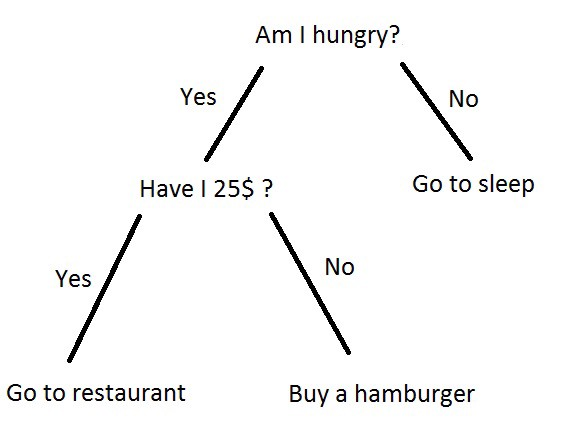
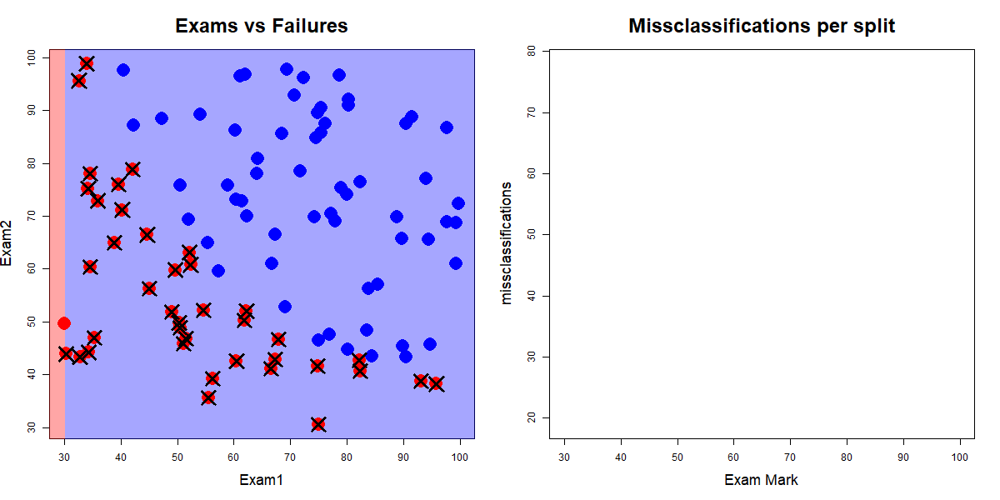

```{r titleslide, child="components/titleslide.Rmd"}
```


```{r setup2, include=FALSE}
library(tidyverse)
library(knitr)
library(kableExtra)
library(textdata)
library(tm)
library(readxl)
library(haven)
library(vctrs)
library(knitr)
library(kableExtra)
library(knitr)
library(lubridate)
library(gridExtra)
library(plotly)
library(broom)
library(broomstick)
library(hpackedbubble)
#library(split)
library(magick)
library(ISLR)

opts_chunk$set(echo = TRUE,   
               out.width = "100%",
               message = FALSE,
               warning = FALSE,
               collapse = TRUE,
               fig.height = 4,
               fig.width = 8,
               fig.align = "center",
               dpi = 300,
               cache = FALSE)

as_table <- function(...) knitr::kable(..., format='html', digits = 3)
```


  
  
```{r funs, echo =FALSE}
draw_split <- function(split){
df_add_sst <- df %>% 
  mutate(x_split = if_else(x <= split, "left", "right")) %>% 
  group_by(x_split) %>% 
  mutate(y_bar = mean(y),
         y_slope = 0) 
ggplot(df_add_sst, 
       aes(x = x, 
           y = y)) + 
  geom_point() +
  geom_vline(xintercept = split, linetype = 2) +
  geom_line(aes(y = y_bar), colour = "salmon") + 
  geom_segment(mapping = aes(xend = x, 
                             yend = y_bar), 
               color = "grey50",
               alpha = 0.5) +
  scale_x_continuous(breaks = seq(-0.5, 0.5, 0.1))
}
```
  
  
---
# Questions/Comments/Suggestions

```{r out.width = '80%', echo = FALSE}
include_graphics("images/rhythm-goyal-_-Ofoh09q_o-unsplash.jpg")
```
 Photo: Rhythm Goyal for  Unsplash.


---
# Recap: Week 10

<br><br>

- A bit more on Networks 
- Decision trees
- How is it computed?
- Decision trees goodness of fit
- Comparison with linear models


---

# Week 11: Outline
<br><br>

- Assignment 2 peer review feedback form
- Classification trees
- Presentations Week 12 (during tutorial hours)
- Data Analysis Exercise Week 12 (during lecture time)


---
# Assignment 2 peer review form
<br>
- You will have the opportunity to provide feedback on any team member that did not contribute equally to the assignment.
- That includes not completed the individual assignment
- not participating in meetings
- not collaborating equally as the other team members

<br>
**You only need to provide feedback for team members that do not collaborated actively**


---
# Peer review feedback

```{r out.width = '70%', echo = FALSE}

```

---
class: transition

# Decision Trees
<br>
- Regression trees
- Classification trees


---
# Tree-based methods
<br><br>
.content-box-neutral[
.green[Regression trees]: Are computational methods that allow us 
to understand the relationship between different 
explanatory variables (x's) with a response variable.
]
.content-box-neutral[
.green[Classification tree]s: Are computation methods that allow us
to find groups in a data set
]

```{r simulated-data, echo = FALSE}
set.seed(2020 - 05 - 21)
x <- sort(runif(100) - 0.5)
df <- data.frame(x,
                 y = 10 * c(x[1:50] ^ 2,
                            x[51:75] * 2,
                            -x[76:100] ^ 2) + rnorm(100) * 0.5)

# ggplot(df, aes(x = x, y = y)) + geom_point()

library(rpart)
# df_lm <- lm(y~x, data=df) - similar to lm! But rpart.
df_rp <- rpart(y~x, data=df)

splt <- as_tibble(df_rp$splits) %>% 
  rowid_to_column(var = "order") %>%
  select(index, order)

df_rp_aug <- augment(df_rp)

```

```{r for-loop , echo = FALSE}
sst <- var(df$y)*(nrow(df)-1)
compute_anova <- function(left, right) {
  ssl <- var(left$y)*(nrow(left)-1)
  if (nrow(left) == 1) {
    ssl <- 1
}
  ssr <- var(right$y)*(nrow(right)-1)
  if (nrow(right) == 1) {
    ssr <- 1
  }
  av <- sst - (ssl+ssr)
  # av <- (ssl+ssr)
  return(av)
}
aov_f <- data.frame(x=df$x[-1], f=df$y[-1])
for (i in 2:nrow(df)) {
  left <- df[1:(i-1),]
  right <- df[i:nrow(df),]
  aov_f$x[i-1] <- mean(df$x[c(i-1, i)])
  aov_f$f[i-1] <- compute_anova(left, right)
}
```

```{r read-exam, echo = FALSE}
data <- read.csv("data/Exam.csv", header=T)
```

---

# Regression Trees

- Regression trees give the predicted response for an observation by using the mean response of the observations that belong to the
same terminal node (partition)

```{r show-reg-pred0, echo = FALSE}
ggplot(df_rp_aug,
       aes(x = x,
           y = y)) + 
  geom_point() +
  geom_line(aes(y = .fitted), colour = "salmon", size = 2)
```


---
# Regression Tree

.pull-left[
```{r reg-tree-split, fig.height = 10, echo = FALSE}
p1 <- ggplot(df, aes(x=x, y=y)) + geom_point(alpha=0.5) + scale_x_continuous(breaks=seq(-0.5, 0.5, 0.1))
p2 <- ggplot(data=aov_f) +
  geom_line(aes(x=x, y=f) , colour="hotpink") +
    geom_vline(xintercept = df_rp$splits[1,4], colour="hotpink", linetype=2)+
   scale_x_continuous(breaks=seq(-0.5, 0.5, 0.1))
grid.arrange(p1, p2, ncol=1)
```
]

.pull-right[
```{r show-split, fig.height = 10 , echo = FALSE}
ggplot(df, aes(x = x, y = y)) + geom_point() +
  geom_vline(data = splt,
             aes(xintercept = index, 
                 colour = factor(order)),
             linetype = 2) +
  geom_text(data = splt,
            aes(x = index, y = max(df$y), label = order),
            nudge_x = 0.02) +
  scale_x_continuous(breaks = seq(-0.5, 0.5, 0.1)) +
  scale_colour_viridis_d() +
  theme_bw() +
  theme(legend.position = "none")
```

]


---
# Regression Tree

.pull-left[
```{r show-split-again, fig.height = 10, echo = FALSE}
ggplot(df, aes(x = x, y = y)) + geom_point() +
  geom_vline(data = splt,
             aes(xintercept = index, 
                 colour = factor(order)),
             linetype = 2) +
  geom_text(data = splt,
            aes(x = index, y = max(df$y), label = order),
            nudge_x = 0.02) +
  scale_x_continuous(breaks = seq(-0.5, 0.5, 0.1)) +
  scale_colour_viridis_d() +
  theme_bw() +
  theme(legend.position = "none")
```
]

.pull-right[
```{r rpart-plot, fig.height = 10, echo = FALSE}
library(rpart.plot)
rpart.plot(df_rp)
```
]

---
# How about if the response variable Y is categorical?

- Then our interest is in  predicting something being in a particular group.
- Say, predicting whether someone passes a course based on two exam scores.
- **Moving from continuous to categorical response**.

```{r out.width = "80%" , echo = FALSE}
ggplot(data, aes(x=Exam1, y=Exam2, color=factor(Label))) +
  geom_point(size=4) + 
  scale_color_brewer("", palette="Dark2") +
  theme_minimal() +
  theme(text = element_text(size=20)) 
```


---
# What is a decision tree?
<br>
.pull-left[
Tree based models consist of one or more of nested
`if-then` statements for the predictors that partition
the data. Within these partitions, a model is used to predict the outcome.
]

<br>
.pull-right[
```{r images-tree}

```

.small[Source: [Egor Dezhic](becominghuman.ai)]

]


---
# Regression? Classification?
  
- Regression trees (quantitative response) give the predicted response for an observation by using the mean response of the observations that belong to the
same terminal node:

```{r show-reg-pred, echo = FALSE}
ggplot(df_rp_aug,
       aes(x = x,
           y = y)) + 
  geom_point() +
  geom_line(aes(y = .fitted), colour = "salmon", size = 2)
```


---
# Classification
<br><br>

A .green[classification tree] predicts each observation belonging to the most commonly occurring class/group of observations.

However, when we interpret a classification tree, we are often interested not only in the class prediction (what is most common), but also the proportion of correct classifications.

---
# Building a classification tree
<br><br>
- Similar approach to building a classification tree as for regression trees
- We use this "recursive binary splitting" approach
- But we don't use the residual sums of squares


$$
SS_T = \sum (y_i-\bar{y})^2
$$


Since we now have a category, we need some way to describe that.

We need something else!

---
# Classification tree
<br><br>
- We can use the .green["classification error"]:
.content-box-neutral[
 Where we count up the number of miss-classified things, and choose the split that has the lowest number of miss-classified things.]
We can represent this in an equation as the .green[fraction of observations in a region which don't belong to the most common class].

 
$$E = 1 - \text{max}_{k}(\hat{p}_{mk})$$

Here,  $\hat{p}_{mk}$ refers to the proportion of observations in the $m$th region, from the $k$th class. 

---
# Understanding classification
<br><br>
What happens when E is zero, and when E is 1?

<br>
$E = 1 - \text{max}_{k}(\hat{p}_{mk})$

<br>

- E is zero when $\text{max}_{k}(\hat{p}_{mk})$ is 1 -->  which is 1 when observations are the same class
- E = 1 --> nothing was classified correctly!


---
# Classification trees
<br><br>

- A classification tree is used to predict a .orange[**categorical response**] and regression tree is used to predict a quantitative response
- .green[Use a recursive binary splitting to grow a classification tree. That is, sequentially break the data into two subsets, typically using a single variable each time].
- The predicted value for a new observation, $x_0$, will be the .green[most commonly occurring class] of observations in the sub-region in which $x_0$ falls


---
# Predicting pass or fail ?

Consider the dataset `Exam` where two exam scores are given for each student, 
and a class `Label` represents whether they passed or failed the course.

.pull-left[
```{r head-data}
head(data,4)
```
]

.pull-right[
```{r, echo=FALSE, out.width = "100%", fig.height = 4, fig.width = 4}
ggplot(data, aes(x=Exam1, y=Exam2, color=factor(Label))) +
  geom_point(size=4) + 
  scale_color_brewer("", palette="Dark2") +
  theme_minimal() +
  theme(text = element_text(size=20)) 
```
]


---
# Calculate the number of misclassifications

Along all splits for `Exam1` classifying according to the majority class for the left and right splits
 
```{r show-two-dgif, out.width = "60%", echo = FALSE}

```

Red dots are .orange["fails"], blue dots are .green["passes"], and crosses indicate misclassifications. .small[Source: John Ormerod, U.Syd]

---
# Calculate the number of misclassifications

Along all splits for `Exam2` classifying according to the majority class for the top and bottom splits

```{r two-d-cart-2-gif, out.width = "60%", echo = FALSE}
include_graphics("gifs/two_d_cart2.gif")
```

Red dots are .orange["fails"], blue dots are .green["passes"], and crosses indicate misclassifications. .small[Source: John Ormerod, U.Syd]

---
# Combining the results from `Exam1` and `Exam2` splits
<br><br>
- The minimum number of misclassifications from using all possible splits of `Exam1` was 19 when the value of `Exam1` was **56.7**
- The minimum number of misclassifications from using all possible splits of `Exam2` was 23 when the value of `Exam2` was .orange[52.5]

So we split on the best of these, i.e., split the data on `Exam1` at 56.7.

---
# Split criteria - purity/impurity metrics
<br>
.green[It turns out that classification error is not sufficiently sensitive for tree-growing].
<br>
In practice two other measures are preferable, as they are more sensitive:
<br>
.content-box-soft[
- The Gini Index (Gini impurity) --> probability of misclassifying an observation. The lower the Gini the better the split.
- Information Entropy --> measure of disorder/homogeneity of the sample --> low level of purity
]
They are both quite similar numerically. 

- .green[Small values] mean that a node contains mostly observations of a single class, referred to as .green[node purity].

---
# Example - predicting heart disease

$Y$: presence of heart disease (Yes/No)

$X$: heart and lung function measurements

```{r print-names , echo = FALSE}
library(tidyverse)
library(ISLR)
library(rpart)
library(rpart.plot)
library(caret)
#https://github.com/jromich/isl_book
#I need to amend this path------------------------------------------
heart <- read_csv("data/Heart.csv") %>%
  dplyr::select(-X1) %>% 
  mutate(AHD=factor(AHD)) %>%
  filter(!is.na(Ca)) %>%
  filter(!is.na(Thal))
colnames(heart)
```


```{r rpart-heart, out.width = "70%" , echo = FALSE}
heart <- heart %>% dplyr::select(Age:AHD)
set.seed(2019)
tr_indx <- createDataPartition(heart$AHD)$Resample1
heart_tr <- heart[tr_indx,]
heart_ts <- heart[-tr_indx,]
heart_finalrp <- rpart(AHD~., data=heart_tr)
prp(heart_finalrp)
```

---
# Deeper trees

Trees can be built deeper by:

- decreasing the value of the complexity parameter `cp`, which sets the difference between impurity values required to continue splitting.
- reducing  the `minsplit` and `minbucket` parameters,  which control the number of  observations  below splits are forbidden.

```{r deeper-trees, out.width="70%", echo = FALSE}
heart_finalrp <- rpart(AHD~., data=heart_tr, control=rpart.control(minsplit=6, cp=0.02))
prp(heart_finalrp)
```

---
# Tabulate true vs predicted to make a .orange[confusion table]. 

<center>
<table>
<tr>  <td> </td><td> </td> <td colspan="2" align="center" > true </td> </tr>
<tr>  <td> </td><td> </td> <td align="center" bgcolor="#daf2e9" width="80px"> C1 (positive) </td> <td align="center" bgcolor="#daf2e9" width="80px"> C2 (negative) </td> </tr>
<tr height="50px">  <td> pred- </td><td bgcolor="#daf2e9"> C1 </td> <td align="center" bgcolor="#D3D3D3"> <em>a</em> </td> <td align="center" bgcolor="#D3D3D3"> <em>b</em> </td> </tr>
<tr height="50px">  <td>icted </td><td bgcolor="#daf2e9"> C2</td> <td align="center" bgcolor="#D3D3D3"> <em>c</em> </td> <td align="center" bgcolor="#D3D3D3"> <em>d</em> </td> </tr>
</table>
</center>

- .green[**Accuracy**]: *(a+d)/(a+b+c+d)*
- .green[**Error**]: *(b+c)/(a+b+c+d)*
- .green[**Sensitivity**]: *a/(a+c)*  (true positive, recall)
- .green[**Specificity**]: *d/(b+d)* (true negative)
- .green[**Balanced accuracy**]: *(sensitivity+specificity)/2*

---
# Confusion Table
<br>
```{r train-confus , echo = FALSE}
confusionMatrix(heart_tr$AHD, predict(heart_finalrp, newdata=heart_tr, type="class"))$table
confusionMatrix(heart_tr$AHD, predict(heart_finalrp, newdata=heart_tr, type="class"))$overall[1]
```

```{r train-v-test, out.width="80%", fig.width=6, fig.height=4, echo = FALSE}
# Decide on best model
heart_bigrp <- rpart(AHD~., data=heart_tr, control=rpart.control(minsplit=6, cp=0.005))
tr_err <- 1-confusionMatrix(factor(heart_tr$AHD), predict(heart_bigrp, newdata=heart_tr, type="class"))$overall[1]
ts_err <- 1-confusionMatrix(factor(heart_ts$AHD), predict(heart_bigrp, newdata=heart_ts, type="class"))$overall[1]
nnodes <- max(heart_bigrp$cptable[,2])+1
cp <- c(0.006, 0.007, 0.008, 0.009, 0.01, 0.02, 0.03, 0.04, 0.05, 0.1, 0.5)
for (i in 1:length(cp)) {
  heart_rp <- rpart(AHD~., data=heart_tr, control=rpart.control(minsplit=6, cp=cp[i]))
  tr_err <- c(tr_err, 1-confusionMatrix(heart_tr$AHD, predict(heart_rp, newdata=heart_tr, type="class"))$overall[1])
  ts_err <- c(ts_err, 1-confusionMatrix(heart_ts$AHD, predict(heart_rp, newdata=heart_ts, type="class"))$overall[1])
  nnodes <- c(nnodes, max(heart_rp$cptable[,2])+1)
}
heart_fit <- tibble(cp=c(0.005, cp), nnodes, train=tr_err, test=ts_err) %>% 
  gather(type, error, train, test) 

gg_heart_fit <- ggplot(heart_fit, aes(x=nnodes, y=error, colour=type)) + 
  geom_line() + scale_colour_brewer("", palette="Dark2") +
  xlab("Size of tree") + ylim(c(0,0.4))
```

```{r eval=FALSE, echo = FALSE}
# Cross-validation, but it transforms categorical variables to numeric
library(e1071)
caret.control <- trainControl(method = "repeatedcv",
                              number = 10,
                              repeats = 1)
heart_rp <- train(AHD~., 
                  data=heart,
                  method = "rpart",
                  trControl = caret.control,
                  tuneLength = 100)
prp(heart_rp$finalModel, digits=2, roundint=FALSE)
```


```{r}
(75 + 58)/(75 + 5 + 11 +58)
```


---
# Example - Crabs

Physical measurements on WA crabs, males and females.

.small[*Data source*: Campbell, N. A. & Mahon, R. J. (1974)]

```{r read-crabs, out.width="50%", fig.width=5, fig.height=5 , echo = FALSE}
crab <- read.csv("http://www.ggobi.org/book/data/australian-crabs.csv")
crab <- subset(crab, species=="Blue", select=c("sex", "FL", "RW"))
crab_rp <- rpart(sex~FL+RW, data=crab, parms = list(split = "information"), 
                 control = rpart.control(minsplit=3))
prp(crab_rp)
```

---
# Example - Crabs

```{r crabs-plot, out.width="80%", fig.width=6, fig.height=4 , echo = FALSE}
ggplot(data=crab, aes(x=FL, y=RW, color=sex, shape=sex)) + 
  geom_point(alpha=0.7, size=3) + 
  scale_colour_brewer(palette="Dark2") +
  theme(aspect.ratio=1) + 
  geom_vline(xintercept=16, linetype=2) + 
  geom_segment(aes(x=7, xend=16, y=12, yend=12), color="black", linetype=2) +
  geom_segment(aes(x=12, xend=12, y=6, yend=12), color="black", linetype=2) + 
  geom_segment(aes(x=7, xend=16, y=8.1, yend=8.1), color="black", linetype=2) +
  geom_segment(aes(x=11, xend=11, y=8.1, yend=12), color="black", linetype=2) +
  geom_segment(aes(x=11, xend=16, y=11, yend=11), color="black", linetype=2) +
  geom_segment(aes(x=11, xend=11, y=8.1, yend=11), color="black", linetype=2) +
  geom_segment(aes(x=12, xend=16, y=11, yend=11), color="black", linetype=2) +
  geom_segment(aes(x=14, xend=14, y=11, yend=12), color="black", linetype=2) +
  geom_segment(aes(x=16, xend=21.3, y=16, yend=16), color="black", linetype=2)
```

---
# Comparing models

.pull-left[

Classification tree

```{r out.width="100%", fig.height=4, fig.width=4, echo = FALSE}
crab_grid <- expand.grid(FL=seq(7,22,0.25), RW=seq(6,17,0.25))
crab_grid$sex <- predict(crab_rp, newdata=crab_grid, type="class")
ggplot(data=crab_grid, aes(x=FL, y=RW, color=sex)) + 
  geom_point(alpha=0.3, size=3) + 
  geom_point(data=crab, aes(x=FL, y=RW, color=sex), shape=2, size=3) + 
  scale_colour_brewer(palette="Dark2") +
  theme_bw() + 
  theme(aspect.ratio=1, legend.position="none") 

```
]


.pull-right[

Linear classifier

```{r out.width="100%", fig.height=4, fig.width=4, echo = FALSE}
library(MASS)
crab_lda <- lda(sex~FL+RW, data=crab, prior=c(0.5,0.5))
crab_grid$sex <- predict(crab_lda, newdata=crab_grid)$class
ggplot(data=crab_grid, aes(x=FL, y=RW, color=sex)) + 
  geom_point(alpha=0.3, size=3) + 
  geom_point(data=crab, aes(x=FL, y=RW, color=sex), shape=2, size=3) + 
  scale_colour_brewer(palette="Dark2") +
  theme_bw() + 
  theme(aspect.ratio=1, legend.position="none") 
```

]

---
# Strengths and Weaknesses

**Strengths:**

- The decision rules provided by trees are very easy to explain, and follow. A simple classification model.
- Trees can handle a mix of predictor types, categorical and quantitative.
- Trees efficiently operate when there are missing values in the predictors.

**Weaknesses:**

- Algorithm is greedy, a better final solution might be obtained by taking a second best split earlier.
- When separation is in linear combinations of variables trees struggle to provide a good classification


---
# Machine learning
<br>
- Materials -- >http://iml.numbat.space
- We use some of the materials there for today's lecture.


---
# Group Project Milestone 4 + peer marking

<br><br>
**Each team member** please prepare the following documents and all the team members please submit the same files:
.content-box-neutral[
1. **Moodle**: Zip folder with all the Rmd files + any other files required to reproduced the report. All the rmd files must knit. 
2. Deadline 1pm May 24.
]

The following submission will be opened at 10am Tuesday May 25.
.content-box[
1. Presentation uploaded in Moodle after your tutorial by 6:30pm Friday May 28. 
2. Peer review form for milestone 1, 2, 3 and 4 by 6:30pm Friday May 28. 
]


---
# Week 12 Group presentations
<br><br>
.content-box-neutral[
  Presentations (ETC1010 and ETC5510)]
 - Group order presentations for each tutorial will be available in Moodle by Thursday this week.
 - **Attendance for this session is compulsory.**
 - Each group will have 15min to present their project and all the team members must participate in the presentation.
 - Questions will follow after the presentation.
 

---
# Week 12 Monday in-class asessment
 
.content-box-neutral[ 
Monday (May, 24th: In-class final semester assessment (ETC1010 and ETC5510)
]

- Rstudio Cloud project will be released both in Rstudio Cloud and Moodle. In Rstudio Cloud you will be able to access the project under 

```{r out.width = '40%', echo = FALSE}

```
- The link to access the space is this one and you should all have access to it:
XXXX
- Copy paste the entire link in the browser. 
- You will need to complete the exercise  and **submit the entire project folder in Moodle by 5:00pm on Monday May 24th**.
- **Late submissions will not be accepted**

---
# Testing during tutorials this week

<br>
- You do do some testing access during the tutorial
- You will also learn about how to download the project from Rstudio Clould
- You will also learn how to upload the project back into Rstudio Cloud
- You will learn about decisions trees


---
# If you experience a technical issue with Rstudio Cloud

<br>

- If you experience an Rstudio Cloud issue please join the Zoom link for your allocated tutorial and the tutors will be able to help you.

- Help about R or knitting problems are **not** technical issues as they are part of the assessment. **No questions related to that will be answered.**

- Please make sure you knit the file as you go and that all the R code chunks are evaluated (eval = TRUE)


---
# It's been wonderful to teach you!


```{r out.width = '40%', echo = FALSE}


```

Photo by <a href="https://unsplash.com/@liplip?utm_source=unsplash&utm_medium=referral&utm_content=creditCopyText">Lip</a> on <a href="https://unsplash.com/s/photos/thank-you?utm_source=unsplash&utm_medium=referral&utm_content=creditCopyText">Unsplash</a>
  
---

```{r endslide, child="components/endslide.Rmd"}
```  