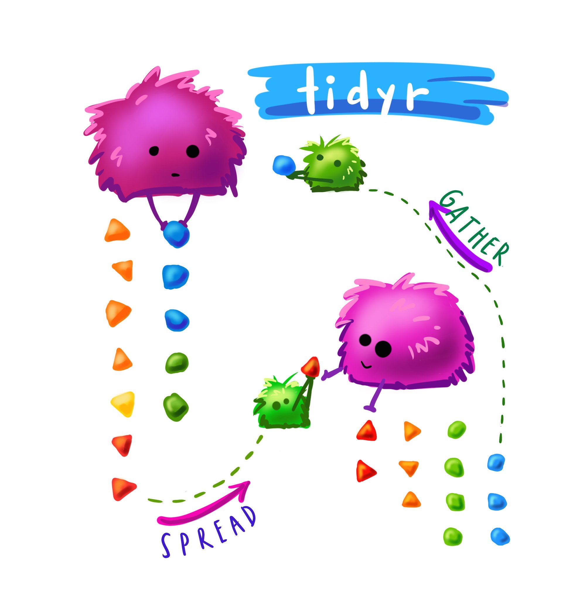

```{r titleslide, child="components/titleslide.Rmd"}
```


```{r setup, include=FALSE}
library(tidyverse)
library(knitr)
library(kableExtra)
library(emo)
#library(countdown)
opts_chunk$set(echo = FALSE,   
               message = FALSE,
               warning = FALSE,
               collapse = TRUE,
               fig.height = 4,
               fig.width = 8,
               fig.align = "center",
               cache = FALSE)
```


---
# Questions/Comments/Suggestions/Complains

```{r out.width = '80%', echo = FALSE}
include_graphics("images/rhythm-goyal-_-Ofoh09q_o-unsplash.jpg")
```
 Photo: Rhythm Goyal for  Unsplash.
---
# Recap: Week 1
<br><br>
- Intro to the unit
- Assessment
- R, Rstudio, Rstudio Cloud
- First hands on experience with data analysis
- Rmarkdown


---

# Week2: Outline
<br><br>
- Tidy Data
- Data wrangling
- Different examples of data wrangling
- Good coding practices


---
# Tidy Data
```{r clean-data-img, echo = FALSE, output = "55%"}
include_graphics("images/cleaning-data.jpg")
```
.blockquote[
You're ready to sit down with a newly-obtained dataset, excited about how it will open a world of insight and understanding, and then find you can't use it. You'll first have to spend a significant amount of time to restructure the data to even begin to produce a set of basic descriptive statistics or link it to other data you've been using.

--John Spencer 
([Measure Evaluation](https://www.measureevaluation.org/resources/newsroom/blogs/tidy-data-and-how-to-get-it))
]

---
# Tidy Data

```{r clean-data-img-2, echo = FALSE, output = "75%"}
include_graphics("images/cleaning-data.jpg")
```


.blockquote[
"Tidy data" is a term meant to provide a framework for producing data that conform to standards that make it easier to use. Tidy data may still require some cleaning for analysis, but the job will be much easier.

--John Spencer 
([Measure Evaluation](https://www.measureevaluation.org/resources/newsroom/blogs/tidy-data-and-how-to-get-it))
]


---
# Data wrangling using tidyverse
<br><br>

[tidyverse info](https://www.tidyverse.org/packages/)

<br>

.content-box-neutral[
- Allow us to filter data
- Calculate summaries of the data
- Create new variables
- Change the way in which the data is organized
- Much more!
]

---
# The pipe operator: `%>%`
<br><br>


- The .green[pipe operator] help us .greenc[connect "commands"] in the tidyverse universe.
- It is extremely useful
- It provides an easy way to create tidy code

.content-box-neutral[
The symbol .purple[%>%] is referred to as the .green["pipe operator"]:
]


---
# The The pipe operator: `%>%`
<br><br>

- You can think of it .green[as an operator that allow us to connect operations:]

```{r , eval = FALSE, echo = TRUE}
data %>%
  select(age, height, hair_colour) %>% 
  filter(hair_colour == "ginger")

```

Use the .green[data] file , THEN (.purple[%>% ]) .purple[select] the variables (columns), age, height, and hair_colour THEN (.purple[%>% ])  .purple[filter] so we only retain rows which have hair_color equal to "ginger"

- .purple[%>% ] -->  .green[It passes the output along to the next function]

[More on pipes](https://r4ds.had.co.nz/pipes.html)

---

# Example: US graduate programs
<br><br>
.green[Data from a study on US grad programs.] 

- Originally came in an excel file containing rankings of many different programs. 
- Contains information on four programs:
  1. Astronomy
  1. Economics
  1. Entomology, and 
  1. Psychology

---

# Example: US graduate programs

```{r readgrad, echo = TRUE}
library(tidyverse)
grad <- read_csv("data/graduate-programs.csv")
grad
```

---
# Example: US graduate programs
<br><br>
Good things about the format:

.pull-left[
```{r print-grad, echo = FALSE}
head(grad)
```
]
.pull-right[

.green[**Rows**] contain information about the institution

.green[**Columns**] contain types of information, like average number of publications, average number of citations, % completion, 
]

---

# Example: US graduate programs

<br><br>
Easy to make summaries:

<br>

```{r , echo = TRUE}
unique(grad$subject)
```

```{r grad-count, echo = TRUE}
grad %>% count(subject)
```


---

# Example: US graduate programs
<br><br>
.green[Using the .green[dplyr] it is easy to filter data and calculate summary statistics:]
<br>

```{r grad-filter, echo = TRUE}
grad %>%
  filter(subject == "economics") %>%
  summarise(
    mean = mean(NumStud), 
    s = sd(NumStud)
  )
```

The .green[dplyr] package is part of the .green[tidyverse] package.

---

# Example: US graduate programs
<br><br>
The .green[package --> ggplot2 which is part of the tidyverse] (we will learn more about ploting
next week!)
<br><br>

.pull-left[

Easy to make a plot


```{r grad-plot, eval = FALSE, echo = TRUE}
grad %>%
  filter(subject == "economics") %>%
  ggplot(aes(x = NumStud,
             y = MedianTimetoDegree)) +
  geom_point() + 
  theme(aspect.ratio = 1)
```  
]

<br>
.pull-right[
```{r gra-dplot-out, ref.label = 'grad-plot', echo = FALSE, out.height= "100%"}

```
]


---
# Terminology of data: Variable
<br><br>
.content-box[
- A quantity, quality, or property that you can measure. 
- For the grad programs, these would be all the .green[column headers].
]

```{r show-grad}
grad
```

---
# Terminology of data: Observation
<br><br>
.content-box[
- A set of measurements made under similar conditions
- Contains several values, each associated with a different variable.
- For the grad programs, this is institution, and program, .green[uniquley define the observation].
]

```{r show-grad-again}
grad
```


---
# Terminology of data: Value
<br><br>

.content-box[
- Is the state of a variable when you measure it. 
- The value of a variable typically changes from observation to observation.
- For the grad programs, this is the value in .green[each cell.]
]

```{r show-grad-again-again}
grad
```


---
# Tidy tabular form
<br><br>
.green[**Tabular data**] is a set of values, each associated with a variable and an observation. Tabular data is .green[**tidy**] iff (if and only if):
<br><br>
.content-box[
* Each variable in its own column, 
* Each observation in its own row,
* Each value is placed in its own `cell`.
]


---
background-image: url(https://imgs.njtierney.com/tidy-data.png)
background-size: contain
background-position: 50% 50%
class: center, bottom, black

---

# The grad program

It is in .green[**tidy**] tabular form. 

```{r}
grad
```


---
class: transition
# Different examples of data
<br><br>
For each of these data examples, **let's try together to identify the variables and the observations** 

---

# Your Turn: Genes experiment `r ji("thinking")`
<br><br>
```{r read-genes}
genes <- read_csv(here::here("slides/data/genes.csv"))
genes 
```

---
# Melbourne weather `r ji("scared")`

<br><br>
```{r melb-weather-read, echo = FALSE}
melbtemp <- read_fwf("data/ASN00086282.dly", 
   col_positions=fwf_widths(c(11, 4, 2, 4, 
        rep(c(5, 1, 1, 1), 31)))) %>%
select(X1, X2, X3, X4, X5, X9, 
          X13, X17, X21, X25, X29, X33)
```

```{r print-weather}
melbtemp
```


---
class: transition
# French fries
<br><br>

.pull-left[
- 10 week sensory experiment
- 12 individuals assessed taste of french fries on several scales (how potato-y, buttery, grassy, rancid, paint-y do they taste?)
- fried in one of 3 different oils, replicated twice. 
]

.pull-right[

```{r graph-french-fries, echo = FALSE, out.width = "100%"}
include_graphics("images/french_fries.png")
```

]


---
# French fries: Variables? Observations?
<br><br>
```{r read-french-fries, echo = TRUE}
french_fries <- read_csv(here::here("slides/data/french_fries.csv"))
french_fries
```

---
# Rude Recliners  data
<br><br>
- data is collated from this story: [41% Of Fliers Think You're Rude If You Recline Your Seat](http://fivethirtyeight.com/datalab/airplane-etiquette-recline-seat/)

- What are the variables?

```{r read-recline , echo = TRUE}
recliners <- read_csv(here::here("slides/data/recliners.csv"))
#recliners <- read_csv("slides/data/recliners.csv")
recliners
```


---

# Messy vs tidy

.pull-left[
Messy data is messy in its own way. You can make unique solutions, but then another data set comes along, and you have to again make a unique solution. 
```{r , echo = FALSE, out.width = "100%"}
include_graphics("images/lego.png")
```
]

.pull-right[
Tidy data can be though of as legos. Once you have this form, you can put it together in so many different ways, to make different analyses.

```{r img-lego, echo = FALSE, out.width = "100%"}
include_graphics("images/lego.png")
```
]


---
# Long and wide format

```{r print-tidy-data-og, out.width = "75%", echo = FALSE}
include_graphics("images/original-dfs-tidy.png")
```

 Example: **.green[Wide] x = NSW, y = VIC, Z = QLD --> .green[long] key = States**
---
# Data Tidying verbs
<br><br>
- `pivot_longer`: Specify the **names_to** (.green[identifiers]) and the **values_to** (.green[measures]) to make longer form data.
- `pivot_wider`: Variables .green[split out in columns]
- `separate`: .green[Split one column into many]
<br>
.green[From the tidyr package -- > part of the tidyverse package]

---

# `pivot_longer`
<br><br>
```r
pivot_longer(<DATA>,
             <COLS>,
             <NAMES_TO>
             <VALUES_TO>)
```

- .green[**cols**] Columns to pivot into longer format. 
- .green[**names_to**] is the name of the variable whose values for the column names.
- .green[**values_to**] is the name of the variable whose values are spread over the cells.

---
# pivot_longer: example
<br><br>


```{r pivot_longer-table4, echo = TRUE}
table4a %>% 
  pivot_longer(cols = c("1999", "2000"),
               names_to = "year",
               values_to = "cases")
```


---
# Tidy genes data

.pull-left[
```{r show-pivot-longer}
genes
```
]

.pull-right[
```{r pivot_longer-genes, echo = TRUE}
genes_long <- genes %>% 
  pivot_longer(cols = -id,
               names_to = "variable",
               values_to = "expr")

genes_long
```
]
---
# Separate columns

.pull-left[
```{r print-genes-long}
genes_long
```
]


.pull-right[
```{r genes-separate, echo = TRUE}
genes_long %>%
  separate(col = variable, 
           into = c("trt",
                    "leftover"),
           "-")
```
]

---
# Separate columns


```{r genes-separate-again, echo = TRUE}
genes_long_tidy <- genes_long %>%
  separate(variable, c("trt", "leftover"), "-") %>%
  separate(leftover, c("time", "rep"), "\\.") 

genes_long_tidy

```

---
class: transition
# Now let's use `pivot_wider` to examine different aspects

---
# Examine treatments against each other
<br><br>
.pull-left[

```{r , echo = TRUE}
head(genes_long_tidy )
```

```{r plot-genes, eval = FALSE, echo = TRUE}
genes_long_tidy %>%
  pivot_wider(id_cols = c(id,
                          rep,
                          time),
              names_from = trt, 
              values_from = expr) 
```  
]

.pull-right[
```{r plot-genes-out, ref.label = 'plot-genes', echo = FALSE, out.height = "60%"}
genes_long_tidy %>%
  pivot_wider(id_cols = c(id,
                          rep,
                          time),
              names_from = trt, 
              values_from = expr) 
```
Generally, some negative association within each gene, WM is low if WI is high. 

]


---
# We can also add a plot!
<br><br>
.pull-left[

```{r shoe-replicates, eval = FALSE, echo = TRUE}
genes_long_tidy %>%
  pivot_wider(id_cols = c(id,
                          trt,
                          time),
              names_from = rep, 
              values_from = expr) %>%
  ggplot(aes(x=R1, 
             y=R4,
             colour=id)) + 
  geom_point() + 
  coord_equal()
```  
]

.pull-right[
```{r shoe-replicates-out, ref.label = 'shoe-replicates', echo = FALSE, out.height = "100%"}

```

Roughly, replicate 4 is like replicate 1, eg if one is low, the other is low. 

That's a good thing, that the replicates are fairly similar.
]


---
# Style guide
<br><br>
> "Good coding style is like correct punctuation: you can manage without it, butitsuremakesthingseasiertoread." -- Hadley Wickham

- Style guide for this course is based on the Tidyverse style guide: http://style.tidyverse.org/
- There's more to it than what we'll cover today, we'll mention more as we introduce more functionality, and do a recap later in the semester

---
# Long lines
<br><br>

.content-box-neutral[
- Limit your code to 80-100 characters per line. This fits comfortably on a printed page with a reasonably sized font.
- Take advantage of RStudio editor's auto formatting for indentation at line breaks.
]


---
# File names and code chunk labels
<br><br>
.content-box[
- Do not use spaces in file names, use `-` or `_` to separate words
- Use all lowercase letters
]

```{r eval = FALSE, echo = TRUE}
# Good
ucb-admit.csv

# Bad
UCB Admit.csv
```

---
# Object names
<br><br>

.content-box[
- Use `_` to separate words in object names
- Use informative but short object names
- Do not reuse object names within an analysis
]

```{r eval = FALSE, echo = TRUE}
# Good
acs_employed

# Bad
acs.employed
acs2
acs_subset
acs_subsetted_for_males
```

---
# Spacing

.content-box[
- Put a space before and after all infix operators (=, +, -, <-, etc.), and when naming arguments in function calls. 
- Always put a space after a comma, and never before (just like in regular English).
]

```{r eval = FALSE, echo = TRUE}
# Good
average <- mean(feet / 12 + inches, na.rm = TRUE)

# Bad
average<-mean(feet/12+inches,na.rm=TRUE)
```

---
# ggplot recap

<br><br>
- Always end a line with `+`
- Always indent the next line

```{r eval = FALSE, echo = TRUE}
 # Good
ggplot(diamonds, mapping = aes(x = price)) +
  geom_histogram()

# Bad
ggplot(diamonds,mapping=aes(x=price))+geom_histogram()
```


---
# Assignment

<br><br>

- Use `<-` not `=`

```{r eval = FALSE, echo = TRUE}
# Good
x <- 2

# Bad
x = 2
```

---
# Quotes

<br><br>

Use `"`, not `'`, for quoting text. The only exception is when the text already contains double quotes and no single quotes.

```{r eval = FALSE, echo = TRUE}
ggplot(diamonds, mapping = aes(x = price)) +
  geom_histogram() +
  # Good
  labs(title = "`Shine bright like a diamond`",
  # Good
       x = "Diamond prices",
  # Bad
       y = 'Frequency')
```

---
background-image: url(images/allison-horst-dplyr-wrangling.png)
background-size: contain
background-position: 50% 50%
class: center, bottom, white

.black.large[
Source: Artwork by @allison_horst
]

---
# Useful functions for data wrangling

<br><br>
.pull-left[
- `filter()`
- `select()`
- `mutate()`
- `arrange()`

]

.pull-right[
- `group_by()`
- `summarise()`
- `count()`
]

---
background-image: url(images/allison-horst-tidyverse-celestial.png)
background-size: contain
background-position: 50% 50%
class: center, bottom, bg-black

.left.white.large[
Artwork by @allison_horst
]

---
class: transition
# R Packages

```{r avail-pkg, echo = TRUE}
avail_pkg <- available.packages(contriburl = contrib.url("https://cran.rstudio.com"))
dim(avail_pkg)
```

As of `r Sys.Date()` there are `r nrow(avail_pkg)` R packages available


---
# Many R packages

<br><br>
- A blessing & a curse! 
- So many packages available, it can make it hard to choose!
- Many of the packages are designed to solve a specific problem
- The tidyverse is designed to work with many other packages following a consistent philosophy
- What this means is that you shouldn't notice it!

<br>
There can be conflicts between function names. 
For example, there is a `filter` function in the `stats` package 
that comes with the R distribution. 

---

# Name clashes
<br><br>
This can cause confusion when
you want to use the filter function in `dplyr` (part of tidyverse).
To be sure the function you use is the one you want to use, you can
prefix it with the package name `dplyr::filter()`.
<br>

```{r print-tidyverse, message = TRUE, include = TRUE, echo = TRUE}
library(tidyverse)
```

```{r name, eval = FALSE, message = TRUE, include = TRUE, echo = TRUE}
data <- dplyr::select(variable)
```
.green[**::** -->] Let R knows which is package that we are using (useful when dealing with functions with same names from different packages)]


---
class: transition

# Let's learn dplyr with an example

---
background-image: url(images/french_fries.png)
background-size: contain
background-position: 50% 50%
class: center, bottom, white


---
# Background on the data

- This was an actual experiment in Food Sciences at Iowa State University. The goal was to find out if some cheaper oil options could be used to make hot chips: that people would not be able to distinguish the difference between chips fried in the new oils relative to those fried in the current market leader.

- Twelve tasters were recruited to sample two chips from each batch, over a period of ten weeks. The same oil was kept for a period of 10 weeks! May be a bit gross by the end!

- This data set was brought to R by Hadley Wickham, and was one of the problems that inspired the thinking about tidy data, and the evolution of the `tidyverse` tools. 


---

# Example: french fries

<br><br>
.green[Experiment in Food Sciences at Iowa State University.]

- .green[**Aim**]: find if cheaper oil could be used to make hot chips
- .green[Question]: Can people distinguish between chips fried in the new oils relative to those current market leader oil?
- 12 tasters recruited 
- Each sampled two chips from each batch
- Over a period of ten weeks.

Same oil kept for a period of 10 weeks! 


---
# Example: french-fries - pivoting into long form

```{r ff-echo, echo = TRUE, eval = FALSE}
french_fries <- read_csv("data/french_fries.csv")
french_fries
```

```{r ff-print, echo = FALSE, eval = TRUE}
# french_fries <- read_csv("data/french_fries.csv")
french_fries <- read_csv(here::here("slides/data/french_fries.csv"))
head(french_fries)
```
<br>
This data set was brought to R by Hadley Wickham, and was one of the problems that inspired the thinking about tidy data and the plyr tools. 

---
# Example: french-fries - pivoting into long form

```{r create-ff-long, echo = TRUE}
fries_long <- french_fries %>% 
  pivot_longer(cols = potato:painty,
               names_to = "type", 
               values_to = "rating") %>%
  mutate(type = as.factor(type))
head(fries_long)
```
We write .green["type"] and .green["rating"] in quotes 
because we are creating the variables.
---
class: transition
# `filter()`

Choose observations (certain rows) from your data

---
# `filter()`: example
.code[
```{r ff-filter-subj, echo = TRUE}
fries_long %>%
  filter(subject == 10)
```
]


---
# `filter()`: details
<br><br>
Filtering requires comparison to find the subset of observations of interest.  What do you think the following mean?

- `subject != 10` 
- `x > 10` 
- `x >= 10` 
- `class %in% c("A", "B")` 
- `!is.na(y)`


---
# `filter()`: details

`subject != 10`

Find rows corresponding to all subjects except subject 10

 `x > 10` 


find all rows where variable `x` has values bigger than 10

`x >= 10` 


 finds all rows variable `x` is greater than or equal to 10.

`class %in% c("A", "B")`


 finds all rows where variable `class` is either A or B

`!is.na(y)` 


finds all rows that *DO NOT* have a missing value for variable `y`


---
class: transition

<br><br>

# The operator `%in%` is very useful to select different things at the same time!


---
# `select()`
<br><br>
.content-box-neutral[
- Chooses which variables to keep in the data set. 
- Useful when there are many variables but you only need some of them for an analysis. 
]

---
# `select()` 

<br><br>

We need to provide a comma separated list of variables, by .green[name].
```{r ff-select-many, echo = TRUE}
french_fries %>% 
  select(time, 
         treatment, 
         subject)
```

---
# `select()`: **drop** selected variables by prefixing with `-`
<br><br>

```{r ff-un-select-many, echo = TRUE}
french_fries %>% 
  select(-time, 
         -treatment, 
         -subject)
```

---
# `select()`
<br><br>
.left-code[
Inside `select()` you can use text-matching of the names like:

- `starts_with()`, 
- `ends_with()`,
- `contains()`, 
- `matches()`, or 
- `everything()`
]


.right-plot[
```{r ff-select-contains, echo = TRUE}
french_fries %>% 
  select(contains("e"))
```
]

---
# `select()`: Using it

.left-code[
You can use the colon, `:`, to choose variables in order of the columns
]


.right-plot[
```{r ff-select-order, echo = TRUE}
french_fries %>% 
  select(time:subject)
```
]

---
class: transition
# Back to the french fries data

- `select()` time, treatment and rep
- `select()` subject through to rating
- drop subject


```{r ff-example-select, eval=FALSE, echo = TRUE}
fries_long %>% select(time,
                      treatment,
                      rep)

```

```{r eval = FALSE, echo = TRUE}
fries_long %>%
  select(subject:rating)
```


```{r eval = FALSE, echo = TRUE}
fries_long %>%
  select(-subject)
```

---
background-image: url(images/allison-horst-dplyr-mutate.png)
background-size: contain
background-position: 50% 50%
class: center, bottom, white

.purple.large.right[
Artwork by @allison_horst
]

---
# `mutate()`: create a new variable; keep existing ones

<br><br>

```{r ff-mutate, echo = TRUE}
french_fries 
```

---
# `mutate()`: create a new variable; keep existing ones

<br><br>
```{r ff-mutate-show , echo = TRUE}
french_fries %>% 
  mutate(rainty = rancid + painty) #<<
```

---
class: transition
<br><br>
# French fries

Compute a new variable called `lrating` by taking a log of the rating

```{r ff-mutate-log, eval= TRUE, echo=TRUE}
fries_long %>%
  mutate(lrating=log10(rating)) %>%
  head()
```

---
# `summarise()`: boil data down to one row observation 
<br><br>
```{r fries-print-it, eval = FALSE}
fries_long
```

```{r fries-print-head, echo = TRUE}
head(fries_long)
```

---
# `summarise()`: boil data down to one row observation 

<br><br>
```{r fries-summarise , echo = TRUE}
fries_long %>% 
  summarise(rating = mean(rating, na.rm = TRUE))
```

---
class: transition
# What if we want a summary for each `type`?

use `group_by()`

---
# Using `summarise()` + `group_by()`

Produce summaries for every group:

```{r fries-group-type-summary, echo = TRUE}
fries_long %>% 
  group_by(type) %>%
  summarise(rating = mean(rating, na.rm=TRUE))
```

---
class: transition
# Let's practice

- Compute the average rating by subject

```{r ff-grouped-summary, echo = TRUE}
fries_long %>% 
  group_by(subject) %>%
  summarise(rating = mean(rating, na.rm=TRUE))
```


---
# Another example

.pull-left[
- Compute the average rancid rating per week
]

```{r ff-grouped-summary-time, echo = TRUE}
fries_long %>% 
  filter(type == "rancid") %>%
  group_by(time) %>%
  summarise(rating = mean(rating, na.rm=TRUE))
```

---
# `arrange()`: orders data by a given variable. 

--

Useful for display of results (but there are other uses!)

```{r fries-group-summary , echo  = TRUE}
fries_long %>% 
  group_by(type) %>%
  summarise(rating = mean(rating, na.rm=TRUE)) 
```

---
# `arrange()`

```{r fries-group-arrange , echo = TRUE}
fries_long %>% 
  group_by(type) %>%
  summarise(rating = mean(rating, na.rm=TRUE)) %>%
  arrange(rating)
```

---
class: transition
# Your turn: french-fries.Rmd - arrange

- Arrange the average rating by type in decreasing order

```{r fries-arrange-summarise , echo = TRUE}
fries_long %>% 
  group_by(type) %>%
  summarise(rating = mean(rating, na.rm=TRUE)) %>%
  arrange(desc(rating))
```

---
# `arrange()` answers

- Arrange the average subject rating in order lowest to highest.

```{r fries-arrange-summarise-subject, echo = TRUE}
fries_long %>% 
  group_by(subject) %>%
  summarise(rating = mean(rating, na.rm=TRUE)) %>%
  arrange(rating)
```
]


---
# `count()` 

The number of elements in groups of a given column

```{r count-sort , echo = TRUE}
fries_long %>% 
  count(type, sort = TRUE)
```


---
class: transition
# French Fries: Putting it together to problem solve

---
# French Fries: Are ratings similar?

.pull-left[
```{r fries-similar-ratings, echo = TRUE}
fries_long %>% 
  group_by(type) %>%
  summarise(
    m = mean(rating, 
             na.rm = TRUE), 
    sd = sd(rating, 
            na.rm = TRUE)) %>%
  arrange(-m)
```
]

--

.pull-right[

The scales of the ratings are quite different. Mostly the chips are rated highly on potato's, but low on grassy. 

]

---
# French Fries: Are ratings similar?

```{r plot-fries-type-rating , echo = TRUE}
ggplot(fries_long,
       aes(x = type, 
           y = rating)) +
  geom_boxplot()
```
.green[Box plot or boxplot] is a five summary data visualization that provides information about the distribution of the data. .green[25th quantile, Median, 75th quantile]


---
# French Fries: Are reps like each other?
<br><br>
```{r fries-longer , echo = TRUE}
fries_spread <- fries_long %>% 
  pivot_wider(names_from = rep, 
              values_from = rating)
  
fries_spread
```

---
# French Fries: Are reps like each other?
<br><br>

```{r fries-spread-summarise, echo = TRUE}
summarise(fries_spread,
          r = cor(`1`, `2`, use = "complete.obs"))
```
.green[Correlation] is measure of similarity (you will learn more about it in other units!)
Correlation takes values between -1 and 1.
---
# French Fries

```{r fries-spread-plot, out.width= "80%" , echo = TRUE}
  ggplot(fries_spread,
         aes(x = `1`, 
             y = `2`)) + 
  geom_point() + 
  labs(title = "Data is poor quality: the replicates do not look like each other!")
```


---
# French Fries: Replicates by rating type
<br><br>
```{r fries-group-summarise-cor, echo = TRUE}
fries_spread %>%
  group_by(type) %>%
  summarise(r = cor(x = `1`, 
                    y = `2`, 
                    use = "complete.obs"))
```
.green[Correlation] is measure of similarity (you will learn more about it in other units!)

---

# French Fries: Replicates by rating type

```{r plot-fries-facet-type, out.width = "70%", echo = TRUE}
ggplot(fries_spread, aes(x=`1`, y=`2`)) + 
  geom_point() +
  facet_wrap(~type, ncol = 5)
```

Potato and buttery have better replication than the other scales,
but there is still a lot of variation from rep 1 to 2.


---
  

```{r allison-tidy-img, echo = FALSE, out.width = "50%"}

```

Source: A drawing made by Alison Horst [@allison_horst](https://twitter.com/allison_horst?lang=en) 

---
# First assignment

<br><br>
.content-box-neutral[
- I will release the first assignment on Moodle this Friday
- You will have two weeks to work on it
- All the details will be posted on Moodle
- We will talk about it next week on Monday!
]

---

```{r endslide, child="components/endslide.Rmd"}
```

