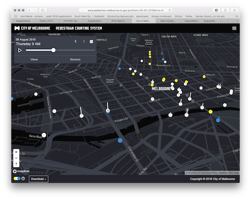
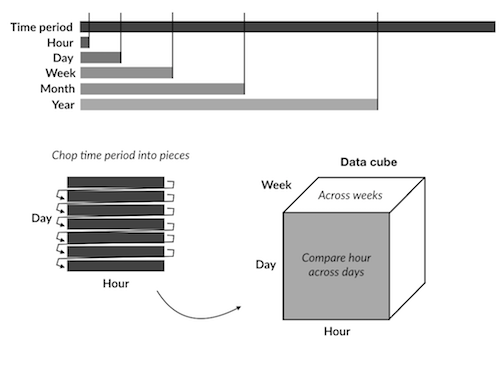

```{r titleslide, child="components/titleslide.Rmd"}
```

```{r setup, include=FALSE}
library(tidyverse)
library(knitr)
library(kableExtra)
library(lubridate)
opts_chunk$set(echo = TRUE,   
               message = FALSE,
               warning = FALSE,
               collapse = TRUE,
               fig.height = 4,
               fig.width = 8,
               fig.retina = 3,
               fig.align = "center",
               cache = FALSE)

as_table <- function(...) knitr::kable(..., format='html', digits = 3)

```


---
# Questions/Comments/Suggestions

```{r out.width = '80%', echo = FALSE}
include_graphics("images/rhythm-goyal-_-Ofoh09q_o-unsplash.jpg")
```
 Photo: Rhythm Goyal for  Unsplash.
---
# Recap: Week 2

<br><br>
- Tidy Data
- Data wrangling
- Different examples of data wrangling
- Good coding practices
- Assignment 1: released at the end of last week


---

# Week 3: Outline
<br><br>
- Going from tidy data to a data plot, using the grammar of graphics
- Mapping of variables from the data to graphical elements
- Using different geoms
- Working with dates
- Constructing graphics with dates
- Briefly talk about the assignment


```{r read-tb, echo = FALSE}
tb <- read_csv(here::here("slides",
                          "data",
                          "TB_notifications_2018-03-18.csv")) %>% 
  select(country, 
         iso3, 
         year, 
         new_sp_m04:new_sp_fu) %>%
  gather(key = stuff, 
         value = count, 
         new_sp_m04:new_sp_fu) %>%
  separate(col = stuff, 
           into = c("stuff1", 
                    "stuff2", 
                    "genderage")) %>%
  select(-stuff1, 
         -stuff2) %>%
  mutate(gender = str_sub(genderage, 1, 1), 
         age = str_sub(genderage, 2, length(genderage))) %>%
  select(-genderage) %>%
  filter(!(age %in% c("04", "014", "514", "u"))) %>%
  filter(year > 1996, 
         year < 2013)
  
tb_au <- tb %>% 
  filter(country == "Australia")  %>%
mutate(age =
  case_when(age == "1524" ~ "15-24",
            age == "2534" ~ "25-34",
            age == "3544" ~ "35-44",
            age == "4554" ~ "45-54",
            age == "5564" ~ "55-64",
            age == "65" ~ "65+"))
```


---
# Intuition: The trick of making graphs 
<br><br>
.green[Using the grammar of graphics]

1. The data has to be stored in a dataframe --> .purple[data]
2. We use the function .purple[ggplot] from .purple[ggplot2] R package

<br><br>
```{r , eval = FALSE}
ggplot(data, aes(x, y)) +
  geom_line()
```


---
# Simple example: line plot
<br><br>
.pull-left[
```{r}
data = data.frame( a= 1:10,
                   b = (1:10)*0.3)
head(data)
```
]
.pull-right[
```{r , eval = TRUE, fig.width = 3}
ggplot(data, aes(x = a, y = b)) +
  geom_line()  #<<
```
]

---
# Simple example: point plot
<br><br>
.pull-left[
```{r , fig.width = 3}
data = data.frame( a= 1:10,
                   b = (1:10)*0.3)
head(data)
```
]

.pull-right[
```{r , eval = TRUE, fig.width = 3}
ggplot(data, aes(x = a, y = b)) +
  geom_point() +  #<<
  theme_bw()   #<<
```

[More on ggplot2 themes here](https://ggplot2.tidyverse.org/reference/ggtheme.html)
]


 
---
class: transition
# Let's unpack a bit.

---
# Data Visualization
<br><br>
.blockquote[
"The simple graph has brought more information to the data analyst’s mind than any other device." — John Tukey
]

- The creation and study of the visual representation of data.
- Many tools for visualizing data (R is one of them)
- Many approaches/systems within R for making data visualizations (.green[**ggplot2**] is one of them, and that's what we're going to use).

---
# ggplot2 one of the  tidyverse packages

.left-code[
<br>
```{r ggplot-in-tidyverse, echo = FALSE, out.width = "80%"}
include_graphics("images/ggplot2-part-of-tidyverse.png")
```
]

.right-plot[
<br>
- **ggplot2** is tidyverse's data visualization package
- The `gg` in "ggplot2" stands for Grammar of Graphics
- It is inspired by the book .green[**Grammar of Graphics**] by Leland Wilkinson <sup>†</sup>
- A grammar of graphics is a tool that enables us to concisely describe the components of a graphic
- (Source: [BloggoType](http://bloggotype.blogspot.com/2016/08/holiday-notes2-grammar-of-graphics.html))
]


---
# Example: Tuberculosis data

<br><br>
.left-code[
The case notifications table From [WHO](http://www.who.int/tb/country/data/download/en/).

Data is .green[tidied] here, with only counts for Australia.

.green[Variables are displayed in the columns and cases in the rows]
]

.right-plot[
```{r print-tb-au}
tb_au
```
]


---
# Example: Tuberculosis data

<br><br>
```{r , echo = TRUE}
glimpse(tb_au)
```


---
# Step by step: Our first ggplot!
<br><br>
.left-code[
```{r first-gg-1, eval = FALSE}
library(ggplot2)
ggplot(tb_au)
```

]

.right-plot[
```{r first-gg-1-out, ref.label = 'first-gg-1', echo = FALSE, out.width = "100%"}

```

]


---
#  Step by step: Our first ggplot!
<br><br>
.left-code[
```{r first-gg-2, eval = FALSE}
library(ggplot2)
ggplot(tb_au,
       aes(x = year, #<<
           y = count)) #<<
```

]

.right-plot[
```{r first-gg-2-out, ref.label = 'first-gg-2', echo = FALSE, out.width = "100%"}

```

]

---
# Step by step: Our first ggplot!
<br><br>
.left-code[
```{r first-gg-3, eval = FALSE}
library(ggplot2)
ggplot(tb_au,
       aes(x = year, 
           y = count))  +
  geom_point() #<<
```

]

.right-plot[
```{r first-gg-3-out, ref.label = 'first-gg-3', echo = FALSE, out.width = "100%"}

```

]


---
# Step by step: Our first ggplot!
<br><br>
.left-code[
```{r first-gg-33, eval = FALSE}
library(ggplot2)
ggplot(tb_au,
       aes(x = year, 
           y = count))  +
  geom_point() +
  ylim(c(0,200)) #<< 
```

]

.right-plot[
```{r first-gg-332, ref.label = 'first-gg-33', echo = FALSE, out.width = "100%"}

```

]


---
# Step by step: Our first ggplot!
<br><br>
.left-code[
```{r first-gg-31, eval = FALSE}
library(ggplot2)
ggplot(tb_au,
       aes(x = year, 
           y = count))  +
  geom_line() #<<
```

]

.right-plot[
```{r , out.width = "100%"}
ggplot(tb_au,
       aes(x = year, 
           y = count))  +
  geom_line() 
```

]

This is **not a good plot!**

---
# Our first ggplot! 
<br><br>
```{r show-tb-au-table, echo = FALSE}
tb_au %>% slice(1:5) %>% as_table()
```

Tuberculosis case notifications table From WHO.
---
# Our first ggplot!
<br><br>
.left-code[
```{r first-gg-4, eval = FALSE}
library(ggplot2)
ggplot(tb_au,
       aes(x = year, 
           y = count))  +
  geom_col() #<<
```
- In .purple[geom_col] .green[the heights of the bars represent values in the data]
- .purple[geom_col()] uses .purple[stat_identity()] .green[to count the data and it leaves the data as is.]
]

.right-plot[
```{r first-gg-4-out, ref.label = 'first-gg-4', echo = FALSE, out.width = "100%"}

```

]

---
# Our first ggplot!
<br><br>
.left-code[
```{r first-gg-5, eval = FALSE}
library(ggplot2)
ggplot(tb_au,
       aes(x = year, 
           y = count,
           fill = gender))  + #<<
  geom_col() 
```

]


.right-plot[
```{r first-gg-5-out, ref.label = 'first-gg-5', echo = FALSE, out.width = "100%"}

```

]


Adding groups with different colors .purple[fill]!

---
# Our first ggplot!
<br><br>
.left-code[
```{r first-gg-6, eval = FALSE}
library(ggplot2)
ggplot(tb_au,
       aes(x = year, 
           y = count,
           fill = gender))  + 
  geom_col(position = "fill")  #<<
```

.green[Adding groups with different colors] .purple[geom_col(position = "fill") ]

]

.right-plot[
```{r first-gg-6-out, ref.label = 'first-gg-6', echo = FALSE, out.width = "100%"}

```

]

<br><br><br>

**By adding** .purple[position = "fill"] we are turning our data into **frequencies/proportions!**


---
# Our first ggplot!
<br><br>
.left-code[
```{r first-gg-7, eval = FALSE}
library(ggplot2)
ggplot(tb_au,
       aes(x = year, 
           y = count,
           fill = gender))  + 
  geom_col(position = "fill") +
  scale_fill_brewer( #<<
    palette = "Dark2" #<<
    ) #<<
```


]

.right-plot[
```{r first-gg-7-out, ref.label = 'first-gg-7', echo = FALSE, out.width = "100%"}

```

]

.green[Changing colors] .purple[ scale_fill_brewer(palette = "Dark2")]

---
# Our first ggplot!
<br><br>
.left-code[
```{r first-gg-8, eval = FALSE}
library(ggplot2)
ggplot(tb_au,
       aes(x = year, 
           y = count,
           fill = gender))  + 
  geom_col(position = "fill") +
  scale_fill_brewer( 
    palette = "Dark2"
    ) +
  facet_wrap(~ age) #<<
```
.green[Creating the same graph broken by different groups]
]

.right-plot[
```{r first-gg-8-out, ref.label = 'first-gg-8', echo = FALSE, out.width = "100%"}

```

]


---
# Explanation
<br><br>
- First argument provided is the name of the data, `tb_au`
- Variable mapping: .green[year is mapped to x], .green[count is mapped to y], .green[gender is mapped to colour], and .green[age is used to subset the data and make separate plots]
- The column geom is used, `geom_col`
- We are mostly interested in proportions between gender, over years, separately by age. The `position = "fill"` option in `geom_bar` sets the heights of the bars to be all at 100%. It ignores counts, and emphasizes the proportion of males and females.

---
# The "100% charts"
<br><br>
.content-box-neutral[
- .purple[geom_bar]: .green[makes the height of the bar proportional to the number of cases in each group] (while in .purple[geom_col()] we need to add .purple[position = "fill"] to achieve the same result!
- .purple[stat]: It counts the number of cases at each x position (by default)
- .purple[position = "fill"]
- .purple[scale_fill_brewer(pallet = "Dark2)]: We can use [different palettes](https://ggplot2.tidyverse.org/reference/scale_brewer.html) 
]

 
[More info about geom_col and geom_bar here]()https://ggplot2.tidyverse.org/reference/geom_bar.html 
---
# The "100% charts"
<br><br>
```{r gg-show-100pct, echo=TRUE, fig.width=8, fig.height=2}
ggplot(tb_au, aes(x = year, y = count, fill = gender)) +
  geom_bar(stat = "identity", position = "fill") +  #<<
  facet_grid(~ age) +   #<<
  scale_fill_brewer(palette="Dark2")
```


- .purple[geom_bar]: makes the height of the bar proportional to the number of cases in each group. 
- .purple[stat]: It counts the number of cases at each x position (by default).
- .purple[position = "fill] shows relative proportions at each x by stacking the bars and then standardising each bar to have the same height.


---
class: transition left
# What do we learn?

<br><br>
- Focus is on .green[**proportion**] in each category. 
- Across (almost) all ages, and years, the proportion of males having TB is higher than females
- .green[These proportions tend to be higher in the older age groups, for all years.]
- .green[**It is very important to think about what is the message that we want to convey with a figure!**]

---
# Recap: Code structure of ggplot
<br><br>
- `ggplot()` is the main function
- Plots are constructed in layers
- Structure of code for plots can often be summarised as

```r
ggplot(data = [dataset], 
       mapping = aes(x = [x-variable], 
                     y = [y-variable])) +
   geom_xxx() +
   other options
```

---
# How to use ggplot
<br><br>
- To use .purple[ggplot2] functions, first load .green[tidyverse] library.

```{r example-load}
library(tidyverse)
```

- For help with the ggplot2, see [ggplot2.tidyverse.org](http://ggplot2.tidyverse.org/)

---
class: transition
# Let's look at some more options to emphasise different features

---
# Displaying the same graph for different groups:
<br><br>
.left-code[
```{r first-gg-9, eval = FALSE}
ggplot(tb_au,
       aes(x = year, 
           y = count,
           fill = gender))  + 
  geom_col(position = "fill") +
  scale_fill_brewer( 
    palette = "Dark2"
    ) +
  facet_wrap(~ age) #<<
```

]

.right-plot[
```{r first-gg-9-out, ref.label = 'first-gg-9', echo = FALSE, out.width = "100%"}

```

]

---
# Emphasizing different features with ggplot2
<br><br>
```{r first-gg-10, fig.height = 2, fig.width = 8, out.width = "100%"}
ggplot(tb_au, 
       aes(x = year, 
           y = count, 
           fill = gender))  + 
  geom_col(position = "fill") +
  scale_fill_brewer( palette = "Dark2") +
  facet_grid(~ age) #<<
```

---
# Emphasise ... ?
<br><br>
```{r first-gg-11, fig.height = 2, fig.width = 8, out.width = "100%"}
ggplot(tb_au, 
       aes(x = year, 
           y = count, 
           fill = gender))  + 
  geom_col() + #<<
  scale_fill_brewer( palette = "Dark2") +
  facet_grid(~ age)
```

---
# What do we learn?

<br><br>
- `, position = "fill"` was removed
- Focus is on .green[**counts**] in each .green[category]. 
- Differences across ages, and years, counts tend to be lower in middle age (45-64)
- 1999 saw a bit of an outbreak, in most age groups, with numbers doubling or tripling other years.
- Incidence has been increasing among younger age groups in recent years.

---
# Emphasise ... ?
<br><br>
```{r gg-side-by-side,  fig.height = 2, fig.width = 8, out.width = "100%"}
ggplot(tb_au, 
       aes(x = year, 
           y = count, 
           fill = gender)) +
  geom_col(position = "dodge") + #<<
  scale_fill_brewer(palette = "Dark2") +
  facet_grid(~ age)
```  

---
# What do we learn?
<br><br>
- `, position="dodge"` is used in `geom_col`
- Focus is on **counts by gender**, predominantly male incidence.
- Incidence among males relative to females is from middle age on. 
- There is similar incidence between males and females in younger age groups.

---
# Separate bar charts
<br><br>

```{r gg-separate, echo=TRUE, fig.width=8, fig.height=3}
ggplot(tb_au, 
       aes(x = year, y = count, fill = gender)) +
  geom_col() +
  scale_fill_brewer(palette = "Dark2") +
  facet_grid(gender ~ age) #<<
```

---
class: transition
# What do we learn?
<br><br>
- `facet_grid(gender ~ age) +` .green[faceted by gender as well as age]
- note `facet_grid` vs `facet_wrap`
- Easier to focus separately on males and females.
- 1999 outbreak mostly affected males.
- Growing incidence in the 25-34 age group is still affecting females but seems to be have stablised for males.

---
# ~~Pie charts?~~ Rose Charts
<br>
```{r gg-rose, echo=TRUE, fig.width=8, fig.height=3}
ggplot(tb_au, 
       aes(x = year, y = count, fill = gender)) +
  geom_col() +
  scale_fill_brewer(palette="Dark2") + 
  facet_grid(gender ~ age) +
  coord_polar() + #<<
  theme(axis.text = element_blank()) #<<
```
<br>
[Polar coordinate system](https://en.wikipedia.org/wiki/Polar_coordinate_system)
is an alternative system to display points in a plane.

---
# What do we learn?

<br><br>
- Bar charts in .green[polar coordinates] produce .green[rose charts]. 
- `coord_polar() +` plot is made in polar coordinates, rather than the default Cartesian coordinates
- .green[**Emphasizes the middle years as low incidence.**] 

---
# Not a good plot: Rainbow charts

<br>
```{r gg-rainbow, echo=TRUE, out.width = "50%"}
ggplot(tb_au, aes(x = 1, 
                  y = count, 
                  fill = factor(year))) + #<<
  geom_col(position = "fill") +
  facet_grid(gender ~ age) 
```

- A single stacked bar, in each facet. 
-  .green[year is now mapped to colour] (that's what gives us the rainbow charts!)
- Pretty chart but .green[**not**] easy to interpret. 


---
# Not a good plot: (Actual) Pie charts
<br>
```{r gg-pie2, echo=TRUE, fig.width=8, fig.height=3, out.width = "50%"}
ggplot(tb_au, aes(x = 1, y = count, fill = factor(year))) +
  geom_col(position = "fill") +
  facet_grid(gender ~ age) + #<<
  coord_polar(theta = "y") + #<<
  theme(axis.text = element_blank())
```

- `coord_polar(theta="y")`  is using the y variable to do the angles for the polar coordinates to give a pie chart.
- Pretty chart but .green[**not**] easy to interpret, or make comparisons across age groups. 

---
# Visualisation: the plot and the message
<br><br>
.content-box-neutral[
- Different plots give different insight about the data.
- It is important to select the right plot to convey the message that we want to highlight.
- The grammar of graphics allow us to easily customize plots.
- The idea for any kind of plot is always the same: data, x and y axis, type of plot and then
other customization!
]

---

# References
<br><br>
- [Chapter 3 of R for Data Science](https://r4ds.had.co.nz/data-visualisation.html)
- [Data made available from WHO](https://www.who.int/tb/country/data/download/en/)
- [Garret Aden Buie's gentle introduction to ggplot2](https://pkg.garrickadenbuie.com/gentle-ggplot2/#1)
- [Mine Çetinkaya-Rundel's introduction to ggplot using star wars.](https://github.com/rstudio-education/datascience-box/tree/master/slides/u1_d02-data-and-viz)


---
background-image: url(images/allison-horst-ggplot2-masterpiece.png)
background-size: contain
background-position: 50% 50%
class: center, bottom, white

.right.purple.small[
Art by Allison Horst
]

---
class: transition

# Dealing with dates

- Needs care and it is actually a very important topic!


---
background-image: url(images/allison-horst-lubridate.png)
background-size: contain
background-position: 50% 50%
class: center, bottom, white
.right.purple.small[
Art by Allison Horst
]

---

# The challenges of working with dates and times
<br><br>
- Conventional order of .green[day, month, year] is .green[**different across locations**]
  - Australia: DD-MM-YYYY
    - "21-02-2020"
  - America: MM-DD-YYYY
    - "02-21-2020"
  - [ISO 8601](https://en.wikipedia.org/wiki/ISO_8601): YYYY-MM-DD
    - "2020-02-21"

---
background-image: url(https://imgs.xkcd.com/comics/iso_8601.png)
background-size: contain
background-position: 50% 50%
class: center, bottom, white


---
# The challenges of working with dates and times
<br><br>
- Number of .green[units change:]
.content-box-neutral[
    - Years do not have the same number of days (leap years)
    - Months have different number of days. (January vs February vs September)
    - Not every minute has 60 seconds (leap seconds!)
]    
    
    
- .green[**Times are local**]. Where are you?
- .green[**Timezones!!!**]


---
# The challenges of working with dates and times
<br><br>

- Representing time relative to it's type:
.content-box-neutral[
   - What day of the week is it? 
   - Day of the month? 
   - Week in the year?
   ]
- Years start on different days (Monday, Sunday, ...)

---
# The challenges of working with dates and times
<br><br>
- Representing time relative to it's type:

.content-box-neutral[
  - Months could be numbers or names. (1st month, January)
  - Days could be numbers of names. (1st day....Sunday? Monday?)
  - Days and Months have abbreviations. (Mon, Tue, Jan, Feb)
]

- Time can be relative: 
.content-box-neutral[
  - How many days until we go on holidays?
  - How many working days?
]


---
# Lubridate
<br><br>
.left-code[

- Simplifies date/time by helping you:
.content-box-neutral[
  - Parse values
  - Create new variables based on components like month, day, year
  - Do algebra on time
 ] 
]

.right-plot[

```{r show-lubridate, echo = FALSE, out.width = "50%"}
include_graphics("images/lubridate.png")
```
]

---

background-image: url(images/allison-horst-lubridate-ymd.png)
background-size: contain
background-position: 50% 50%
class: center, bottom, white
.right.purple.large[Art by Allison Horst]
---
class: transition

# Parsing dates & time zones using `ymd()`

---
# `ymd()` can take a character input

<br><br>
```{r show-ymd, echo = TRUE}
ymd("20190810")   #Input is a character
```
<br>
.green[year, month day]

---
# `ymd()` can also take other kinds of separators
<br><br>
```{r moar-ymd}
ymd("2020-03-31")
ymd("2020/03/31")
```


```{r even-moar-ymd}
ymd("??2020-.-03//31---")
```


.green[year, month, year]

---
# Change the letters, change the output
<br><br>
# `mdy()` expects month, day, year. 


```{r show-mdy}
mdy("03/31/2020")
```

# `dmy()` expects day, month, year.


```{r show-dmy}
dmy("03/31/2020")
```
<br>
.green[day, month, year]

---
# Add a timezone

<br><br>
If you add a time zone, what changes?

```{r add-tz}
ymd("2020-03-31", tz = "Australia/Melbourne")
```
<br>
.green[tz --> time zone]

---
# What happens if you try to specify different time zones?

<br><br>
.pull-left[

```{r add-tz-ymd}
ymd("2020-03-31", 
    tz = "Africa/Abidjan")

ymd("2020-03-31", 
    tz = "America/Los_Angeles")
```

]

.pull-right[

A list of acceptable time zones can be found [here](https://en.wikipedia.org/wiki/List_of_tz_database_time_zones) (google wiki timezone database)

]

---
# Timezones another way:

<br><br>
```{r show-today}
today()
```


```{r today-la}
today(tz = "America/Los_Angeles")
```


```{r now}
now()
```


```{r now-la}
now(tz = "America/Los_Angeles")
```

---
# Date and time: `ymd_hms()`
<br><br>

```{r ymd-hms}
ymd_hms("2020-03-31 10:05:30", 
        tz = "Australia/Melbourne")
```


```{r ymd-hms-la}
ymd_hms("2020-03-31 10:05:30", 
        tz = "America/Los_Angeles")
```
<br>

.green[year, month, day, hour, minutes, seconds]


---
# Extracting temporal elements

<br><br>

- Very often we want to know what day of the week it is
- Trends and patterns in data can be quite different depending on the type of day:
.content-box-neutral[
  - week day vs. weekend
  - weekday vs. holiday
  - regular saturday night vs. new years eve 
]

---
# Many ways of saying similar things
<br><br>
- Many ways to specify day of the week:
  - A number. .green[Does 1 mean... Sunday, Monday or even Saturday???]
  - Or text or or abbreviated text. .green[(Mon vs. Monday)]

- Talking with people we generally use.green[day name]:
  - Today is Friday, tomorrow is Saturday vs Today is 5 and tomorrow is 6.
- But, .green[doing data analysis on days might be useful to have it represented as a number]:
  - e.g., Saturday - Thursday is 2 days (6 - 4)

---
# The Many ways to say Monday 
<br>
```{r wday-and-options}
wday("2019-08-12")
wday("2019-08-12", label = TRUE)
```

```{r many-monday}
wday("2019-08-12", label = TRUE, abbr = FALSE)
wday("2019-08-12", label = TRUE, week_start = 1)
```
- .purple[label = TRUE] --> .green[adds day name & turns output into a factor]
- .purple[abbr = FALSE] --> .green[abbreviation = FALSE then we get full day name]
- .purple[week_start = 1] --> .green[Week starts on Monday]

---
# Similarly, we can extract what month the day is in.
<br><br>
```{r month-label-abbr}
month("2020-03-31")
month("2020-03-31", label = TRUE)
month("2020-03-31", label = TRUE, abbr = FALSE)
```

---
# Fiscally, it is useful to know what quarter the day is in.
<br><br>
```{r quarter-semester}
quarter("2020-03-31")
semester("2020-03-31")
```

---
# Which day is it?
<br><br>
```{r yday}
yday("2020-03-31")
```

---
# Melbourne pedestrian sensor portal
<br><br>
.pull-left[
```{r show-pedestrian-sensor, echo = FALSE, out.width = "100%"}

```
]

.pull-right[

- Contains hourly counts of people walking around the city. 
- Extract records for 2020 for the sensor at Melbourne Central
- Use .green[lubridate to extract different temporal components], so we can study the pedestrian patterns at this location. 

]

[Melbourne pedestrian sensor portal](http://www.pedestrian.melbourne.vic.gov.au/):

---
# Getting pedestrian count data with rwalkr
```{r rwalkr-load, eval = FALSE}
library(rwalkr)
walk_all <- melb_walk_fast(year = 2020)

walk <- walk_all %>% filter(Sensor == "Melbourne Central")
walk
```


```{r read-walk, echo = FALSE}
walk <- readr::read_csv("data/walk_2020.csv")
walk
```


---
# Let's think about the data structure.

.left-code[

- The .green[basic time unit is hour of the day]. 
- Date can be decomposed into 
.content-box-neutral[
    - month
    - week day vs weekend
    - week of the year
    - day of the month
    - holiday or work day
 ]   
]

.right-plot[


]


---
# What format is walk in?

```{r print-walk}
walk
```

It is a data frame (tibble) --> .green[it is an R object where we store data]
---
# Add month and weekday information

```{r walk-tidy}

walk_tidy <- walk %>%
  dplyr::filter(Sensor == "State Library") %>%
  mutate(month = month(Date,  label = TRUE, abbr = TRUE), 
         wday = wday(Date, label = TRUE, abbr = TRUE, week_start = 1))
head(walk_tidy,4)
```
<br>
- .green[We use] .purple[mutate] .green[to create two new variables]
- .green[We extract the month data from the Date variable] --> .purple[month]
- .green[We extract the day of the week from the Date variable] --> .purple[wday]


---
# Pedestrian count per month
<br><br>
.left-code[
```{r gg-walk-month-count, eval = FALSE}
ggplot(walk_tidy,
       aes(x = month, 
           y = Count)) + 
  geom_col()
```  

.purple[geom_col] --> .green[counts the number of cases at each position (x-axis)]
]

.right-plot[

```{r  echo = FALSE, out.width = "100%"}
ggplot(walk_tidy,
       aes(x = month, 
           y = Count)) + 
  geom_col()
```
]


---
# Pedestrian count per weekday
<br><br>
.left-code[
```{r gg-wday-count, eval = FALSE}
ggplot(walk_tidy,
       aes(x = wday,
           y = Count)) + 
  geom_col()
```  
]

.right-plot[
```{r , echo = FALSE, out.width = "100%"}

ggplot(walk_tidy,
       aes(x = wday,
           y = Count)) + 
  geom_col()

```
]


---
# What might be wrong with these interpretations?
<br><br>
- There might be a .green[different number of days of the week over the year].
- This means that .green[simply summing the counts might lead to a misinterpretation of pedestrian patterns]. 
- Similarly, .green[months have different numbers of days].


---
# What are the number of pedestrians per day?

```{r walk-tidy-print}
walk_tidy
```

---
# What are the number of pedestrians per day?


```{r walk-day}
walk_day <- walk_tidy %>% 
  group_by(Date) %>%
  summarise(day_count = sum(Count, na.rm = TRUE))

walk_day
```


---
# What are the mean number of people per weekday?

```{r walk-day-all}
walk_week_day <- walk_day %>%
  mutate(wday = wday(Date, label = TRUE, abbr = TRUE, week_start = 1)) %>% #<<
  group_by(wday) %>%   #<<
  summarise(m = mean(day_count, na.rm = TRUE),   #<<
            s = sd(day_count, na.rm = TRUE))

head(walk_week_day, 5)
```

---
# What are the mean number of people per weekday?
<br><br>
```{r gg-walk-day, fig.width = 8, fig.height = 3}
ggplot(walk_week_day) + 
  geom_errorbar(aes(x = wday, ymin = m - s, ymax = m + s)) +
  labs(x = "Day of week", 
       y = "Average number of pedestrians")
```  

---
class: transition
# Distribution of counts
<br><br>
Side-by-side boxplots show the distribution of counts over different temporal elements.

A [boxplot](https://ggplot2.tidyverse.org/reference/geom_boxplot.html#:~:text=geom_boxplot.Rd,all%20%22outlying%22%20points%20individually.) displays the so called five number summary of a data set: .green[min, first quartile, median, third quartile and max, the whiskers represent 1.5*IQR (interquantile range = 75th quantile - 25th quantile)]

Let's look at it in detail!

---
# Boxplot

```{r clean-data-img2, echo = FALSE, out.width = "80%"}

```


---
# Boxplot and data distribution

```{r clean-data-img, echo = FALSE, out.width = "80%"}

```

---
# Hour of the day
<br><br>
```{r gg-time-count}
ggplot(walk_tidy,
       aes(x = as.factor(Time), y = Count)) + 
  geom_boxplot()
```

---
# Day of the week
<br>
```{r}
walk_tidy <- walk_tidy %>%
mutate(wday = wday(Date, label = TRUE, abbr = TRUE, week_start = 1))
```

```{r gg-walk-weekday-count}


ggplot(walk_tidy,
       aes(x = wday,
           y = Count)) +
  geom_boxplot()
```

---
# Month
<br>
```{r}
walk_tidy <- walk_tidy %>%
  mutate(month = month(Date, label = TRUE)) 
```


```{r gg-month-count-boxplot, cache = TRUE}
ggplot(walk_tidy,
       aes(x = month, 
           y = Count)) + 
  geom_boxplot()
```

---
# Time series plots

## Lines show consecutive hours of the day

```{r gg-time-count-line, cache = TRUE}
ggplot(walk_tidy, aes(x = Time, y = Count, group = Date)) + 
  geom_line()
```

---
# By month

```{r gg-time-count-by-date}
ggplot(walk_tidy, aes(x = Time, y = Count, group = Date)) +
  geom_line() +
  facet_wrap( ~ month)
```

---
# By week day

```{r gg-time-count-line-facet-grid, fig.width = 14, fig.height = 6, cache = TRUE}
ggplot(walk_tidy, aes(x = Time, y = Count, group = Date)) +
  geom_line() +
  facet_grid(month ~ wday)
```

---
# Calendar plots (this is a bit more advanced)

.left-code[
```{r calendar-plot, eval = FALSE}
library(sugrrants)

walk_tidy_calendar <- 
  frame_calendar(walk_tidy,
                 x = Time, 
                 y = Count, 
                 date = Date, 
                 nrow = 4)

p1 <- ggplot(walk_tidy_calendar,
       aes(x = .Time, #<<
           y = .Count, #<<
           group = Date)) +
  geom_line()

prettify(p1)
```  
]

.right-plot[
```{r calendar-plot-out, ref.label = 'calendar-plot', echo = FALSE, out.width = "100%"}

```
]

*.Time* is mapped to the x and y axes respectively group by *Date*
---
# Holidays

<br><br>
- You will also learn how to plot a 
holiday calendar in the workshop on Friday using:

  - suggrants
  - tsibble
  - lubridate
  - dplyr
  - timeDate
  - rwalkr
  
  [For more info on calendar plots here](https://pkg.earo.me/sugrrants/articles/frame-calendar.html)
  
---
# Assignment 1
<br><br>

.content-box-neutral[
- It is available on Moodle
- Please read the announcement
- Info about how to submit an assignment in Moodle [here](https://guides.lib.monash.edu/moodle/assignments)
- **Go over assignment instructions and make sure you submit all the necessary files**
- Assignment must be completed on Rstudio Cloud
- Due date **5pm, March 26**. Make sure you submit on time! 
- **.red[LATE SUBMISSIONS WILL NOT BE CONSIDERED]**
]

.green[It is a great opportunity to learn, enjoy it!]
  

---

```{r endslide, child="components/endslide.Rmd"}
```


