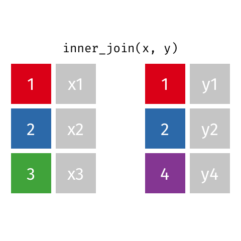

```{r titleslide, child="components/titleslide.Rmd"}
```


```{r setup, include=FALSE}
library(tidyverse)
library(knitr)
library(kableExtra)
library(emo)
library(widgetframe)
library(htmlwidgets)
opts_chunk$set(echo = TRUE,   
               message = FALSE,
               warning = FALSE,
               collapse = TRUE,
               fig.height = 4,
               fig.width = 8,
               fig.align = "center",
               cache = FALSE)

as_table <- function(...) knitr::kable(..., format='html', digits = 3)
```


---
# Questions/Comments/Suggestions

```{r out.width = '80%', echo = FALSE}
include_graphics("images/rhythm-goyal-_-Ofoh09q_o-unsplash.jpg")
```
 Photo: Rhythm Goyal for  Unsplash.
---
# Recap: Week 3
<br><br>

- Going from tidy data to a data plot, using the grammar of graphics
- Mapping of variables from the data to graphical elements
- Using different geoms
- Working with dates
- Constructing graphics with dates


---

# Week 4: Outline
<br><br>
- What is relational data?
- Combining different data sets for data analysis
- Keys
- Different sorts of joins
- Color Palettes  and effective graphs
- Maps
- Debugging
- Assignment 1 


---
class: refresher
# Recap: Tidy data

```{r print-tidy-data-og, out.width = "75%", echo = FALSE}
include_graphics("images/original-dfs-tidy.png")
```


---
# Relational data
<br><br>
- Data analysis .green[**rarely involves**] only a single table of data. 
- To answer questions you generally need to .green[combine many tables of data.]
- Multiple tables of data are called .green[*relational data*.]
- It is the .green[**relations**], not just the individual datasets, that are important.

---
# Example `nycflights13`
<br><br>
- Data set of flights that departed NYC in 2013 from https://www.transtats.bts.gov - a public database of all USA commercial airline flights. It has .green[five tables]:
<br><br>
    1. **flights**
    1. **airlines**
    1. **airports**
    1. **planes**
    1. **weather**

---
# Flights
<br>
```{r print-flights}
library(nycflights13)
names(flights)

head(flights, 3)
```

---
# Airlines
<br>
```{r print-airlines}

names(airlines)
head(airlines, 3)
```

---
# Airports
<br>
```{r print-airports}
names(airports)
head(airports, 3)
```

---
# Planes

<br>
```{r print-planes}
names(planes)
head(planes, 3)
```

---
# weather
<br>
```{r print-weather}
names(weather)
head(weather, 3)
```

---
# Concept map of tables and joins from the text

```{r show-nycflights-graphic, echo = FALSE, out.width = "80%"}
include_graphics("images/relational-nycflights.png")
```

---
# Keys `r ji("key")`
<br><br>
- .green[Keys] = variables used to connect records in one table to another. 
- In the `nycflights13` data, 
.content-box-neutral[

    - `flights` connects to `planes` by a single variable `tailnum`
    - `flights` connects to `airlines` by a single variable `carrier`
    - `flights` connects to `airports` by two variables, `origin` and `dest`
    - `flights` connects to `weather` using multiple variables, `origin`, and `year`,     `month`, `day` and `hour`.
]


---
# Joins: Combine variables 

<br><br>
- Adding variables from one table to another. 
- There is always a decision on what observations are copied to the new table as well. 
- Let's discuss how joins work using some [lovely animations](https://github.com/gadenbuie/tidyexplain) provided by [Garrick Aden-Buie](https://www.garrickadenbuie.com/).

---
# Example data

```{r print-example-data, echo = FALSE, out.width = "75%"}
include_graphics("images/original-dfs.png")
```

---
#  Left Join (Generally the one you want to use)

.left-code[
<br>
.green[**All**] observations from the .green[**left** table], but .green[only] the observations from the .green[**right** table] that match those in the left.

]

.right-plot[

```{r animate-left-join, echo = FALSE, out.width = "100%"}
include_graphics("gifs/left-join.gif")
```
]

---
# Right Join

.left-code[
<br><br>
Same as left join, but in .green[**reverse**].
]

.right-plot[
```{r animate-right-join, echo = FALSE, out.width = "100%"}
include_graphics("gifs/right-join.gif")
```
]

---
# Inner join

.left-code[
<br>
.green[Intersection] between the two tables, .green[**only the observations that are in both**]
]

.right-plot[
```{r animate-inner-join, echo = FALSE, out.width = "100%"}

```
]

---
# Outer (full) join

.left-code[
<br>
.green[Union] of the two tables, .green[**all observations from both**], .green[and missing values might get added]
]

.right-plot[
```{r animate-full-join, echo = FALSE, out.width = "100%"}
include_graphics("gifs/full-join.gif")
```
]

---
# Combine full airline name with flights data?

<br><br>

```{r print-flights-again}
names(flights)
head(flights, 3)
```

---
# Combine full airline name with flights data?


```{r print-airlines-again}
names(airlines)
head(airlines, 3)
```

---
# Combine `airlines` & `flights` using `left_join()`

.left-code[
<br>
```{r join-flights-airlines, eval = FALSE}
flights %>%
  left_join(airlines, 
            by = "carrier") %>%
  glimpse()

```  
]

.right-plot[
```{r join-flights-airlines-out, ref.label = 'join-flights-airlines', echo = FALSE}

```
]

---
# Example: flights joining to airports

.left-code[
<br>
```{r join-flights-airports, eval = FALSE}
flights %>%
  left_join(
    airports, 
    by = c("origin" = "faa")
    ) %>%
  glimpse()
```  
]

.right-plot[
```{r join-flights-airports-out, ref.label = 'join-flights-airports', echo = FALSE, out.width = "100%"}

```
]

---
# Airline travel, ontime data
<br><br>
```{r read-plane}

plane_N4YRAA <- read_csv("data/plane_N4YRAA.csv")

glimpse(plane_N4YRAA)
```

---


# Airline travel, airport location
<br><br>
```{r read-airports}
airport_raw <- read_csv("data/airports.csv")

airport_raw %>%
  select(AIRPORT, 
         LATITUDE, 
         LONGITUDE, 
         AIRPORT_STATE_NAME) %>%
  glimpse()
```

---
# How can we combine these two data sets?
<br><br>
```{r}
 plane_N4YRAA %>%
  left_join(
    airport_raw, 
    by = c("ORIGIN" = "AIRPORT")
    ) %>%
  head()
```


---
class: transition

# Data Visualization


---
# Making effective data plots
<br><br><br>
1. Principles / science of data visualisation
2. Features of graphics

---
# Principles / science of data visualization
<br><br>
.content-box-neutral[
  - .green[Palettes] and .green[colour blindness]
  - change blindness
  - using proximity
  - hierarchy of mappings
]


---
# Features of graphics 

<br><br><br>
.content-box-neutral[
- Layering statistical summaries
- Themes
- Adding interactivity
]

---
# Palettes and colour blindness
<br><br>
There are .green[three main types of colour palettes]:
<br>
.content-box-neutral[
- .green[Qualitative]: categorical variables
- .green[Sequential]: low to high numeric values
- .green[Diverging]: negative to positive values
]

---
# Qualitative: categorical variables

```{r print-qual-pal, echo=FALSE, fig.height=7, fig.width=12}
library(RColorBrewer)
display.brewer.all(type = "qual")
```

---
# Sequential: low to high numeric values

```{r print-seq-pal, echo=FALSE, fig.height=7, fig.width=12}
display.brewer.all(type = "seq")
```

---
# Diverging: negative to positive values

```{r print-div-pal, echo=FALSE, fig.height=7, fig.width=12}
library(RColorBrewer)
display.brewer.all(type = "div")
```

---
# Example: TB data
<br><br>
```{r read-tb, echo = FALSE}
# Read the tb data
tb <- read_csv("data/TB_notifications_2018-03-18.csv") %>%
  select(country, year, new_sp_m04:new_sp_fu) %>%
  gather(stuff, count, new_sp_m04:new_sp_fu) %>%
  separate(stuff, c("stuff1", "stuff2", "genderage")) %>%
  select(-stuff1, -stuff2) %>%
  mutate(
    gender = substr(genderage, 1, 1),
    age = substr(genderage, 2, length(genderage))
  ) %>%
  select(-genderage)

tb

```

---
# Example: TB data: adding relative change
<br><br>
```{r tb-increase, echo = FALSE}
tb_inc <- tb %>%
  filter(year %in% c(2002, 2012)) %>%
  group_by(country, year) %>%
  summarise(count = sum(count, na.rm = TRUE)) %>%
  spread(year, count) %>%
  mutate(reldif = if_else(condition = `2002` == 0, 
                          true = 0, 
                          false = (`2012` - `2002`) / (`2002`))) %>%
  ungroup()

tb_inc
```


```{r map-prep, echo = FALSE}
# Join with a world map
library(maps)
library(ggthemes)
# this function gets map data of
world_map <- map_data("world")
# Names of countries need to be the same in both data tables
tb_rel <- tb_inc %>%
  mutate(country = recode(
    country,
    "United States of America" = "USA",
    "United Kingdom of Great Britain and Northern Ireland" = "UK",
    "Russian Federation" = "Russia"
  ))
tb_map <- left_join(world_map, tb_rel, by = c("region" = "country"))


```


---
# Example: Sequential colour with default palette

```{r map-default, out.width = "80%", fig.height = 4, fig.width = 8}
ggplot(tb_map) + 
  geom_polygon(aes(x = long, y = lat, group = group, fill = reldif)) +
  theme_map()
```  

---
# Example: (improved) sequential colour with default palette

```{r viridis-plot, out.width = "80%", fig.height = 3, fig.width = 8}
library(viridis)
ggplot(tb_map) +
  geom_polygon(aes(x = long, y = lat, 
                   group = group,
                   fill = reldif)) +
  theme_map() + 
  scale_fill_viridis(na.value = "white")
```

---
# Example:  Diverging colour with better palette

```{r map-distiller, out.width = "80%", fig.height = 4, fig.width = 8}
ggplot(tb_map) +
  geom_polygon(aes(x = long, y = lat,
                   group = group,
                   fill = reldif)) +
  theme_map() +
  scale_fill_distiller(palette = "PRGn", na.value = "white", limits = c(-7, 7))
```

---
# Summary on colour palettes
<br><br>

- .green[Different ways] to map colour to values:

<br>
.content-box-neutral[
  - Qualitative: categorical variables
  - Sequential: low to high numeric values
  - Diverging: negative to positive values
]

---
# Colour blindness
<br><br>
- About 8% of men (about 1 in 12), and 0.5% women (about 1 in 200) population have difficulty distinguishing between red and green. 
- Several colour blind tested palettes: .green[RColorbrewer] has an associated web site [colorbrewer.org](http://colorbrewer2.org) where the palettes are labelled. See also `viridis`, and `scico`.

---
# Plot of two coloured points: Normal Mode
<br><br>
```{r colour-blind, fig.show='hold', fig.width=8, fig.height=6, echo = FALSE}
library(scales)
df <- data.frame(x = runif(100), y = runif(100), cl = sample(c(rep("A", 50), rep("B", 50))))
p <- ggplot(data = df, aes(x, y, colour = cl)) + theme_bw() +
  geom_point() + theme(legend.position = "none", aspect.ratio = 1)
library(dichromat)
clrs <- hue_pal()(3)
p
```

---
# Plot of two coloured points: dicromat mode
<br><br>
```{r colour-blind-2, fig.show='hold', fig.width=8, fig.height=6, echo = FALSE}
clrs <- dichromat(hue_pal()(3))
p + scale_colour_manual("", values = clrs)
```


---
# Impact of colourblind-safe palette
<br><br>
```{r colourblindr-brewer, echo = TRUE, fig.width=8, fig.height=6}
p2 <- p + scale_colour_brewer(palette = "Dark2")
p2
```


---
# Impact of colourblind-safe palette
<br><br>
```{r colourblindr-viridis, echo = TRUE, fig.width=8, fig.height=6}
p3 <- p + scale_colour_viridis_d()
p3
```

---
# Summary colour blindness
<br><br>
- .green[**Apply colourblind-friendly colourscales**]
<br>
.content-box-neutral[
  - `+ scale_colour_viridis()`
  - `+ scale_colour_brewer(palette = "Dark2")`
  - `scico` R package
]


---
# Pre-attentiveness: Find the odd one out?
<br><br>
```{r pre-attentiveness, echo = FALSE, fig.width=8, fig.height=6} 
df <- data.frame(x = runif(100), 
                 y = runif(100), 
                 cl = sample(c(rep("A", 1), 
                               rep("B", 99))))
ggplot(data = df, 
       aes(x, 
           y, 
           shape = cl)) + 
  theme_bw() +
  geom_point() +
  theme(legend.position = "None", aspect.ratio = 1)
```

---
# Pre-attentiveness: Find the odd one out?
<br><br>
```{r pre-attentive-easier, echo = FALSE, fig.width=8, fig.height=6}
ggplot(data = df, aes(x, y, colour = cl)) +
  geom_point() +
  theme_bw() +
  theme(legend.position = "None", aspect.ratio = 1) +
  scale_colour_brewer(palette = "Set1")
```

---
class: idea
# Using proximity in your plots
<br><br>

.green[Basic rule]: place the groups that you want to compare .green[close to each other!]


```{r read-tb-again, echo=FALSE}
tb <- read_csv("data/TB_notifications_2018-03-18.csv") %>%
  select(country, iso3, year, new_sp_m04:new_sp_fu) %>%
  gather(stuff, count, new_sp_m04:new_sp_fu) %>%
  separate(stuff, c("stuff1", "stuff2", "genderage")) %>%
  select(-stuff1, -stuff2) %>%
  mutate(
    gender = substr(genderage, 1, 1),
    age = substr(genderage, 2, length(genderage))
  ) %>%
  select(-genderage)

tb_au_2012 <- tb %>%
  filter(country == "Australia") %>%
  filter(!(age %in% c("04", "014", "514", "u"))) %>%
  filter(year == 2012)

ggplot(tb_au_2012, aes( x= age, y = count)) +
  geom_col() +
  ggtitle("Counts of TB cases in different age groups")
```

---
# Which plot answers which question?
<br><br>
.green[**Message:**]

<br><br>
.content-box-neutral[
- "Is the incidence similar for males and females in 2012 across age groups?"
- "Is the incidence similar for age groups in 2012, across gender?" 
]


---
# Incidence similar for: (M and F) or (age, across gender) ?" 

<br><br>

```{r  print-many-tb, echo=FALSE, fig.width=8, fig.height=2}
gg_fill_gender <- 
ggplot(tb_au_2012,
       aes(x = gender, 
           y = count, 
           fill = gender)) +
  geom_col(position = "dodge") +
  facet_grid(~age) +
  scale_fill_brewer(palette = "Dark2")

gg_fill_age <- 
ggplot(tb_au_2012,
       aes(x = age, 
           y = count, 
           fill = age)) +
  geom_col(position = "dodge") +
  facet_grid(~gender) +
  scale_fill_brewer(palette = "Dark2")

gg_fill_gender
gg_fill_age
```


---
# Two different arrangements
<br>
- To answer the question .green["Is the incidence similar for males and females in 2012 across age groups?"] the first arrangement is better. 
- It puts males and females right beside each other, so the relative heights of the bars can be seen quickly. The answer to the question would be "No, the numbers were similar in youth, but males are more affected with increasing age."

- The second arrangement puts the .green[focus on age groups], and is better to answer the question "Is the incidence similar for age groups in 2012, across gender?"
- To which the answer would be "No, among females, the incidence is higher at early ages. For males, the incidence is much more uniform across age groups."


---
# "Incidence similar for M & F in 2012 across age?"
<br><br>
```{r gg-fill-gender-print, fig.width=8, fig.height=2, echo = FALSE}
gg_fill_gender
```
<br>
- Males & females next to each other: .green[relative heights of bars is seen quickly]. 
- .green[**Question answer:**] "No, the numbers were similar in youth, but males are more affected with increasing age."

---
# "Incidence similar for age in 2012, across gender?"
<br><br>
```{r gg-fill-age-print, fig.width=8, fig.height=2, echo = FALSE}
gg_fill_age
```
<br>
- Puts the .green[focus on age groups] 
- .green[**Answer to the question:**] "No, among females, the incidence
is higher at early ages. For males, the incidence is much more uniform across age groups."

---
# Proximity wrap up
<br><br>
- .green[Facetting of plots and proximity]  --> are related to change blindness, an area of study in cognitive psychology. 
- There are a series of fabulous videos illustrating the effects of making a visual break,
on how the mind processes it by Daniel Simons lab. 
- Here's one example:  
[The door study](https://www.youtube.com/watch?v=FWSxSQsspiQ)

---
# Layering
<br><br>
- .green[*Statistical summaries:*] It is common to layer plots, particularly
by adding statistical summaries, like a model fit, or means and standard
deviations. The purpose is to show the **trend** in relation to the **variation**. 
- .green[*Maps:*] Commonly maps provide the framework for data collected spatially. 
One layer for the map, and another for the data.

```{r smooth-later, echo = FALSE}
df <- tibble(
  x = runif(100),
  y1 = 4 * x + rnorm(100),
  y2 = -x + 10 * (x - 0.5)^2 + rnorm(100)
)
```

---
# `geom_point()`
<br><br>
```{r point-1}
ggplot(df, aes(x = x, y = y1)) +
  geom_point() +
  theme_bw()
```

---
# `geom_smooth(method = "lm", se = FALSE)`
<br><br>
```{r point-2}
ggplot(df, aes(x = x, y = y1)) + geom_point() +
  geom_smooth(method = "lm", se = FALSE) +
  theme_bw()
```

---
# `geom_smooth(method = "lm")`

<br><br>
```{r point-3}
p1 = ggplot(df, aes(x = x, y = y1)) + geom_point() +
  geom_smooth(method = "lm")
 p1
```


---
# Interactivity with  plotly
<br><br>

```{r , fig.align = "center", eval = FALSE}
library(plotly)

ggplotly(p1)

```


DEMO


---
# Themes: Add some style to your plot


```{r mtcars, eval = FALSE}
p <- ggplot(mtcars) +
  geom_point(aes(x = wt, 
                 y = mpg, 
                 colour = factor(gear))) +
  facet_wrap(~am)
p

```  

```{r mtcars-out, ref.label = 'mtcars', echo = FALSE, out.width = "60%"}

```

---
# Theme: theme_minimal

.left-code[
<br>
```{r mtcars-minimal, eval = FALSE}
p + 
  theme_minimal()
```  
]

.right-plot[
<br>
```{r mtcars-minimal-out, ref.label = 'mtcars-minimal', echo = FALSE, out.width = "100%"}

```
]
---
# Theme: ggthemes `theme_few()`

.left-code[
<br>
```{r mtcars-theme-few, eval = FALSE}
p + 
  theme_few() + 
  scale_colour_few()
```  
]

.right-plot[
<br>
```{r mtcars-theme-few-out, ref.label = 'mtcars-theme-few', echo = FALSE, out.width = "100%"}

```
]

---
# Theme: ggthemes `theme_excel()` `r ji("sick")`

.left-code[
<br><br>
```{r mtcars-theme-excel, eval = FALSE}
p + 
  theme_excel() + 
  scale_colour_excel()
```  
]

.right-plot[
<br><br>
```{r mtcars-theme-excel-out, ref.label = 'mtcars-theme-excel', echo = FALSE, out.width = "100%"}

```
]
---
# Theme: for fun

.pull-left[
<br><br>
```{r theme-wes, eval = FALSE}
library(wesanderson)
p + 
  scale_colour_manual(
    values = wes_palette("Royal1")
    )

```  
]

.pull-right[
<br><br>
```{r theme-wes-out, ref.label = 'theme-wes', echo = FALSE, out.width = "100%"}

```
]


---
# Themes

```{r}
 p +
  theme_bw() +
   theme(
  panel.grid.major.y = element_blank(),
  panel.grid.minor.y = element_blank(),
  axis.text.x = element_text(angle = 90),
  axis.ticks = element_blank(),
  text = element_text(size=20)
  
)
  
```


---
# Summary: themes
<br><br>
.content-box-neutral[
- The `ggthemes` package has many different styles for the plots. 
- Other packages such as `xkcd`, `skittles`, `wesanderson`, `beyonce`, `ochre`, ....
]


---

# More on data vizsuzalization
<br><br>

**Hierarchy of mappings more resources:**

- [Di's crowd-sourcing expt](http://visiphilia.org/2016/08/03/CM-hierarchy)
- Nice explanation by [Peter Aldous](http://paldhous.github.io/ucb/2016/dataviz/week2.html)
- [General plotting advice and a book from Naomi Robbins](https://www.forbes.com/sites/naomirobbins/#2b1e20082a6a)

**Data visualization references**

- Kieran Healy [Data Visualization](http://socviz.co/index.html)
- Winston Chang (2012) [Cookbook for R](graphics cookbook)
- Antony Unwin (2014) [Graphical Data Analysis](http://www.gradaanwr.net)
- Naomi Robbins (2013) [Creating More Effective Charts](http://www.nbr-graphs.com)

---
class: transition
# Debugging code

---
# Assignment

<br><br>

- **Late submissions will not be accepted**
- Friday 5pm, March 26.
- Please make sure you upload the three files


---

```{r endslide, child="components/endslide.Rmd"}
```