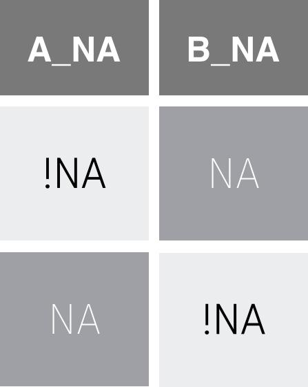
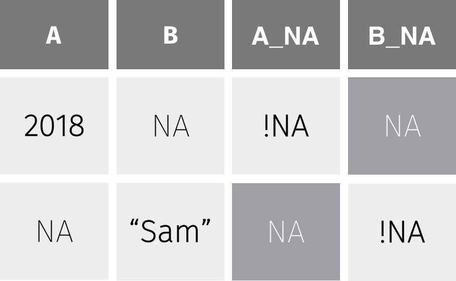

```{r titleslide, child="components/titleslide.Rmd"}
```

```{r setup, include=FALSE}
library(tidyverse)
library(knitr)
library(kableExtra)
library(tuneR)
library(textreadr)
library(rvest)
opts_chunk$set(echo = TRUE,   
               message = FALSE,
               warning = FALSE,
               collapse = TRUE,
               fig.height = 5,
               fig.width = 8,
               out.width = "80%",
               fig.retina = 2,
               fig.align = "center",
               cache = FALSE)

as_table <- function(...) knitr::kable(..., format='html', digits = 3)
```

---
# Questions/Comments/Suggestions

```{r out.width = '80%', echo = FALSE}

```
 Photo: Rhythm Goyal for  Unsplash.
 
---
# Tutorial replacements for Friday
<br><br>
- Tutorial/02.ETC5510 (Chin Quek) Wed 31st at 4.30pm. --> online (usually Fridays 4pm)
- Tutorial/05.ETC5510 (Samithree Rajapaksha) Tues 30th at 9.00am. --> online  (usually Fridays 12pm)
- Tutorial/12_LiveStream.ETC5510 (Nitika Kandhari) Thurs 1st at 2.00pm. --> online
  (usually Fridays 4pm)
 
---
# Recap: Week 4
<br><br>

- What is relational data?
- Combining different data sets for data analysis
- Keys
- Different sorts of joins
- Color Palettes  and effective graphs
- Maps
- Debugging


---

# Week 5: Outline
<br><br>
-  What even are missing values?

- How to start looking at missing data?

- How to start exploring missing data?

- How to impute (fill in) Missing values?

- Different file formats
    - Audio / binary


```{r prepare-data, echo = FALSE}
library(tidyverse)
library(visdat)
library(naniar)

tb <- read_csv("data/TB_notifications_2018-03-18.csv") %>%
  select(country, iso3, year, new_sp_m04:new_sp_fu) %>%
  gather(stuff, count, new_sp_m04:new_sp_fu) %>%
  separate(stuff, c("stuff1", "stuff2", "genderage")) %>%
  select(-stuff1, -stuff2) %>%
  mutate(
    gender = substr(genderage, 1, 1),
    age = substr(genderage, 2, length(genderage))
  ) %>%
  select(-genderage)

tb_au <- tb %>%
  filter(country == "Australia")


dat_sf_clean <- readr::read_rds(here::here("slides/data/dat_sf_clean.rds"))

```

---
class: center
# Example


San Francisco weather data 

|| Date | Wind | Temp ||

Using the R package: [`GSODR`](https://data.noaa.gov/dataset/dataset/global-surface-summary-of-the-day-gsod)

[(Global Surface Summary of the Day)](https://data.noaa.gov/dataset/dataset/global-surface-summary-of-the-day-gsod)

Written by Adam Sparks

github.com/ropensci/GSODR
---

```{r sf-intro-temp-data, out.width = "100%", echo = FALSE, fig.width = 8, fig.height = 5}
# let's messy up the data
ggplot(
  dat_sf_clean,
  aes(
    x = date,
    y = temp_avg
  )
) +
  geom_line()
```

---
class: transition

# These gaps are missing values! 

Typically encoded as NA's

---

# Some Questions

<br><br>

.content-box-neutral[

- What are some reasons this might be a problem?
- What is missing? 
- Why are they missing?
- How can we summarise and explore this?
]


---
# One way to show missing data

```{r sf-final-miss-mech2, out.width = "90%", echo = FALSE}
ggplot(
  dat_sf_clean,
  aes(
    x = wind_speed_max,
    y = temp_avg
  )
) +
  geom_miss_point()
```

---
# What do we see in that plot?
<br><br>

We can create a graphic where we can see the data that are present are in blue, and the data that are missing are in red. What we see here then is that the data that are missing for air temperature are in red here, but are actually measured only beyond gust speeds of 8 kpmh

So in cases of strong winds, the air temperature measurements break. 

---

# Where do the missing values come from?
<br><br>

.content-box-neutral[
- In many cases, it is obvious to point out the precise mechanism that generated missing values.
- However, in most cases knowning the reason why we have missing values in the data is difficult specially when there is a lot of missing data, or when there are many variables.  
]


---
# Learn more about missing values

```{r learn-more, echo = FALSE, out.width = "70%"}
knitr::include_graphics("https://imgs.njtierney.com/hex-visdat-and-naniar.png")
```

.pull-left[
.center[

visdat.njtierney.com

]
]

.pull-right[
.center[

naniar.njtierney.com

]
]


---
# What are missing values?
<br>

> Missing values are values that should have been recorded but were not.

.content-box[`NA` = **N**ot **A**vailable.]

- .green[Missing values are values that should have been recorded, but were not.]

Think of it this way: 

- You might accidentally not record seeing a bird - this is a missing value. 
- This is different to recording that there were no birds observed.

.green[R stores missing values as `NA`, which stands for **N**ot **A**vailable.]


---
# How do I check if I have missing values?
**Using the R package .purple[naniar]**

```r
x <- c(1, NA, 3, NA, NA, 5)
```

```r
library(naniar)
any_na(x)   # Is there any missing values?
```

```
[1] TRUE
```

```r
are_na(x)   # Is a vector entry missing?

```

```
[1] FALSE  TRUE FALSE  TRUE  TRUE FALSE
```

```r
n_miss(x)  # what is the number of missing values?
```

```
[1] 3
```

```r
prop_miss(x)  # What is the proportion of missing values?
```

```
[1] 0.5   # 3/6  = 0.5 
```

---
# Missing values 

- Missing values don't jump out and scream "I'm here!". 
- They're usually hidden, like a needle in a haystack.
- To detect missing values use `any_na`, which returns TRUE if there are any missings, and FALSE if there are none.
- `are_na` asks "are these NA?" and returns TRUE/FALSE for each value
- `are_na` shows us 3 TRUE values - 3 missing values.
- To avoid counting each TRUE yourself, `n_miss` counts the number of missings
- And `prop_miss` gives the proportion of missings, which gives important context: 50% of data is missing!


---
# Working with missing data
<br><br>
.green[Remember the assignment - na.rm = TRUE?]

Reason: 

`NA` + [anything] = `NA`

```r
heights
```

```
Sophie    Dan   Fred 
   165    177     NA 
```

```r
sum(heights)
```

```
[1] NA
```

---
# Working with missing data

<br><br>

`na.rm = TRUE` will remove missings values from an operation

```r
sum(heights, na.rm = TRUE)
```

```
[1] 342
```

**Use this `responsibly` and knowing what you are doing!!**

---

# Dangers of removing missing values

.green[You can remove most of or all of your data:]


```{r diagonal, echo = FALSE}
dat_df <- data.frame(x = 1:9,
                     y = 1:9,
                     z = 1:9)

dat_df$x[1:3] <- NA
dat_df$y[4:6] <- NA
dat_df$z[7:9] <- NA

knitr::kable(dat_df)
```

---

# Dangers of removing missing values
<br><br>
You can remove most of or all of your data:

```{r vis-miss-dat-df, out.width = "80%"}
vis_miss(dat_df)
```

---

# Dangers of removing missing values
<br><br>
You can remove most of or all of your data:
<br><br>
```{r}
na.omit(dat_df)
```
<br><br>
When you were not intending to do that!

---

# `na.omit` / `na.rm` = listwise delection

|  x|  y|  z|
|--:|--:|--:|
| ~~NA~~|  ~~1~~|  ~~1~~|
| ~~NA~~|  ~~2~~|  ~~2~~|
| ~~NA~~|  ~~3~~|  ~~3~~|
|  ~~4~~| ~~NA~~|  ~~4~~|
|  ~~5~~| ~~NA~~|  ~~5~~|
|  ~~6~~| ~~NA~~|  ~~6~~|
|  ~~7~~|  ~~7~~| ~~NA~~|
|  ~~8~~|  ~~8~~| ~~NA~~|
|  ~~9~~|  ~~9~~| ~~NA~~|

---

# `na.omit` / `na.rm` = listwise delection

|  x|  y|  z|
|--:|--:|--:|
| ~~NA~~|  ~~1~~|  ~~1~~|
| ~~NA~~|  ~~2~~|  ~~2~~|
| ~~NA~~|  ~~3~~|  ~~3~~|
|  4| NA|  4|
|  5| NA|  5|
|  6| NA|  6|
|  7|  7| NA|
|  8|  8| NA|
|  9|  9| NA|

---

# `na.omit` / `na.rm` = listwise delection

|  x|  y|  z|
|--:|--:|--:|
| ~~NA~~|  ~~1~~|  ~~1~~|
| ~~NA~~|  ~~2~~|  ~~2~~|
| ~~NA~~|  ~~3~~|  ~~3~~|
|  ~~4~~| ~~NA~~|  ~~4~~|
|  ~~5~~| ~~NA~~|  ~~5~~|
|  ~~6~~| ~~NA~~|  ~~6~~|
|  7|  7| NA|
|  8|  8| NA|
|  9|  9| NA|

---

# `na.omit` / `na.rm` = listwise delection

|  x|  y|  z|
|--:|--:|--:|
| ~~NA~~|  ~~1~~|  ~~1~~|
| ~~NA~~|  ~~2~~|  ~~2~~|
| ~~NA~~|  ~~3~~|  ~~3~~|
|  ~~4~~| ~~NA~~|  ~~4~~|
|  ~~5~~| ~~NA~~|  ~~5~~|
|  ~~6~~| ~~NA~~|  ~~6~~|
|  ~~7~~|  ~~7~~| ~~NA~~|
|  ~~8~~|  ~~8~~| ~~NA~~|
|  ~~9~~|  ~~9~~| ~~NA~~|

---
class: transition

# Important!
<br><br>

- na.rm or na.omit can remove entire rows containing missings
- This is bad because you can lose data - sometimes all your data! This might not be what you anticipate!
- It can also mean that you are removing / censoring observations.


---
# Dangers of removing missing values

You can introduce bias - what happens when you remove the NAs? 

```{r inside-outside, echo = FALSE}
df_inside <- 
data.frame(temp = c(27, 26, NA, 29, NA, 20, 21, 24),
           location = c("inside", 
                        "inside", 
                        "outside", 
                        "inside", 
                        "outside", 
                        "outside",
                        "outside",
                        "inside"))

kable(df_inside)
```


---
# Dangers of removing missing values
<br><br>
.green[So what happens when we mix missing values with our calculations?] 
.content-box[
We need to know what happens, so we can be primed to find these cases. The general rule is this:]
<br><br>

- Calculations with `NA` return `NA`.

- Say you have the height of three friends: Sophie,  Dan, and Fred.

- The sum of their heights returns `NA`, 

.content-box[This is because we don't know the sum of a number and NA.]


---
# Introduction to missingness summaries

<br><br>

- Now that you understand what missing values are,
how to count them, and how they operate, let's scale these up to more detailed summaries of missingness.

- We need to summarise missing data to identify variables, 
cases, or patterns of missingness, as these can bias our data analysis.


---
# Introduction to missingness summaries


**.green[Basic summaries of missingness (R package narniar):]**

- `n_miss`  --> number of missing values
- `n_complete` --> Total number of values - missing values (complete values)

**.green[Dataframe summaries of missingness (R package narniar):]**

- `miss_var_summary` --> Number of variables with missing values
- `miss_case_summary` --> Number of cases with missing values

These functions work with `dplyr::group_by` and return the number and percentage of missings in each variable or case
so you can fluidly explore missingness for different groups.


---
# Naniar
<br><br>

.content-box[
`naniar` provides a family of functions all starting with `miss_`., which each provide different summaries of missingness, and return a dataframe.]


<!-- --- -->
<!-- # Introduction to missingness summaries -->

<!-- .green[There are two main summaries: **basic, and dataframe summaries**.] -->

<!-- - Basic summaries return a single number, like the number of missing or complete values using `n_miss` or `n_complete`.  -->
<!-- - However, you will need more detailed missingness summaries to help you on your journey through a data analysis.  -->

<!-- - `naniar` provides a family of functions all starting with `miss_`., which each provide different summaries of missingness, and return a dataframe.  -->

<!-- - This allows us to see features that can be difficult to articulate, or time consuming to calculate.  -->

<!-- - For example, `miss_var_summary` and `miss_case_summary` return the number and percentage of missings in each variable or case. -->

<!-- - These summaries work with `dplyr`''s `group_by`, so you can fluidly explore missingness by each groups. -->


---
# Missing data summaries: Variables
<br><br>
```{r aq-miss-var-summary}
miss_var_summary(dat_sf_clean)
```
.content-box[For example, temp_max has .green[70 missing value]s, and is about .green[17.3] percent missing.]

---
# Missing data summaries: Variables example
<br><br>
- Use `miss_var_summary` to summarise the number of missings in each variable. 

- This returns a dataframe where each row is a variable. It also includes summaries of the number and percentage of missings for each variable in the dataset, and is sorted by the number of missings.

<br><br>
.content-box[For example, temp_max has 70 missing values, and is about 17.3 percent missing.]


---
# Missing data summaries: Cases (rows)
<br><br>

- Similar to `miss_var_summary`, `miss_case_summary` returns a summary dataframe, .green[where each case  represents a dataset row number.]

- .purple[n_miss] --> number a variables that have a missing case for a given row
- .purple[pct_miss] --> percentage of missing accross all the variables

---
# Missing data summaries: Cases example
<br><br>

.left-code[
```{r aq-miss-cas-summary}
miss_case_summary(dat_sf_clean)
```

]
.right-code[
.content-box[Here, case 5 - the fifth row in the dataset - has variables with 3 missing values for that case, which means 50% of the variables have mising values for that case/row.]
]
---
# Missing data tabulations: variables
<br><br>
```{r aq-miss-var-tab}
miss_var_table(dat_sf_clean)
```
- .purple[n_miss_in_var] number of missing values
- .purple[n_vars] in how many variables?
---
# Missing data tabulations: cases
<br><br>
- Tabulation of missingness counts the number of times there are 0, 1, 2, 3, and so on, missings. They are very useful, compact summaries that reveal interesting structure.

- `miss_var_table` .green[returns a dataframe with the number of missings in a variable, and the number and percentage of variables affected.] 


- Similarly, `miss_case_table` returns the same information, but for cases.

---
# Missing data tabulations: cases example
<br><br>
```{r aq-miss-case-tab}
miss_case_table(dat_sf_clean)
```
 - .purple[n_miss_in_case] --> number of missing values 
 - .purple[n_cases] --> number of cases or rows that have the n_miss_in_case number of missing values


---
# Missing values accross gruups
<br><br>
Sometimes you are interested in missingness for groups in the data.

.content-box-soft[
- Each missingness summary function can be calculated by group, using `group_by` from `dplyr`.

- For example, we can look at the missingness by Month in the airquality dataset.
]

---
# Using summaries with `group_by`

```{r aq-group-miss-var-sum}
dat_sf_clean %>%
  group_by(month) %>%
  miss_var_summary()
```


---
# Introduction to missing data visualisations in naniar
<br><br>

- Visualisation can quickly capture an idea or thought.
- `naniar` provides a friendly family of missing data visualization functions.
- Each visualization corresponds to a data summary.
- Visualisations help you operate closer to the speed of thought.


<!-- --- -->

<!-- We cover how to get a bird's eye view of the data, how to look at missings in the variables and cases, and how to generate visualizations for missing spans and across groups in the data. -->

<!-- We now know what missing values are, how they work, how to count and summarise them - now let's look at some of the built-in visualisations that come with `naniar`. -->

<!-- Data summaries are very useful, but sometimes an idea or a thought can be quickly captured with a visualisation.  -->

<!-- `naniar` provides a friendly family of missing data visualisation functions, each presenting different visualisations missingness summaries. -->

<!-- In fact, each of these visualisations is a nice compact shorthand for the data summaries. While you could create similar and more complex visualisations using the summary information from the previous lesson, this can be repetitive. The visualisations in `naniar` reduce repetition and increase iteration, so you can operate closer to the speed of thought. -->

---
# Get a bird's eye view of the missing data

```{r aq-vis-miss}
vis_miss(dat_sf_clean)
```

---
# Data overview
<br>
- When you first get a dataset, it can be difficult to get a visceral sense of **where** the missings are. 

- To get an overview of the amount of missingness, use the `vis_miss` function from the `visdat` package. 

- `vis_miss` produces a "heatmap" of the missingness - like as if the plot corresponded to the dataset as a giant spreadsheet, with values coloured black for missing, and grey for present.

- `vis_miss` also provides missingness summary statistics, showing the overall percentage of missingness in the legend, and the amount of missings in each variable. 

- These can be turned off in its options, described in the helpfile.


---
# Clustering the missing data by re-ordering rows

<br><br>

`vis_miss` also allows for clustering of the missing data by setting `cluster = TRUE` --> this orders the rows by missingness to identify common co-occurrences.

---
# Get a bird's eye view of the missing data

```{r aq-vis-miss-cluster}
vis_miss(dat_sf_clean, cluster = TRUE)
```


---
# Visualizing missing in variables and cases

- To quickly show the missingness in variables and cases, we visualise them using `gg_miss_var` and `gg_miss_case`. Note that these are visual analogues of the `miss_var_summary` and `miss_case_summary` functions.

- These plots show the amount of missingness on the x axis, and for `gg_miss_var`, each point represents the amount of missingness in that variable, and for `gg_miss_case`, each line represents the amount of missingness in that case.

- Note that these visualisations are ordered so that the most missing is at the top. The ordering in `gg_miss_case` can be turned off with option, `order_cases = FALSE`.

---
# Look at missings in variables

```{r aq-gg-miss-var, out.width = "80%"}
gg_miss_var(dat_sf_clean)
```
Lollipop chart

---
# Look at missings in cases

```{r aq-gg-miss-case, out.width = "80%"}
gg_miss_case(dat_sf_clean)
```


---
# Visualizing missing by facets

<br><br>

.content-box-soft[
`gg_miss_var` and `gg_miss_case` also allow for facetting by one variable.
]
<br><br>
- This means you can explore missingness in cases and variables across the levels of another group. 

- This plot is facetted by month, showing the number of missings in each variable for each month.


---
# Look at missings in variables using facets

```{r}
gg_miss_var(dat_sf_clean, facet = month)
```


---
# Visualizing combinations
<br><br>
To visualise the common combinations of missingness - which variables and cases go missing together, use `gg_miss_upset`. 

This powerful visualisation shows the number of combinations of missing values that co-occur.


---
# Visualizing missingness patterns

```{r}
gg_miss_upset(dat_sf_clean)
```

<!-- An upset plot of the `airquality` dataset shows there are only missing values in Ozone and Solar.R, with 35 in only Ozone, 5 in Solar.R, and in both Ozone and Solar.R, there are 2 missing cases. -->


---
class: middle
# Functions

.pull-left[
# `miss_*`
# `miss_var_*`
# `miss_case_*`
]


.pull-right[
# `gg_miss_*`
# `gg_miss_var`
# `gg_miss_case`
]


---
class: transition

# Representing _Missing_ values in a _Tidy_ Way

---
# Tidy Data

.pull-left[

Variables in columns

Observations in Rows

One value per cell
]

.pull-right[
```{r fig.align='center', out.width="100%", echo = FALSE}

```
]

---


# Data Shadow

.pull-left[
Variable ends in NA

Values are missing (NA) or not (!NA)
]

.pull-right[
```{r fig.align='center', out.width = "100%", echo = FALSE}

```
]

---
class: center middle

# Tidy Missing Data 

`bind_shadow(data)`

```{r fig.align='center', out.width = "60%", echo = FALSE}

```

---


# `bind_shadow()`

```{r echo = TRUE, warnings = FALSE}

bind_shadow(dat_sf_clean) %>% glimpse()
```

---
# Shadows In Practice: Explore one variable

```{r shadow-plot-no-na, echo = TRUE, out.width = "70%", message = FALSE, warning = FALSE}

dat_sf_clean %>% 
  ggplot(aes(x = wind_speed_max)) + 
  geom_density()

```

---
# Shadows In Practice: Explore one variable

```{r shadow-plot-2, echo = TRUE, out.width = "60%", message = FALSE, warning = FALSE}

dat_sf_clean %>%
bind_shadow() %>% #<<    # Distribution of wind when temp is missing and when it is not
  ggplot(aes(x = wind_speed_max,
           colour = temp_avg_NA)) + #<<
  geom_density()

```


---
# In Practice: Explore two variables
<br><br>

.left-code[
```{r gg-explore-two, eval = FALSE}
ggplot(dat_sf_clean, 
       aes(x = temp_avg, 
           y = wind_speed_max)) + 
  geom_point()

```  
]

.right-plot[
```{r gg-explore-two-out, ref.label = 'gg-explore-two', echo = FALSE, out.width = "100%"}

```
]


---
class: transition
#Imputing  missing values

---
# Impute shadow values into our realm
<br><brr>
.pull-left[
```{r show-missings, echo = FALSE}
dat_sf_clean %>%
  cast_shadow(temp_avg) %>%
  slice(1:7) 
```
]


.pull-right[
```{r show-imputed, echo = FALSE}
dat_sf_clean %>%
  cast_shadow(temp_avg) %>%
  slice(1:7) %>%
  mutate(temp_avg = impute_below(temp_avg))
```
]


<!-- One approach, (ggobi) is to **shift** missing values below the minimum value -->

<!-- This then means that they can be plotted on the same axis. -->

<!-- Typically, when exploring this data, you would do something like this: -->

<!-- The problem with this is that ggplot does not handle missings be default, and removes the missing values. This makes it hard to explore the missing values. -->

---
# `impute_below()`

# Impute missing values from the shadows into our realm

```{r echo = TRUE}
dat_sf_clean %>%
  slice(5:10) %>%
  mutate(temp_avg_shift = impute_below(temp_avg)) %>% #<<
  select(temp_avg, temp_avg_shift)

``` 

---
# `geom_miss_point()`
<br><br>

.left-code[
```{r gg-geom-miss-point, eval = FALSE}
ggplot(dat_sf_clean, 
       aes(x = wind_speed_max, 
           y = temp_avg)) + 
  geom_miss_point() #<<

```  
.purple[geom_miss_point] provides a way to transform and plot missing values in ggplot2. 
]

.right-plot[
```{r gg-geom-miss-point-out, ref.label = 'gg-geom-miss-point', echo = FALSE, out.width = "100%"}
```
]

.small[
.green[.purple[geom_miss_point] uses functions  from ggobi and manet, where missing values (“NA”) are replaced with values 10% lower than the minimum value in that variable and plot in red on the figure.]
]
---
class: center

# Facets!

```{r ggmissing-facet, echo = FALSE}

ggplot(dat_sf_clean, 
       aes(x = wind_speed_max, 
           y = temp_avg)) + 
  geom_miss_point() + 
  facet_wrap(~lubridate::month(dat_sf_clean$date))

```

---
class: transition
# Exploring imputed values


Imputation is the process of filling in missing values with some other estimate

---
# What about this imputation thing? 

```{r echo = TRUE, warning = FALSE, out.width = "60%", fig.width = 10, fig.height =4}

dat_sf_clean %>%  
  as.data.frame() %>% 
  simputation::impute_lm(temp_avg ~ wind_speed_max) %>% #<<
  ggplot(aes(x = date,
             y = temp_avg)) + 
  geom_point()
  
```
<br>
Where are the inputed values? They are **invisible!**


---
# Tidy Missing Data reveals the imputations!

```{r echo = TRUE, message=FALSE, warning = FALSE, out.width = "60%", fig.width = 10, fig.height =4}

bind_shadow(dat_sf_clean) %>% #<<
  as.data.frame() %>% 
  simputation::impute_lm(temp_avg ~ wind_speed_max + date) %>%
  as_tibble() %>% 
  ggplot(aes(x = date,
             y = temp_avg,
             colour  = temp_avg_NA)) + #<<
  geom_point() +
  scale_colour_brewer(palette = "Dark2")
  
```

---
# Shadows make things clearer!

```{r echo = TRUE, message=FALSE, warning = FALSE, out.width = "60%"}
bind_shadow(dat_sf_clean) %>% #<<
  as.data.frame() %>% 
  simputation::impute_lm(temp_avg ~ wind_speed_max) %>%
  ggplot(aes(x = temp_avg,
             fill = wind_speed_max_NA)) +  #<<
  geom_density(alpha = 0.5) 
```


---
# Example data: oceanbuoys

```{r print-tao}
oceanbuoys
```

---
# Start looking at missing values

```{r vismiss-ocean}
vis_miss(oceanbuoys)
```

???

West Pacific Tropical Atmosphere Ocean Data, 1993 & 1997, for improved detection, understanding and prediction of El Nino and La Nina, collected from [http://www.pmel.noaa.gov/tao/index.shtml](http://www.pmel.noaa.gov/tao/index.shtml)

The data has 736 observations, and 8 variables. All of the variables are numeric (including year).

???

What do we learn?

- Two variables, air temperature and humidity,  have a large number of missings.
- Year, latitude and longitude have no missings
- Sea temperature has a couple of missings
- Some rows have a lot of missings

Overall statistics, 3% of possible values are missing. That's not much. BUT, both air temperature and humidity have more than 10% missing which is too much to ignore.

This type of display is called a "heatmap", displays the data table, with cells coloured according to some other information. In this case it is type of variable, and missingness status. What do we learn?

- Most of the variables are `character` (text) variables, or `integer` variables.
- Missing values are located only in the counts, but it is in blocks, so perhaps corresponds to some category levels of the other variables.

---
# Missing value patterns

```{r}
gg_miss_upset(oceanbuoys)
```


---
# Missings Tend to get ignored by most software

.left-code[
```{r gg-show-warning, eval = FALSE}
ggplot(oceanbuoys,
  aes(x = sea_temp_c,
      y = humidity)) +
  geom_point() + 
  theme(aspect.ratio = 1)
```  
]

.right-plot[
```{r gg-show-warning-out, ref.label = 'gg-show-warning', echo = FALSE, out.width = "100%"}

```
]


and this is a problem, because results computed on data with missing values might be biased.

---
# Add missings to plot with `geom_miss_point()`

.left-code[
```{r gg-ocean-show-geom-miss, eval = FALSE}
ggplot(oceanbuoys,
       aes(x = sea_temp_c,
           y = humidity)) +
  scale_colour_brewer(
    palette="Dark2") +
  geom_miss_point() + 
  theme(aspect.ratio=1)
```  
]

.right-plot[
```{r gg-ocean-show-geom-miss-out, ref.label = 'gg-ocean-show-geom-miss', echo = FALSE, out.width = "100%"}

```
]

---
# Facet By year

```{r gg-ocean-by-year, out.width = "60%"}
ggplot(oceanbuoys,
       aes(x = sea_temp_c,
           y = humidity)) +
  geom_miss_point() + 
  scale_colour_brewer(
    palette = "Dark2") +
  facet_wrap(~year) + 
  theme(aspect.ratio=1) 
```  

---
# Understanding missing dependencies

.left-code[
```{r gg-ocean-year, eval = FALSE}
ggplot(oceanbuoys,
       aes(x = sea_temp_c,
           y = air_temp_c)) +
  geom_miss_point() + 
  scale_colour_brewer(
    palette="Dark2") +
  facet_wrap(~year) + 
  theme(aspect.ratio=1)

```  
]

.right-plot[
```{r gg-ocean-year-out, ref.label = 'gg-ocean-year', echo = FALSE, out.width = "100%"}

```
]

???

What do we learn?

- There is a different missingness pattern in each of the years
- Year needs to be accounted for in finding good substitute values.

---
# Strategies for working with missing values

<br><br>

.content-box-neutral[
- Small fraction of cases have several missings (around 5%) - explore data, and possibly drop the cases
- A variable or two, out of many, have a lot of missings, drop the variables
]
---
# Strategies for working with missing values

<br><br>

.content-box-neutral[
- If missings are small in number, but located in many cases and variables, you need to impute these values, to do most analyses
- Designing the imputation should take into account dependencies that you have seen between missingness and existing variables.
- For the ocean buoys data this means imputation needs to be done separately by year
]
---
# Common ways to impute values
<br><br>

.content-box-neutral[
- (Usually bad) Simple parametric: use the mean or median of the complete cases for each variable
- (Better) More complex: use models to predict missing values
- (Best) Multiple imputation: Use a statistical distribution, e.g. normal model and simulate a value (or set of values, hot deck imputation) for the missings.
]
---
# Setup for missings

```{r tao-shadow}
tao_shadow <- bind_shadow(oceanbuoys)

tao_shadow
```

---
# Imputing the Mean (ignoring year).
<br><br>
```{r}
tao_imp_mean <- tao_shadow %>%
  mutate(sea_temp_c = impute_mean(sea_temp_c),
         air_temp_c = impute_mean(air_temp_c))

tao_shadow
```

---
# Imputing the Mean (ignoring year).

.left-code[
```{r gg-vis-mean-imp, eval = FALSE}
ggplot(tao_imp_mean,
       aes(x = sea_temp_c,
           y = air_temp_c, 
           colour = 
             air_temp_c_NA)) +
  geom_point(alpha = 0.7) + 
  facet_wrap(~year) + 
  scale_colour_brewer(
    palette = "Dark2") +
  theme(aspect.ratio = 1)

```  
]

.right-plot[
```{r gg-vis-mean-imp-out, ref.label = 'gg-vis-mean-imp', echo = FALSE, out.width = "100%"}

```
]

???

What do we learn?

- Oh, this is so wrong!
- The imputed values are nothing like the complete case values

---
# Impute Mean by year
<br><br>
```{r imp-by-year}

tao_shadow <- tao_shadow %>%
  group_by(year) %>%
  mutate(sea_temp_c = impute_mean(sea_temp_c),
         air_temp_c = impute_mean(air_temp_c))

head(tao_shadow, 5)
```


---
# by year
<br><br>
.left-code[
```{r gg-imp-mean-by-year, eval = FALSE}
ggplot(tao_shadow,
       aes(x = sea_temp_c,
           y = air_temp_c, 
           colour=air_temp_c_NA)) +
  geom_point(alpha=0.7) + 
  facet_wrap(~year) + 
  scale_colour_brewer(
    palette="Dark2") +
  theme(aspect.ratio=1)
```  
]

.right-plot[
```{r gg-imp-mean-by-year-out, ref.label = 'gg-imp-mean-by-year', echo = FALSE, out.width = "80%"}

```
]
.small[
- The imputed values are closer to the complete case values
- However, they form a rigid line, mismatching the variation 
- and they extend outside the range of complete values.
-This is a problem in that the imputed air temperature value for these high sea temperature cases is lower than we would expect, and thus possibly impeding good model fitting
]

---
### Relationship with other variables

```{r , out.width= "40%"}
ggplot(data = tao_shadow,
       aes(x = wind_ew, 
           y=wind_ns, 
           colour=air_temp_c_NA)) +
       scale_colour_brewer(palette="Dark2") +
       geom_point(alpha=0.7) + theme(aspect.ratio=1) 
```


- The lowest values of east-west winds have no missing values. Maybe it is less likely to have air temperature missing values when there are light east-west winds?


---

# Resources
<br><br>

- [R-miss-Tastic](https://rmisstastic.netlify.com)
- [naniar](http://naniar.njtierney.com/)
- [visdat](http://visdat.njtierney.com/)


```{r read-data, echo = FALSE}
wav_as_tibble <- function(wav, word) {
  wv_obj <- readWave(wav) %>% 
    extractWave(from = 25000, to = 75000)
  tibble(
    t = seq_len(length(wv_obj)),
    left = wv_obj@left,
    right = wv_obj@right,
    word = word
  )
}

wavs <- list(
  data = "data/data3.wav",
  statistics = "data/statistics1.wav"
)

df_wavs <- map2_dfr(wavs, names(wavs), wav_as_tibble)
```


---
class: transition
# The many shapes and sizes of data

---
# Data as an audio file

```{r, echo = TRUE, eval = FALSE}
library(tuneR)
wv_data <- readWave("data/data3.wav") %>%
    extractWave(from = 25000, to = 75000)
df_wav_data <- tibble(
  t = seq_len(length(wv_obj)),
  left = wv_obj@left,
  right = wv_obj@right,
  word = "data"
)
```

```{r print-audio-data, echo = FALSE}
df_wavs %>%
  glimpse()
```


---
# Plotting audio data?

```{r show-audio, echo = FALSE}
ggplot(df_wavs, aes(x = t, y = left)) +
  geom_line() +
  facet_wrap(~ word, ncol = 2) +
  labs(title = "Say:")
```

---
# Compare left and right channels

```{r gg-compare-left-and-right, echo = FALSE}
ggplot(df_wavs, aes(x = left, y = right)) +
  geom_point() +
  coord_fixed() +
  facet_wrap(~ word, ncol = 2)
```


???

Oh, same sound is on both channels! A tad drab.

---
# Compute statistics

```{r wavs, echo = FALSE}
df_wavs <- df_wavs %>%
  pivot_longer(cols = c(left,right),
               names_to = "channel")
df_wavs
```

```{r print-summary, echo = FALSE}
df_wavs %>%
  filter(channel == "left") %>%
  group_by(word) %>%
  summarise(
    m = mean(value),
    s = sd(value),
    mx = max(value),
    mn = min(value)
  ) %>%
  as_table()
```

---
# Music library

```{r dis-music, include = FALSE}
music <- read_csv("data/music-sub.csv")
```


```{r dis-music-print, echo = FALSE}
music
```

---
# Plotting music library

```{r gg-di-music, echo = FALSE}
ggplot(music, aes(x = artist, y = lave)) +
  geom_boxplot() +
  labs(x = NULL, y = "Average Amplitude")
```

---
# Plot music library

```{r gg-di-music-points, fig.height=4.5, fig.weight=7, echo = FALSE}
ggplot(music, aes(x = lvar, y = lave, colour = artist)) +
  geom_point(size = 5, alpha = 0.5) +
  scale_colour_brewer(palette = "Dark2") +
  labs(x = "Std amplitude", y = "Average amplitude") +
  theme(aspect.ratio = 1)
```

Abba is just different from everyone else!

---
# Question time:

<br><br>
-   "How does `data` appear different than `statistics` in the time series?"
-   "What format is the data in an audio file?"
-   "How is Abba different from the other music clips?",


---
# Why look at audio data?

- Data comes in many shapes and sizes
- Audio data can be transformed ("rectangled") into a data.frame
- Try on your own music with the [spotifyr](https://github.com/charlie86/spotifyr) package!


---
# Mid-Semester Assessment

<br><br>

- After the break in Week 6
- Week 6: Wednesday 1pm to Thursday 1pm
- You will have 45 min to complete it once you start.
- Quiz

---

```{r endslide, child="components/endslide.Rmd"}
```