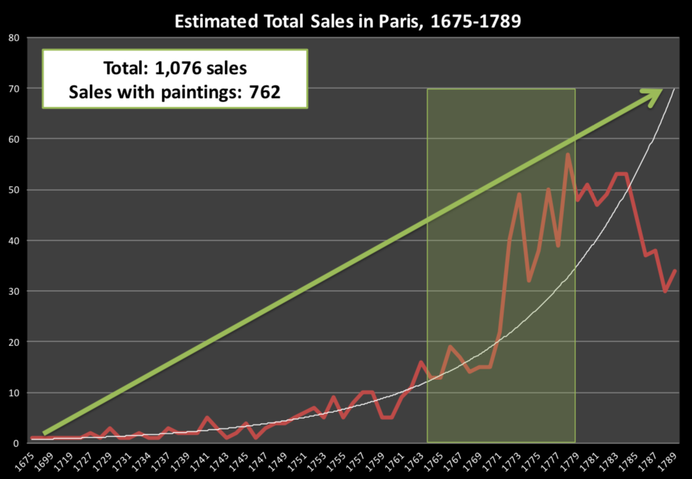

```{r titleslide, child="components/titleslide.Rmd"}
```


```{r setup1, include=FALSE}
library(tidyverse)
library(knitr)
library(kableExtra)
library(emo)
library(viridis)
opts_chunk$set(echo = TRUE,   
               message = FALSE,
               warning = FALSE,
               collapse = TRUE,
               fig.height = 4,
               fig.width = 8,
               fig.align = "center",
               cache = FALSE)

as_table <- function(...) knitr::kable(..., format='html', digits = 3)
```


---
# Questions/Comments/Suggestions

```{r out.width = '80%', echo = FALSE}
include_graphics("images/rhythm-goyal-_-Ofoh09q_o-unsplash.jpg")
```
 Photo: Rhythm Goyal for  Unsplash.
---
# Recap: Week 6
<br><br>

<br><br>
- Web scraping
- Intro to using functions
- Organizing your own folders
- File paths and Rstudio projects


---

# Week 7: Outline
<br><br>

- Modeling
- Linear Models
- Linear Models and Correlation
- Model Selection
- Model Goodness of Fit
- Correlation


```{r setup, include=FALSE}
library(tidyverse)
library(knitr)
library(kableExtra)
library(broom)
library(ggResidpanel)
opts_chunk$set(echo = TRUE,   
               message = FALSE,
               warning = FALSE,
               collapse = TRUE,
               fig.height = 4,
               fig.width = 8,
               out.width = "100%",
               fig.align = "center",
               dpi = 300,
               cache = FALSE)

as_table <- function(...) knitr::kable(..., format='html', digits = 3)

# ggplot2 color palette with gray
color_palette <- list(gray = "#999999", 
                      salmon = "#E69F00", 
                      lightblue = "#56B4E9", 
                      green = "#009E73", 
                      yellow = "#F0E442", 
                      darkblue = "#0072B2", 
                      red = "#D55E00", 
                      purple = "#CC79A7")
```

---
--- 
# Mid-semester quiz

<br><br>

**Great work everyone!!**
<br><br>
- Grades are available in **Moodle on Wednesday Week 7** (this week)
- Any questions please come to the consultation hours and we will be 
more than happy to answer any question.


<br>

- .green[Please remember to contact your group members -- Group project milestone due in Week 8:  April 30, 5pm]. As usual **late submissions will not be considered.**


---
# Modeling
<br>
.green[**The ultimate goal: Understanding the relationship between different variables.**]
.content-box-neutral[
- We observe the data but we don't know anything about the underlying process --> we use the data to 
make inferences about the underlying process.
- We use models to explain the relationship between variables --> explaining the underlying process.
- Once we know the relationship between variables then we can use the models to  make predictions.
- There are lots of different models! Linear and non-linear, parametric and non-parametric...
- For now we focus on **linear** models.
]


---
class: transition

# Packages

.left-code[


]

.right-plot[
- You're familiar with the tidyverse:

- The broom package takes the messy output of built-in functions in R, such as `lm`, and turns them into tidy data frames.

]

---
class: transition

# Data: Paris Paintings

---
# Paris Paintings

```{r read-paris2, message=FALSE}
pp <- read_csv(here::here("slides/data/paris-paintings.csv"), 
               na = c("n/a", "", "NA"))
head(pp)
```

---
# Meet the data curators

.left-code[
 


]

.right-plot[

Sandra van Ginhoven

Hilary Coe Cronheim

PhD students in the Duke Art, Law, and Markets Initiative in 2013

- Source: Printed catalogues of 28 auction sales in Paris, 1764- 1780
- 3,393 paintings, their prices, and descriptive details from sales catalogues over 60 variables
]

---
# Auctions today

<iframe width="1013" height="570" src="https://www.youtube.com/embed/apaE1Q7r4so" frameborder="0" allow="accelerometer; autoplay; encrypted-media; gyroscope; picture-in-picture" allowfullscreen></iframe>
---
# Auctions back in the day
<br>
```{r auctions-include, echo = FALSE, out.width="70%"}
include_graphics("images/old-auction.png")
```

Pierre-Antoine de Machy, Public Sale at the Hôtel Bullion, Musée Carnavalet, Paris (18th century)

---
# Paris auction market

```{r paris-auction-market, echo = FALSE, out.width="70%"}

```

---
class: transition

# Understanding the data
<br><br>
## Data distribution: histogram --> graphical representation of the data

<br><br>
[Links to some interesting books about stats here](https://chance.amstat.org/2014/11/book-reviews-27-4/)

---
#  Describe the distribution of prices of paintings.

```{r gg-price, fig.height = 3.5}
ggplot(data = pp, aes(x = price)) +
  geom_histogram(binwidth = 100)
```
The histogram of the prices!

---
class: transition

# Modelling the relationship between variables


---
# Models as functions
<br><br>
.content-box[
- Models can be understand as .green[functions]
- We can represent relationships between variables using **functions**
- A function is a mathematical concept --> Represents the relationship between
and input/s and an output. 
- Remember the box that I drew last week?
] 
<br>
.green[**Important:** Mathematical functions and functions in 
coding are concepts that are related!]

---
# Models as functions: Example
<br>
Do you remember when you learn to write the equation of a line?
.content-box-neutral[
- The formula $y = 3x + 7$ 
represents the equation of a line. 
- We can also write it like this:  $y = f(x) = 3x + 7$ 
- This is a function with input $x$ and output $y$ or $f(x)$.
]
<br>
For example when $x$ is $5$ --> the output $y$ is $22$

`y = 3 * 5 + 7 = 22`

---
# Models as functions: Example
<br><br>
In R:

```{r anon}
f <- function(x){
  
  y = 3*x + 7
  y
}
f(5)
```


---
# Height as a function of width
<br>
Example: Understand/Describe the relationship betweenthe  height and width of the paintings.
<br>
```{r gg-price-point, warning = FALSE, echo = FALSE, fig.height = 3.5}
ggplot(data = pp, aes(x = Width_in, y = Height_in)) +
  geom_point() 
```

---
# Visualizing the linear model
<br>
```{r gg-point-smooth-lm, warning = FALSE, fig.height = 3.5}
ggplot(data = pp, aes(x = Width_in, y = Height_in)) +
  geom_point() +
  geom_smooth(method = "lm") # lm for linear model
```

---
# Visualizing the linear model 
.green[With a measure of uncertainty around the line]

```{r gg-point-lm-no-se, warning = FALSE, fig.height = 2.25, fig.width=5}
ggplot(data = pp, aes(x = Width_in, y = Height_in)) +
  geom_point() +
  geom_smooth(method = "lm", se = TRUE, level = 0.95) # lm for linear model
```

---
# Visualizing the linear model (style the line)

```{r gg-smooth-change-line, warning = FALSE, fig.height = 2, fig.width = 5}
ggplot(data = pp, aes(x = Width_in, y = Height_in)) +
  geom_point() +
  geom_smooth(method = "lm", se = FALSE, 
              col = "pink", # color
              lty = 2,      # line type
              lwd = 3)      # line weight
```

---
# Vocabulary
<br><br>
- **Response variable:** Variable whose behavior or variation you are trying to understand, on the y-axis (dependent variable) --> .green[**y**]


- **Explanatory variables:** Other variables that you want to use to explain the response, on the x-axis (independent variables) --> .green[**x**]

.content-box-neutral[
$y = f(x) = b + ax + \epsilon$ 
]

- $\epsilon$  --> error term with certain properties and this is the stochastic part of the model that allow us to make inferences about
the model and model parameters!

---
# Vocabulary

<br>
.green[**Once the model is fitted (i.e once we know the values of a and b )**]

- **Fitted values:** $\hat{y} = \hat{f}(x) =  \hat{a} + \hat{b}x$
    
- **Residuals:** $\hat{\epsilon}$ -->Show how far each case is from its model value
    - Residual = Observed value $y$ - Fitted value $\hat{y}$
    - Tells how far are the points from the line (model function) 
    
- **Predicted values**: $\hat{y} = \hat{f}(3) =  \hat{a} + \hat{b} \times 3$ 
Once we the model is .green[fitted], that is we know the values of $\hat{a}$ and $\hat{b}$,
then we can find out what is the $\hat{y}$ value  .green[for any given $x$ that is 
**within the range of the $x$ values that I have used to estimate my model**].

---
# Residuals
<br>
- What does a negative residual mean? 
- Which paintings on the plot have have negative 
residuals, those below or above the line?

<br>
```{r gg-price-height, warning = FALSE, echo=FALSE, fig.height = 2.5}
ggplot(data = pp, aes(x = Width_in, y = Height_in)) +
  geom_point() +
  geom_smooth(method = "lm", se = FALSE)
```

---

```{r gg-alpha, warning = FALSE, echo=FALSE, fig.height = 3.5}
ggplot(data = pp, aes(x = Width_in, y = Height_in)) +
  geom_point(alpha = 0.2)
```

--

- What feature is apparent in this plot that was not (as) apparent in the previous plots? 

- What might be the reason for this feature?

???

The plot below displays the relationship between height and width of paintings. It  uses a lower alpha level for the points than the previous plots we looked at. 
---
# Landscape vs portrait paintings

.pull-left[
- Landscape painting is the depiction in art of landscapes – natural scenery such as mountains, valleys, trees, rivers, and forests, especially where the main subject is a wide view – with its elements arranged into a coherent composition.<sup>1</sup>

- Landscape paintings tend to be wider than longer.
]

.pull-right[

- Portrait painting is a genre in painting, where the intent is to depict a human subject.<sup>2</sup>

- Portrait paintings tend to be longer than wider.
]
.footnote[
[1] Source: Wikipedia, [Landscape painting](https://en.wikipedia.org/wiki/Landscape_painting)

[2] Source: Wikipedia, [Portait painting](https://en.wikipedia.org/wiki/Portrait_painting)
]


---
# Multiple explanatory variables

How, if at all, the relationship between width and height of paintings vary by whether
or not they have any landscape elements?

```{r gg-landscape, warning = FALSE, fig.height=2}
ggplot(data = pp, aes(x = Width_in, y = Height_in, 
                      color = factor(landsALL))) +
  geom_point(alpha = 0.4) +
  geom_smooth(method = "lm", se = FALSE) +
  labs(color = "landscape") +
  scale_colour_viridis_d()
```

---
# Models - important considerations
<br>
.content-box-neutral[
- First, we need an exhaustive exploratory analysis of the data
before investigating any model --> you can use your data wrangling tool box!
- That will allow us to better understand which model/s might be adequate for a given data set.
- Models can sometimes reveal patterns that are not evident in the
data. 
- However, there is a real risk,  that a model is imposing structure that is
not really there. 
- That is why inspecting the model assumptions and residuals is essential!
]

---
# Model Inspection
<br><br>

.content-box-neutral[
- Scatterplot suggests there might be other factors that account for large parts 
of painting-to-painting variability.
- In many cases, we will find out that the process that we are trying to model might be affected
by other factors that we did not account for at first.
]

---
# Model Inference
<br><br>
Model goodness of fit and model uncertainty --> It is just as important as the model!
<br>
.content-box-neutral[
- We use statistical inference to the explain the uncertainty in the model, model parameters
and residuals.
- Also we use statistical inference to draw conclusions from our model.
]

---
# Linear Models
<br><br>

.content-box-neutral[
1.Characterize the relationship between $y$ and $x$ assuming there is a linear relationship between the variables.
2. Once the model is fitted --> we have estimated all the parameters in the model then:
3. We can make prediction: Plug in $x$, get the predicted $\hat{y}$
4. ** Predictions are only valid for new values $x$ that are within the min and max of the original $x$ use to fit the model.**
]


---
class: transition
# Characterizing relationships with models

---
# Height & width
<br><br>
```{r model-height-width}
m_ht_wt <- lm(Height_in ~ Width_in, data = pp)
m_ht_wt
```


---
# Model of height and width
<br><br>
$$\widehat{Height_{in}} = 3.62 + 0.78~Width_{in}$$
 

- **Intercept:** Paintings that are 0 inches wide are expected to be 3.62 inches high, on average.
- **Slope:** For each additional inch the painting is wider, the height is expected
to be higher, on average, by 0.78 inches.


---
# The linear model with a single predictor
<br><br>

Typically a linear regression model with a single predictor is denoted as follows:

$$ y = \beta_0 + \beta_1~x + \epsilon $$

with $\epsilon_i$ independent and identically distributed -->  $\epsilon_i \sim N(0,\sigma^2)$

Using the data we are interested in making inferences about  $\beta_0$ (population parameter for the intercept)
and the $\beta_1$ (population parameter for the slope).


---
# Least squares regression
<br><br>
The regression line minimizes the sum of squared residuals:

$e_i = y - \hat{y}$,

the regression line minimizes $\sum_{i = 1}^n e_i^2$.

```{r ls, echo = FALSE, out.width = "50%"}

```

---
# Visualizing residuals
<br><br>
```{r vis-resid2, echo=FALSE}
d <- tibble(
    Width_in     = m_ht_wt$model$Width_in,
    Height_in    = m_ht_wt$model$Height_in,
    pred         = m_ht_wt$fitted.values,
    res          = m_ht_wt$residuals
  )
p <- ggplot(data = d, mapping = aes(x = Width_in, y = Height_in)) +
  geom_point(alpha = 0.2) + 
  theme_bw() +
  labs(title = "Height vs. width of paintings", subtitle = "Just the data") +
  xlim(0, 250) +
  ylim(0, 200)
p
```

---
# Visualizing residuals (cont.)
<br><br>
```{r vis-resid-line2, echo=FALSE}
p <- p + 
  geom_smooth(method = "lm", color = color_palette$darkblue, se = FALSE) +
  geom_point(mapping = aes(y = pred), color = color_palette$darkblue) +
  labs(subtitle = "Data + least squares regression line")
p
```

---
# Visualizing residuals (cont.)
<br><br>
```{r vis-redis-segment, echo = FALSE}
p + 
  geom_segment(mapping = aes(xend = Width_in, yend = pred), color = color_palette$lightblue, alpha = 0.4) +
  labs(subtitle = "Data + least squares regression line + residuals")
```


---
# Visualizing the residuals for model diagnostic
<br>

```{r, out.width= "70%"}
resid_panel(m_ht_wt, plots = "all")
```

---
# Properties of the least squares regression line
<br><br>

$$y = \beta_0 + \beta_1 x + \epsilon  ~ \rightarrow ~ \beta_0 = y - \beta_1 x$$
$$\epsilon \sim N(0,\sigma^2)$$

- The errors has expected value 0
- The errors are independent and have common variance
- The sign of the slope is the same as the sign of the correlation between the variables

<!-- - The slope has the same sign as the correlation coefficient: -->

<!-- $$\beta_1 = r \frac{s_y}{s_x}$$ -->

---

# Assumptions of least squares regression line
<br><br>

- The sum of the residuals is zero: 
$$\sum_{i = 1}^n e_i = 0$$

- The residuals have constant variance (homoskedastic errors)

- The residuals and $x$ values are uncorrelated.

---
# Height and landscape features
<br><br>
```{r fit-lands}
m_ht_lands <- lm(Height_in ~ factor(landsALL), data = pp)
m_ht_lands
```

--

<br>

$$\widehat{Height_{in}} = 22.68 - 5.65~landsALL$$

---
# Height & landscape features Model Summary
<br>

```{r}
summary(m_ht_lands)
```


---
# Height & landscape features (cont.)
<br><br>

- **Intercept:** Paintings that don't have landscape features are expected, on 
average, to be 22.68 inches tall.
- **Slope:** Paintings with landscape features are expected, on average,
to be 5.65 inches shorter than paintings that without landscape features.
    - Compares baseline level (`landsALL = 0`) to other level
    (`landsALL = 1`).


---
# Categorical predictor with 2 levels
<br><br>
```{r slice-paint, echo=FALSE}
dat <- pp %>% 
  mutate(landsALL = as.factor(landsALL)) %>%
  select(name, price, landsALL) %>% 
  slice(1:8)

dat
```

```{r}
levels(dat$landsALL)
```


---
# Relationship between height and school

```{r fit-school}
m_ht_sch <- lm(Height_in ~ school_pntg, data = pp)
summary(m_ht_sch)
```
 
---
# Model parametrization
 <br><br>
- Categorical explanatory variables are typically encoded to
**dummy variables**, one for each of the levels.
- Each coefficient describes the expected difference between heights in that 
particular school compared to the baseline level.
- We can inspect the model matrix using .purple[model.matrix] in R


---
# Categorical predictor with >2 levels
<br><br>
```{r show-cats, echo=FALSE}
pp %>% 
  select(school_pntg) %>% 
  group_by(school_pntg) %>% 
  sample_n(1) %>%
  mutate(
    D_FL = as.integer(ifelse(school_pntg == "D/FL", 1L, 0)),
    F    = as.integer(ifelse(school_pntg == "F", 1L, 0)),
    G    = as.integer(ifelse(school_pntg == "G", 1L, 0)),
    I    = as.integer(ifelse(school_pntg == "I", 1L, 0)),
    S    = as.integer(ifelse(school_pntg == "S", 1L, 0)),
    X    = as.integer(ifelse(school_pntg == "X", 1L, 0))
  )
```

---
# The linear model with multiple predictors
<br><br>
.green[Multiple linear regression model]

$$ y = \beta_0 + \beta_1~x_1 + \beta_2~x_2 + \cdots + \beta_k~x_k  + \epsilon$$
We can also write it using matrix form:

$$Y = X~\beta + \epsilon$$
with $\epsilon_i$ independent and identically distributed such that $\epsilon_i~ N(0,\sigma^2)$ 
<!-- --- -->
<!-- # Correlation does not imply causation! -->
<!-- <br><br> -->
<!-- - Remember this when interpreting model coefficients -->

---
class: transition
# Prediction with models

---
# Predict height from width
<br><br>
On average, how tall are paintings that are 60 inches wide?
$$\widehat{Height_{in}} = 3.62 + 0.78~Width_{in}$$

```{r add-slope}
3.62 + 0.78 * 60
```

"On average, we expect paintings that are 60 inches wide to be 50.42 inches high."

**Warning:** We "expect" this to happen, but there will be some variability. (We'll
learn about measuring the variability around the prediction later.)

---
# Prediction vs. extrapolation
<br><br>
On average, how tall are paintings that are 400 inches wide?
$$\widehat{Height_{in}} = 3.62 + 0.78~Width_{in}$$

```{r extrapolate, warning = FALSE, echo=FALSE, fig.height = 2.5}
newdata <- tibble(Width_in = 400)
newdata <- newdata %>%
  mutate(Height_in = predict(m_ht_wt, newdata = newdata))

ggplot(data = pp, aes(x = Width_in, y = Height_in)) +
  geom_point(alpha = 0.4) +
  geom_smooth(method = "lm", fullrange = TRUE, color = color_palette$darkblue, se = FALSE) +
  xlim(0, 420) +
  ylim(0, 320) +
  geom_segment(data = newdata, mapping = aes(x = Width_in, y = 0, xend = Width_in, yend = Height_in), color = color_palette$salmon, lty = 2) +
  geom_segment(data = newdata, mapping = aes(x = Width_in, y = Height_in, xend = 0, yend = Height_in), color = color_palette$salmon, lty = 2)
```


---
class: transition

# Measuring model fit

---
# What is $R^2$?
<br><br>

It is also known as .green[coefficient of determination]

<br>
- It measures the ratio between (model variance)/(total variance), the proportion variance in the response variable explained by the model. 
- $R^2$ always ranges between 0 and 1, with 1 indicating a perfect fit. 
- Adding more variables to the model will always increase $R^2$, so what is important is how big an increase is gained. 
- However, adding more variables into a model increases --> model complexity and sometimes that is not good!
- Adjusted $R^2$ takes into account model complexity and accounts for that.


---
# Measuring the strength of the fit
<br><br>
$$R^2 = 1- \big(\sum_i (y_i -\hat{y}_i)^2/ \sum_i (y_i -\bar{y})^2\big)$$ residual sum of squares/ Total sum of squares $\in [0,1]$

.content-box-neutral[
- $R^2$ is a common measurement of strength of linear model fit.
- $R^2$ tells us % variability in response explained by 
model.
- Remaining variation is explained by variables not in the model.
- $R^2$ is sometimes called the coefficient of determination.
]
---
# Obtaining $R^2$ in R
<br><br>
- Height vs. width

```{r glance-r-squared}
broom::glance(m_ht_wt)
broom::glance(m_ht_wt)$r.squared # extract R-squared
```

Roughly 68% of the variability in heights of paintings can be explained by their widths.

---
# Obtaining $R^2$ in R
<br><br>
- Height vs. landscape features

```{r glance-lands}
glance(m_ht_lands)$r.squared
```

---
# Model residuals
<br>
Using the broom package we can explore model residuals:
<br>
```{r , out.width= "60%"}
library(broom)
y <-rnorm(100)
x <-1:100
mod <- lm(y ~ x)
df <- augment(mod)
ggplot(df, aes(x = .fitted, y = .resid)) + geom_point()
```

---
# Model residuals

```{r, out.width= "60%"}

y <-rnorm(100)
x <-1:100
mod <- lm(y ~ x)
modf <- fortify(mod)
ggplot(modf, aes(x = .fitted, y = .resid)) + geom_point() +
  ggtitle("Anscome plot")
```

---
# Furthermore on residuals check

R package: ggResidpanel 

[Great post here](https://cran.r-project.org/web/packages/ggResidpanel/vignettes/introduction.html)

```{r, out.width= "80%"}
resid_panel(mod, plots = "all")
```


```{r setup2, include=FALSE}
library(emo)
library(tidyverse)
library(polite)
library(rvest)
library(knitr)
library(lubridate)
library(tuneR)
library(gridExtra)
library(plotly)
library(broom)
knitr::opts_chunk$set(
  fig.width = 8,
  fig.height = 4.5,
  fig.retina = 3,
  fig.align = "center",
  out.width = "90%",
  message = FALSE,
  warning = FALSE,
  cache = TRUE,
  autodep = TRUE,
  hiline = TRUE
)

knitr::opts_hooks$set(fig.callout = function(options) {
  if (options$fig.callout) {
    options$echo <- FALSE
    options$out.height <- "99%"
    options$fig.width <- 16
    options$fig.height <- 8
  }
  options
})

options(
  htmltools.dir.version = FALSE,
  width = 90,
  max.print = 9999,
  knitr.table.format = "html"
)

as_table <- function(...) knitr::kable(..., format = "html", digits = 3)

# ggplot2 color palette with gray
color_palette <- list(gray = "#999999", 
                      salmon = "#E69F00", 
                      lightblue = "#56B4E9", 
                      green = "#009E73", 
                      yellow = "#F0E442", 
                      darkblue = "#0072B2", 
                      red = "#D55E00", 
                      purple = "#CC79A7")
```

```{r pkg-load, echo=FALSE}
library(broom)
library(gridExtra)
```

```{r create-cor, echo = FALSE}
library(mvtnorm)
df <- tibble(r = seq(-1, 1, 0.25))
vfun <- function(df) {
  vc <- matrix(c(1, df$r, df$r, 1), ncol=2, byrow=TRUE)
  d <- as_tibble(rmvnorm(1000, mean=c(0,0), vc))
  return(d)
}
smp <- df %>%
  split(.$r) %>%
  map(vfun)

df_cor <- bind_rows(smp) %>% mutate(r = rep(df$r, rep(1000, 9)))

b1 <- smp %>%
  map_dbl(~ coefficients(lm(V2 ~ V1, data = .x))[2])

sample_r <- smp %>%
  map_dbl(~ cor(.x$V1, .x$V2))

```

```{r fun-gg-xy-cor, echo = FALSE}
gg_xy_cor <- function(data, cor = NULL){
  
  if (length(cor) == 1) {
    new_data <- filter(data, r == cor) 
  } else if (is.null(cor)) {
    new_data <- data
  }
  
  ggplot(new_data,
         aes(x = V1, 
             y = V2)) + 
  geom_point(alpha = 0.5) +
  facet_wrap(~r, 
             ncol = 3, 
             labeller = "label_both") + 
  theme(aspect.ratio = 1) +
  labs(x = "X",
       y = "Y")
}
```


---
# What is correlation?
<br><br>
.content-box-neutral[
- It is the linear association between two variables 
- Ranges from -1 to +1
- It is computed between two variables.
- In correlation both variables are interchangeable.
- In regression we single out one variable as the response and we use the 
explanatory variable to explain or predict the behavior of the response variable!
]
---
# Strong Positive correlation

As one variable increases, so does another

```{r plot-strong-pos-corr, echo = FALSE}
gg_xy_cor(df_cor, 1)
```

---
# Strong Positive correlation

As one variable increases, so does another variable

```{r plot-pos-corr, echo = FALSE}
gg_xy_cor(df_cor, 0.75)
```

---
# Zero correlation: neither variables are related

```{r plot-meh-corr, echo = FALSE}
gg_xy_cor(df_cor, 0)
```

---
# Strong negative correlation

As one variable increases, another decreases

```{r plot-neg-corr, echo = FALSE}
gg_xy_cor(df_cor, -0.5)
```

---
# STRONG negative correlation

As one variable increases, another decreases

```{r plot-strong-neg-corr, echo = FALSE}
gg_xy_cor(df_cor, -1)
```


---
# Correlation formal definition
<br><br>
For two variables $X, Y$, correlation is:
<br><br>

.content-box-neutral[
$$r=\frac{\sum_{i=1}^{n} (x_i-\bar{x})(y_i-\bar{y})}{\sqrt{\sum_{i=1}^{n}(x_i-\bar{x})^2}\sqrt{\sum_{i=1}^{n}(y_i-\bar{y})^2}} = \frac{cov(X,Y)}{s_xs_y}$$ ]


---
class: transition

# Remember! Correlation does not equal causation

[Have a look at some examples here!](https://www.tylervigen.com/spurious-correlations)


---
# Unpacking lm and model objects
<br>
```{r read-paris}
pp <- read_csv("data/paris-paintings.csv", na = c("n/a", "", "NA"))
head(pp)
```

---
# Unpacking linear models

```{r gg-paris, fig.height = 3.5}
ggplot(data = pp, aes(x = Width_in, y = Height_in)) +
  geom_point() +
  geom_smooth(method = "lm") # lm for linear model
```


---
class: transition

# Linear Model R specification

.large[
`lm(<FORMULA>, <DATA>)`

Example: 

`mod <- lm( y ~ x, data = mydata`)
]

---
# Fitting a linear model
<br><br>
```{r fit-paris}
m_ht_wt <- lm(Height_in ~ Width_in, data = pp)

m_ht_wt
```

---
class: transition
# Using tidy, augment, glance

---
# tidy: return a tidy table of model information


`tidy(<MODEL OBJECT>)` from the broom package

```{r tidy-paris}
tidy(m_ht_wt)
```
<br>
Great for reporting!
---
# summary
`summary(<Model Object>)`
returns model summary:

```{r tidy-paris2}
summary(m_ht_wt)
```
---
# Visualizing residuals

```{r vis-resid, echo=FALSE}
d <- tibble(
    Width_in     = m_ht_wt$model$Width_in,
    Height_in    = m_ht_wt$model$Height_in,
    pred         = m_ht_wt$fitted.values,
    res          = m_ht_wt$residuals
  )
p <- ggplot(data = d, mapping = aes(x = Width_in, y = Height_in)) +
  geom_point(alpha = 0.2) + 
  theme_bw() +
  labs(title = "Height vs. width of paintings", subtitle = "Just the data") +
  lims(x = c(0, 250),
       y = c(0, 250))
p
```

---
# Visualizing residuals (cont.)

```{r vis-resid-line, echo=FALSE}
p <- p + 
  geom_smooth(method = "lm", color = color_palette$darkblue, se = FALSE) +
  geom_point(mapping = aes(y = pred), color = color_palette$darkblue) +
  labs(subtitle = "Data + least squares regression line")
p
```

---
# Visualizing residuals (cont.)

```{r vis-redis-segment2, echo = FALSE}
p + 
  geom_segment(mapping = aes(xend = Width_in, yend = pred), color = color_palette$lightblue, alpha = 0.4) +
  labs(subtitle = "Data + least squares regression line + residuals")
```

---
# glance: get a one-row summary out

.large[
`glance(<MODEL OBJECT>)`
]

```{r glance-paris}
glance(m_ht_wt)
```
<br><br>

Model goodness-of-fit!
---
# Goodness of fit measures

<br><br>

- **AIC**, **BIC**, and **Deviance** are goodness of fit measure to compare models.
- .green[AIC] = Akaike Information Criterion (can be used to compare models. The smaller the value the better the model.)
- Similarly .green[BIC] = Bayes Information Criterion indicates how well the model fits, best used to compare two models. Lower is better.
- .green[Deviance] is the residual variation, how much variation in response that IS NOT explained by the model. The close to 0 the better, but it is not on a standard scale. In comparing two models if one has substantially lower deviance, then it is a better model.
<br>
[For those who want to learn more about linear models. See second edition of Linear Models with R](https://people.bath.ac.uk/jjf23/LMR/index.html)
---
# augment: get the data

.large[
`augment<MODEL>`

or

`augment(<MODEL>, <DATA>)`
]

---
# augment

```{r aug-ht-wt}
augment(m_ht_wt)
```


---
# Understanding residuals for model selection

- Variation explained by the model
- Residual variation:  what's left over after fitting the model

```{r, out.width= "80%"}
resid_panel(mod, plots = "all")
```

---
# Going beyond a single model

```{r show-elephant, echo = FALSE, out.width = "70%"}
include_graphics("images/blind-men-and-the-elephant.png")
```

Image source: https://balajiviswanathan.quora.com/Lessons-from-the-Blind-men-and-the-elephant

---
class: transition
# Going beyond a single model

- Beyond a single model
- Fitting many models 


---
# Gapminder
<br><br>
- Hans Rosling was a Swedish doctor, academic and statistician, Professor of International Health at Karolinska Institute. Sadly he passed away in 2017. 
- He developed a keen interest in health and wealth across the globe, and the relationship with other factors like agriculture, education, energy. 
- You can play with the gapminder data using animations at https://www.gapminder.org/tools/. 

---
<iframe width="1008" height="567" src="https://www.youtube.com/embed/jbkSRLYSojo" frameborder="0" allow="accelerometer; autoplay; encrypted-media; gyroscope; picture-in-picture" allowfullscreen></iframe>

---
# R package: `gapminder`
<br>
Contains subset of the data on five year intervals from 1952 to 2007.

```{r show-gapminder}
library(gapminder)
glimpse(gapminder)
```

---
# "Change in life expectancy in countries over time?"
<br><br>
```{r gg-gapminder-line, fig.height = 4, echo = FALSE}
gapminder %>% 
  ggplot(aes(year, lifeExp, group = country)) +
    geom_line(alpha = 1/3)

```

---
# "Change in life expectancy in countries over time?"
<br><br>
- There generally appears to be an increase in life expectancy
- A number of countries have big dips from the 70s through 90s
- A cluster of countries starts off with low life expectancy but ends up close to the highest by the end of the period.

---
# Gapminder: Australia
<br>
Australia was already had one of the top life expectancies in the 1950s.

```{r gapminder-oz}
oz <- gapminder %>% filter(country == "Australia")

head(oz)
```

---
# Gapminder: Australia
<br>
```{r plot-gapminder-oz, fig.height=3, fig.width=8}
ggplot(data = oz, 
       aes(x = year, 
           y = lifeExp)) + 
  geom_line() 
```

---
# Gapminder: Australia
<br>
```{r lm-oz-gapminder}
oz_lm <- lm(lifeExp ~ year, data = oz)

oz_lm
```

---
# Tidy Gapminder Australia
<br>
```{r tidy-oz-gapminder}
tidy(oz_lm)
```

.large[
$$\widehat{lifeExp} = -376.1163 - 0.2277~year$$
]

---
# Center year
<br>
- Let us treat 1950 is the first year
- So for model fitting we are going to shift year to begin in 1950
- This improved interpretability.

```{r center-eyar}
gap <- gapminder %>% 
  mutate(year1950 = year - 1950)
oz <- gap %>%  filter(country == "Australia")
```


---
# Model for centred year
<br>
```{r oz-gapminder-centered-year}
oz_lm <- lm(lifeExp ~ year1950, data = oz)

oz_lm
```


---
# Tidy the model
<br><br>
```{r tidy-oz-gapminder-centered-year}
tidy(oz_lm)
```


$$\widehat{lifeExp} = 67.9 +  0.2277~year$$

---
#nest() country level data (one row = one country)

```{r}
by_country <- gap %>%
select(country,
       year1950,
       lifeExp,
       continent) %>% 
group_by(country, continent) %>%
nest()
by_country
```


---
# Using map function 

```{r}
 country_model <- by_country %>% 
  mutate(model = map(.x = data,
                     .f = function(x){
                           lm(lifeExp ~ year1950, 
                              data = x) 
                     }))

country_model

```

---
# List with model outputs

<br><br>

```{r}
country_model$model[[1]]
```

---

```{r endslide, child="components/endslide.Rmd"}
```
