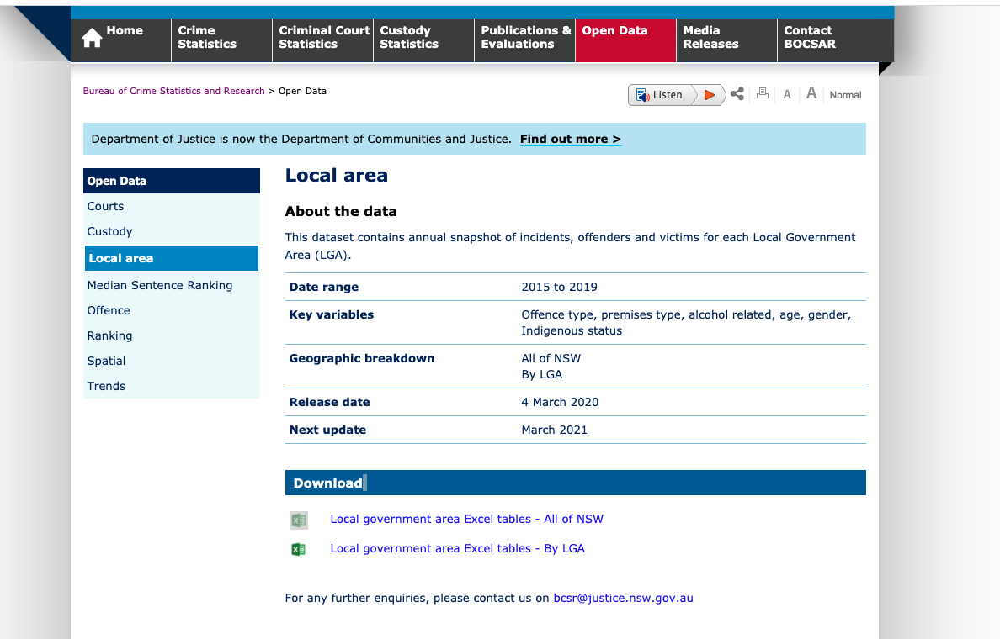
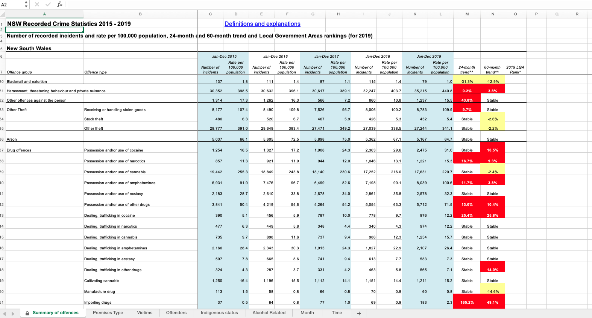
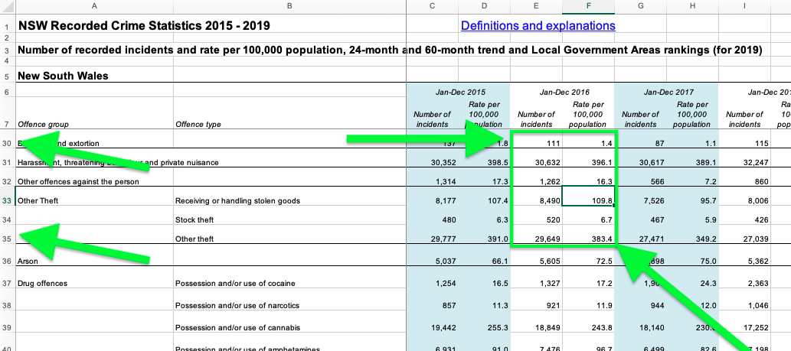
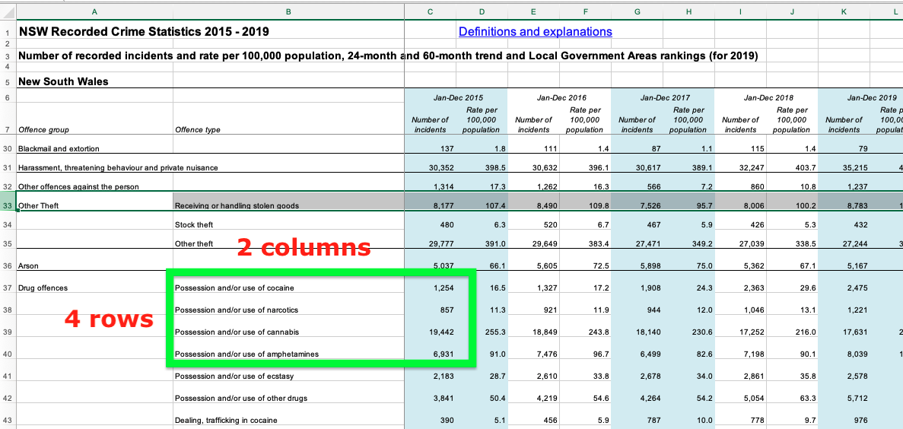
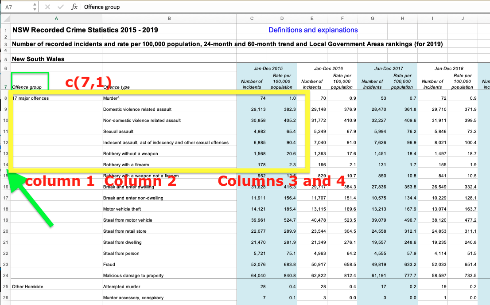
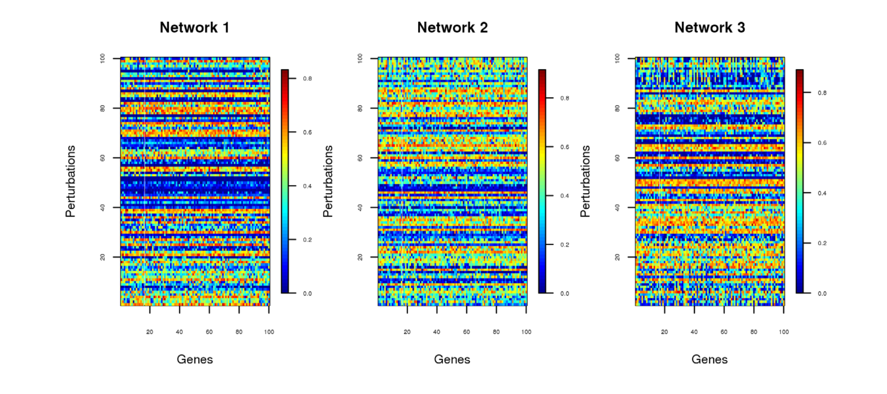
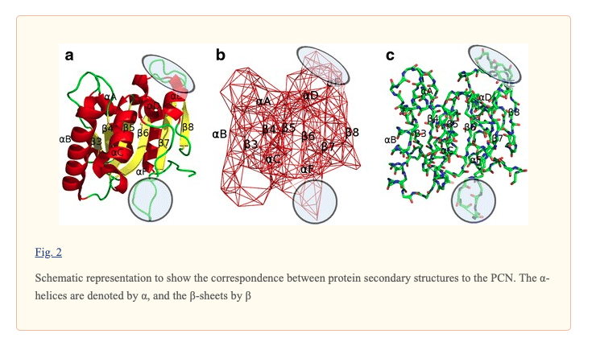

```{r titleslide, child="components/titleslide.Rmd"}
```


```{r setup2, include=FALSE}
library(tidyverse)
library(knitr)
library(kableExtra)
library(textdata)
library(tm)
library(readxl)
library(haven)

opts_chunk$set(echo = TRUE,   
               out.width = "100%",
               message = FALSE,
               warning = FALSE,
               collapse = TRUE,
               fig.height = 4,
               fig.width = 8,
               fig.align = "center",
               dpi = 300,
               cache = FALSE)

as_table <- function(...) knitr::kable(..., format='html', digits = 3)
```


```{r setup3, include=FALSE}
library(tidyverse)
library(knitr)
library(kableExtra)
library(ggraph)
library(igraph)
library(tidygraph)
library(knitr)
library(lubridate)
library(gridExtra)
library(plotly)
#library(geomnet)
opts_chunk$set(echo = TRUE,   
               message = FALSE,
               warning = FALSE,
               collapse = TRUE,
               fig.height = 4,
               fig.width = 8,
               fig.retina = 2,
               out.width = "100%",
               fig.align = "center",
               cache = FALSE)

as_table <- function(...) knitr::kable(..., format='html', digits = 3)
```
  
---
# Questions/Comments/Suggestions

```{r out.width = '80%', echo = FALSE}
include_graphics("images/rhythm-goyal-_-Ofoh09q_o-unsplash.jpg")
```
 Photo: Rhythm Goyal for  Unsplash.
---
# Recap: Week 8

<br><br>
- The analysis of text data, why?
- Analysis of text data steps
- R packages for text analysis
- Tidy text
- Extracting common words, stop words etc
- Sentiment of the text


---

# Week 9: Outline
<br><br>

- Extracting data from messy excel files
- Graphical models
- Networks
- Visualizing networks
- Remarks about assignment 2
- Presentations of group projects in Week 12.
- Notice about in-class final semester assessment in Week 12


---
# Announcements
<br><br>
.content-box-neutral[
 Group project milestone 2: Monday 10 May, 1pm.
 ]
 - Folder with original data and folder with clean data --> google drive link (if larger than 500MB)
 - Page describing your data and the data cleaning that you have done
 - Rmd with the cleaning done to the data

.content-box-neutral[
Assignment 2: Release tonight and due on Monday May 17, 11am. ]
 - Late submissions will not be accepted.
 
 
---
# Assignment 2

<br><br>
- You will first complete the assignment on your own
- Then all the team members start working together for the group submission
- You will need to submit your individual assignment and the group assignment

---
# R packages

<br><br>

- library(readxl)
- library(haven)

---
# Example data file: BOCSAR

```{r ls1, echo = FALSE, out.width = "80%"}

```


https://www.bocsar.nsw.gov.au/Pages/bocsar_datasets/Local-area.aspx


---
# Example data file

```{r ls, echo = FALSE, out.width = "90%"}

```


https://www.bocsar.nsw.gov.au/Pages/bocsar_datasets/Local-area.aspx


---
# List of sheets in an excel file

<br><br>

```{r}
 excel_sheets("data/NewSouthWales.xlsx")

```


---
# Read different excel sheets

<br><br>

```{r}
read_excel("data/NewSouthWales.xlsx", sheet = 1)

```


---
# Read specific cells from an excel file

```{r , echo = FALSE, out.width = "80%"}

```

```{r}
read_excel("data/NewSouthWales.xlsx", sheet = 1, range = "E30:F35")
```


---
# Read specific cells from an excel file 

```{r , echo = FALSE, out.width = "50%"}

```
```{r}
read_excel("data/NewSouthWales.xlsx", sheet = 1, col_names = FALSE,
range = anchored("B37", dim = c(4,2)))

```

---
# Read specific cells from an excel file 

```{r , echo = FALSE, out.width = "50%"}

```

```{r}
read_excel("data/NewSouthWales.xlsx", sheet = 1, 
range = cell_limits(c(7,1), c(14,4) ))

```

---
# Read specific cells from an excel file 

<br><br>

```{r}
read_excel("data/NewSouthWales.xlsx", sheet = 1, 
range = cell_limits(c(1,1), c(NA, NA) ))
```
When we use NA we assume that the entire rows or columns are being selected.

---
# Read specific cells from an excel file 

```{r}
read_excel("data/NewSouthWales.xlsx", sheet = 1,  
range = cell_limits(c(1, NA), c(NA, 2) ))
```
.green[Starting in the cell located row 1 select all the rows in that column and 
select all the rows in column 2.]


---
# Read specific cells from an excel file 

<br>

.green[Reading column 2] 
<br>
```{r}
read_excel("data/NewSouthWales.xlsx", sheet = 1, 
range = cell_cols(2))
```

---
# Read specific cells from an excel file 

<br><br>

.green[Reading rows 1 to 4.]

```{r}
read_excel("data/NewSouthWales.xlsx", sheet = 1, 
range = cell_rows(1:4))
```
---
# Summary
<br><br>

.content-box-neutral[
- .purple[anchored()] -->  Select a range of cells
- .purple[cell_limits()] --> Select a range of cells
- .purple[cell_cols()] --> Select columns  
- .purple[cell_rows()] --> Select  rows
]


---
# Reading different formats

<br><br>
Using the Readr package:
<br><br>
.content-box-neutral[
- SAS --> .purple[read_sas]("name.sas7bdat")
- SPSS --> .purple[read_spss]("name.sav")
- STATA  --> .purple[read_stata]("name.dta")
]


---
class: transition

# Graphical Models

```{r gene, echo = FALSE, out.width = "50%"}

```
<br>
Menéndez, P., Kourmpetis, Y. A., ter Braak, C. J., & van Eeuwijk, F. A. (2010). Gene regulatory networks from multifactorial perturbations using Graphical Lasso: application to the DREAM4 challenge. PloS one, 5(12), e14147.


---
# Graphical Models 

```{r protein, echo = FALSE, out.width = "50%"}

```
"Three-dimensional structures of proteins that regulate their functions can be modelled using complex network based approaches for understanding the structure-function relationship."
<br>
Kandhari, N., & Sinha, S. (2017). Complex network analysis of thermostable mutants of Bacillus subtilis Lipase A. Applied Network Science, 2(1), 18.


---
# Graphical model

<br><br>
.content-box-neutral[
A **graphical model** represents the probabilistic relationships among a set of variables.
]

<br>
- Graphical models allow us to .green[understand "high-order" relationships between variables representing a complex system].
- .green[Graphical models are represented by a network]: each .green[node/vertex (vertices) of the graph represents a variable] and .green[each edge represents the dependency between the variables that are connected by an edge].

---
# How does a graphical model representation look like?


```{r make-call-graph3, echo = FALSE}
simple <- make_graph(c(1,2,1,3,2,3,2,4,3,5), directed = FALSE)
V(simple)$name <- c('Gene1', 'Gene2', 'Gene3', 'Gene4', 'Gene5')

example <- as_tbl_graph(simple)
ggraph(example, layout = 'graphopt') + 
    geom_edge_link(aes(start_cap = label_rect(node1.name),
                       end_cap = label_rect(node2.name)))+ 
    geom_node_text(aes(label = name))

```
The graph represents the .green[network topology] that is how the different
variables in the system connect to each other. Typically relationships represent
dependencies.

---
# Network topology --> Adjacency matrix

<br><br>
The network topology (network connections)
is given by the so called .green[adjacency matrix].

<br>
.pull-left[
```{r, echo = FALSE}
as_adjacency_matrix(simple, sparse = FALSE)
```
]
.pull-right[
```{r make-call-graph2, echo = FALSE}
simple <- make_graph(c(1,2,1,3,2,3,2,4,3,5), directed = FALSE)
V(simple)$name <- c('Gene1', 'Gene2', 'Gene3', 'Gene4', 'Gene5')

example <- as_tbl_graph(simple)
ggraph(example, layout = 'graphopt') + 
    geom_edge_link(aes(start_cap = label_rect(node1.name),
                       end_cap = label_rect(node2.name)))+ 
    geom_node_text(aes(label = name))

```
]

---
# Directed and undirected graphs

<br><br>
.pull-left[
# Undirected graph

```{r make-call-graph5, echo = FALSE}
simple <- make_graph(c(1,2,1,3,2,3,2,4,3,5), directed = FALSE)
V(simple)$name <- c('Gene1', 'Gene2', 'Gene3', 'Gene4', 'Gene5')

example <- as_tbl_graph(simple)
ggraph(example, layout = 'graphopt') + 
    geom_edge_link(aes(start_cap = label_rect(node1.name),
                       end_cap = label_rect(node2.name))) + 
    geom_node_text(aes(label = name))
```
]
.pull-right[

# Directed graph
```{r , echo = FALSE}
simple <- make_graph(c(1,2,1,3,2,3,2,4,3,5), directed = TRUE)
V(simple)$name <- c('Gene1', 'Gene2', 'Gene3', 'Gene4', 'Gene5')

example <- as_tbl_graph(simple)
ggraph(example, layout = 'graphopt') + 
    geom_edge_link(aes(start_cap = label_rect(node1.name),
                       end_cap = label_rect(node2.name)), 
                   arrow = arrow(length = unit(4, 'mm'))) + 
    geom_node_text(aes(label = name))

```
]

A directed graph represents the connection and direction of the relationship between variables,  while undirected graphs
represent the connections not the directions (in many cases we will not have information on that).


---
# Nodes and edges

<br><br>

- The .green[edges] in a network representing a graphical model
describe whether there is a .green[relationship between different variables].

- The relationship between variables (or nodes) in a graphical model
can be established by studying conditional probabilities (and also much more complicated models) or more simply
using correlation thresholds between variables.


---
# Knowing/not knowing the network topology

<br><br>

Typically we might encounter two problems:

<br>
- Estimation of the network topology
- If we know the network topology under
the strength of the relationship between the 
variables (i.e the value of the edges)

---
# Graphical models based on correlations
<br>
If we don't know the topology of the network,
we can use correlations to find out the network
describing the relationship between the variables.
More complex methods are typically used!

```{r}
set.seed(120)
variables_df <- data.frame(Gene1 = rnorm(100),
                           Gene2 = rnorm(100),
                           Gene3 = rnorm(100))
head(variables_df)
```

---
# Computing correlations
```{r}
Correlation_matrix<- cor(variables_df)
Correlation_matrix
```
We can create an adjacency matrix:

```{r}
adjacency_matrix <- ifelse(Correlation_matrix <= 0.06, 0, 1)
adjacency_matrix
```
<br>

How does the graph looks like?

---
# Sometimes we know the network topology
<br><br>
**A description of phone calls** and we want
to represent the connections via a network/graph.
In this case, we know the direction of the connections between
the nodes.

## Relationship between group phone calls.
<br>
- Johnny --> Liz
- Liz --> Anna
- Johnny -- > Dan
- Dan --> Liz
- Dan --> Lucy

---
# Network visualization
<br>
Example of directed network:
<br>
```{r make-call-graph, echo = FALSE}
simple <- make_graph(c(1,2,1,3,2,3,2,4,3,5), directed = TRUE)
V(simple)$name <- c('Johnny', 'Dan', 'Liz', 'Lucy', 'Anna')

example <- as_tbl_graph(simple)
ggraph(example, layout = 'graphopt') + 
    geom_edge_link(aes(start_cap = label_rect(node1.name),
                       end_cap = label_rect(node2.name)), 
                   arrow = arrow(length = unit(4, 'mm'))) + 
    geom_node_text(aes(label = name))

```

---
class: transition

# Corresponding adjacency matrix

<br><br>
```{r, echo = FALSE}
as_adjacency_matrix(simple, sparse = FALSE)
```
<br>
Is this matrix symmetric? Why?

---
# Examples 

These examples present situations in which
we might be interested to know or to represent how the
different variables connect to each other.

- **Telephone exchanges**: Nodes are the phone numbers. Edges would indicate a call was made betwen two numbers.
- **Book or movie plots**: Nodes are the characters. Edges would indicate whether they appear together in a scene, or chapter. If they speak to each other, various ways we might measure the association.
- **Social media**: nodes would be the people who post on facebook, including comments. Edges would measure who  comments on who's posts.


---
# Example: Madmen

<br>
Relationship between characters of a movie.

<br>

```{r show-madmen-logo, echo = FALSE}
include_graphics("images/Mad-men-title-card.jpg")
```
<br>
Source: [wikicommons](https://en.wikipedia.org/wiki/Mad_Men#/media/File:Mad-men-title-card.jpg)

---
# Generate a network view
<br><br>
- Create a layout (in 2D) which places nodes which are most related close,
- Plot the nodes as points, connect the appropriate lines
- Overlaying other aspects, e.g. gender

---
# Introducing `madmen` data
```{r}
library(geomnet)
data(madmen)
madmen_nodes <- as_tibble(madmen$vertices) %>% 
  mutate_all(as.character) %>% #<<
  rename(gender = Gender)
madmen_edges <- as_tibble(madmen$edges) %>% mutate_all(as.character)
```

```{r make-madmen-graph}
glimpse(madmen)
```


---
# Example: Mad Men. (Nodes = characters from the series)

```{r mm-nodes}
madmen_nodes
```

---
# Example: Mad Men. (Edges = how they are associated)

```{r mm-edges}
madmen_edges
```

---
# Let's get the madmen data into the right shape
<br><br>
```{r}
madmen_edges %>%
  rename(from_id = Name1, to_id = Name2) 
```
<br>
Is this data represented a directed or an undirected graph?

---
# Let's get the madmen data into the right shape

```{r}
madmen_net <- madmen_edges %>%
  rename(from_id = Name1, to_id = Name2) %>%
  full_join(madmen_nodes,  #<<
            by = c("from_id" = "label")) #<<

madmen_net
```

---
# Full join?

```{r full-join-gif, echo = FALSE, out.width = "40%"}
include_graphics("gifs/full-join.gif")
```
.small[Return all rows and all columns from both x and y. Where there
are not matching values, returns NA for the one missing.]
---
# Plotting the data

```{r ggraph-madmen, echo = FALSE, fig.width = 10, fig.height = 5}
# create plot
set.seed(5556677)
ggplot(data = madmen_net, aes(from_id = from_id, to_id = to_id)) +
  geom_net(aes(colour = gender), layout.alg = "kamadakawai",
    size = 2, labelon = TRUE, vjust = -0.6, ecolour = "grey60",
    directed =FALSE, fontsize = 3, ealpha = 0.5) +
    scale_colour_manual(values = c("#F8B195", "#6C5B7B")) +
    xlim(c(-0.05, 1.05)) +
    theme_net() +
    theme(legend.position = "bottom")

```

---
# How to plot? Step by Step
<br><br>
.left-code[
```{r graph-step-1, eval = FALSE}
set.seed(5556677)
ggplot(data = madmen_net, 
       aes(from_id = from_id, 
           to_id = to_id)) +
  geom_net(aes(colour = gender)) 

```  
]

.right-plot[
```{r graph-step-1-out, ref.label = 'graph-step-1', echo = FALSE, out.width = "100%"}

```
]

---
# How to plot: specify the layout algorithm
<br><br>
.left-code[
```{r graph-plot-2, eval = FALSE}
set.seed(5556677)
ggplot(data = madmen_net, 
       aes(from_id = from_id, 
           to_id = to_id)) +
  geom_net(aes(colour = gender), 
           layout.alg = "kamadakawai") 
```  
]

.right-plot[
```{r graph-plot-2-out, ref.label = 'graph-plot-2', echo = FALSE, out.width = "100%"}

```
]

---
# How to plot: adding labels
<br><br>
.left-code[
```{r graph-plot-3, eval = FALSE}
set.seed(5556677)
ggplot(data = madmen_net, 
       aes(from_id = from_id, 
           to_id = to_id)) +
  geom_net(aes(colour = gender), 
           layout.alg = "kamadakawai",
           directed = FALSE,
           labelon = TRUE,
           fontsize = 3) 
```  
]

.right-plot[
```{r graph-plot-3-out, ref.label = 'graph-plot-3', echo = FALSE, out.width = "100%"}

```
]

---
# How to plot: adjustments
<br><br>
.left-code[
```{r graph-plot-4, eval = FALSE}
set.seed(5556677)
ggplot(data = madmen_net, 
       aes(from_id = from_id, 
           to_id = to_id)) +
  geom_net(aes(colour = gender), 
           layout.alg = "kamadakawai",
           directed = FALSE,
           labelon = TRUE,
           fontsize = 3,
           size = 2,
           vjust = -0.6,
           ecolour = "grey60",
           ealpha = 0.5)
```  
]

.right-plot[
```{r graph-plot-4-out, ref.label = 'graph-plot-4', echo = FALSE, out.width = "100%"}

```
]

---
# How to plot: adding theme
.left-code[
```{r graph-plot-5, eval = FALSE}
set.seed(5556677)
ggplot(data = madmen_net, 
       aes(from_id = from_id, 
           to_id = to_id)) +
  geom_net(aes(colour = gender), 
           layout.alg = "kamadakawai",
           directed = FALSE,
           labelon = TRUE,
           fontsize = 3,
           size = 2,
           vjust = -0.6,
           ecolour = "grey60",
           ealpha = 0.5) +
    scale_colour_manual(
      values = c("#F8B195",
        "#6C5B7B")
     ) +
    lims(x = c(-0.05, 1.05)) + 
    theme_net() +
    theme(legend.position = "bottom")
```  
]

.right-plot[
```{r graph-plot-5-out, ref.label = 'graph-plot-5', echo = FALSE, out.width = "100%"}

```
]


---
# Which character was most connected?
<br>
```{r}
madmen_edges %>% 
  pivot_longer(cols = c(Name1, Name2),
               names_to = "List",
               values_to = "Name") %>%
  head()

```

---
# Which character was most connected?

```{r}
madmen_edges %>% 
  pivot_longer(cols = c(Name1, Name2),
               names_to = "List",
               values_to = "Name") %>% 
  count(Name, sort = TRUE) %>%
  head()
```


<!-- --- -->
<!-- # Example: Harry Potter characters -->
<!-- <br> -->
<!-- There is a connection between two students if one provides emotional support to the other at some point in the book.  -->
<!-- - Code to pull the data together is provided by Sam Tyner [here](https://github.com/sctyner/geomnet/blob/master/README.Rmd#harry-potter-peer-support-network). -->

<!-- ```{r read-hp, echo=FALSE} -->
<!-- hp_chars <- read_csv(here::here("slides/data/hp_chars.csv")) -->
<!-- hp_edges <- read_csv(here::here("slides/data/hp_edges.csv")) -->

<!-- # for each book, expand the edges data and join it to characters -->
<!-- hp_all <- hp_edges %>% -->
<!--   group_by(book) %>% -->
<!--   group_map(~ full_join(.x, hp_chars, by = c("name1" = "name"))) %>% -->
<!--   bind_rows(.id = "book") %>%  -->
<!--   rename(from_id = name1,  -->
<!--          to_id = name2) -->
<!-- ``` -->

<!-- --- -->
<!-- # Harry potter data as nodes and edges -->
<!-- <br> -->
<!-- ```{r print-hp} -->
<!-- hp_all -->
<!-- ``` -->

<!-- --- -->
<!-- # Let's plot the characters -->

<!-- ```{r plot-hp, echo=TRUE, eval = FALSE} -->
<!-- ggplot(data = hp_all, -->
<!--        aes(from_id = from_id, -->
<!--            to_id = to_id)) + -->
<!--   geom_net(aes(colour = house, group = house, shape = gender), -->
<!--            fiteach=T, -->
<!--            directed = T, -->
<!--            size = 3, -->
<!--            linewidth = .5, -->
<!--            ealpha = .5, -->
<!--            labelon = T, -->
<!--            fontsize = 3)+ -->
<!--            # repel = T, -->
<!--            # labelcolour = "black", -->
<!--            # arrowsize = .5, -->
<!--            # singletons = FALSE) + -->
<!--   scale_colour_manual(values = c("#941B08","#F1F31C", "#071A80", "#154C07")) + -->
<!--   facet_wrap(~book, labeller = "label_both", ncol=3) + -->
<!--   theme_net() + -->
<!--   theme(panel.background = element_rect(colour = 'black'), -->
<!--         legend.position="bottom") -->
<!-- ``` -->

<!-- --- -->
<!-- # Let's plot the characters -->

<!-- ```{r ggraph-hp-out, ref.label='plot-hp', echo = FALSE, fig.width = 10, fig.height = 6} -->
<!-- ``` -->


---
# Summary 
<br><br>

- For network representation you need: 

<br>

    - an adjacency matrix, that describes how nodes (vertices) are connected to each other via edges.
    - a layout algorithm to place the nodes optimally so that the fewest edges cross, or that the nodes that are most closely associated are near to each other.


---
# Annoucements related to presentations in Week 12

<br><br>
- All the presentations will be done within your tutorials. Attendance is required.
- Each group will need to answer questions from the teaching team (~15min per group)
- Each group will need to ask questions to the other groups
- In-class final semester assessment:

- **On Week 12 Monday during the lecture scheduled time there will be 
an exercise to be done and submitted by the end of the lecture. ** 


---

```{r endslide, child="components/endslide.Rmd"}
```

